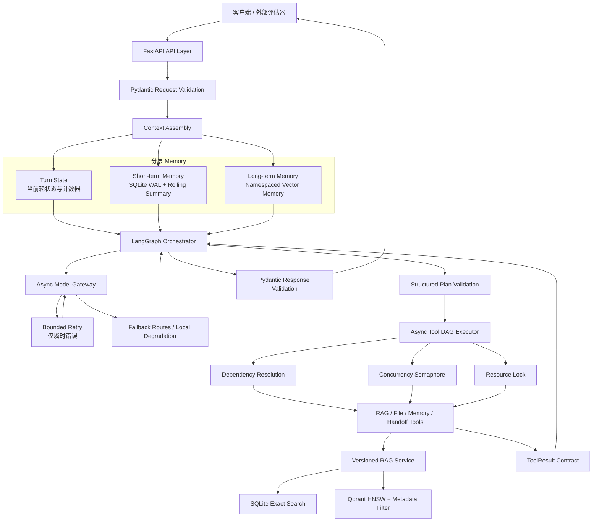
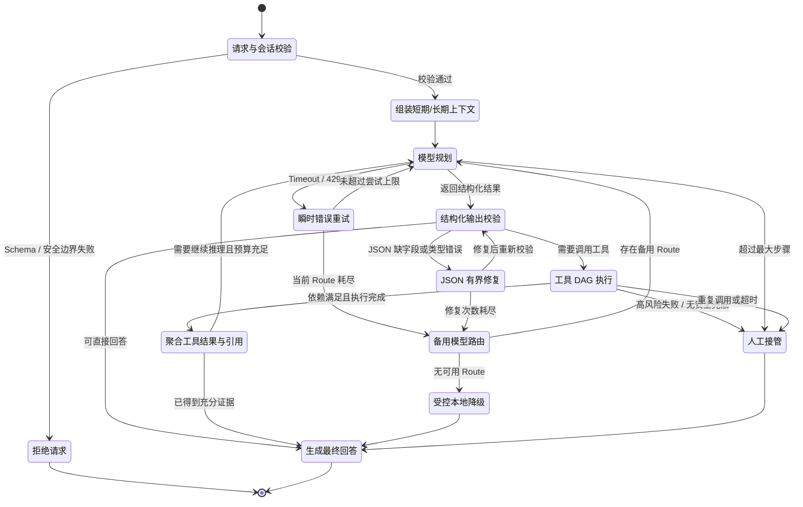
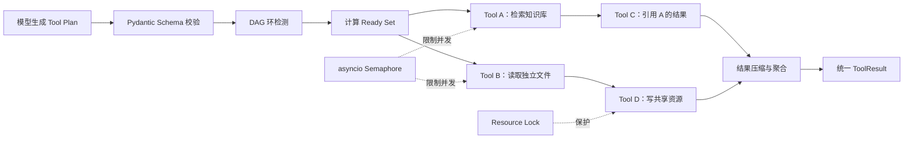
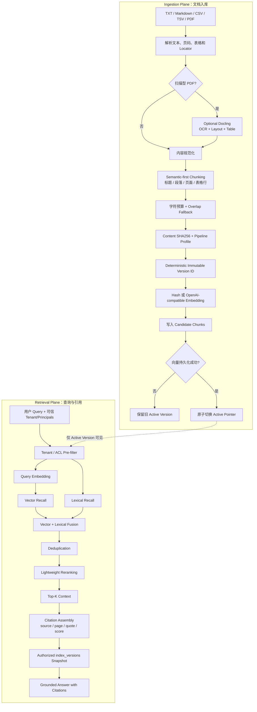

# AgentForge

> 面向工程落地与外部评估的异步 Agent 服务：基于 **LangGraph、asyncio、FastAPI、Pydantic v2、分层 Memory、Function Calling 与 Retrieval-Augmented Generation（RAG）** 构建。

AgentForge 将早期单文件 Demo 重构为模块化、可验证、可降级的 Agent 工程基线。项目重点不是展示一段 Prompt，而是解决真实 Agent 系统中更容易失控的部分：数据契约、状态所有权、异步并发、工具依赖、失败恢复、上下文隔离、RAG 生命周期、租户权限、引用溯源和兼容迁移。

> **最近一次验收：2026 年 8 月 14 日。** Ruff 检查通过；mypy strict 对 17 个源文件检查通过；pytest 共 47 项测试通过。RAG 测试覆盖版本生命周期、迁移、故障注入、Tenant/ACL 隔离、兼容性和并发语义。按照项目范围约定，**未进行压力测试、吞吐量测试或持续负载测试**。

## 项目价值

- **可靠性**：仅对瞬时错误执行有界重试，支持模型路由 Fallback、受控降级和 Human Handoff。
- **可控性**：LangGraph 显式管理状态、节点和终止条件，通过最大步数、重复调用检测和超时避免死循环。
- **异步化**：模型、Memory、RAG、工具和 Multi-Agent worker 全链路采用 async API；无依赖工具并发执行。
- **契约优先**：Pydantic v2 定义请求、模型结构化输出、工具参数和响应格式，错误数据在进入业务逻辑前被拦截。
- **可解释 RAG**：检索结果携带 source、chunk、page/locator、quote、score 和索引版本快照，可生成可追溯引用。
- **数据隔离**：知识库以 `(tenant_id, source_id)` 标识文档，ACL 在评分前过滤，未授权数据和版本信息均不可见。
- **可迁移性**：SQLite 提供零服务本地基线，Qdrant 提供面向更大语料的 HNSW 与 metadata filtering；持久化格式采用版本化迁移策略。
- **可复现性**：使用 `uv.lock` 锁定依赖，配套 Ruff、mypy、pytest、Node syntax check 和离线 RAG evaluator。

## 外部评估快速路径

建议按以下顺序评估：

1. 阅读[能力—证据矩阵](#能力证据矩阵)，快速定位实现与测试。
2. 查看[总体架构](#总体架构)、[Agent-状态流转](#agent-状态流转)和[RAG-工程流程](#rag-工程流程)。
3. 不配置模型 API Key，运行服务并验证受控本地 Fallback。
4. 执行[质量门禁与复现命令](#质量门禁与复现命令)。
5. 查看 `src/agent_service/` 中的正式实现以及 `tests/` 中的失败路径测试。
6. 阅读详细设计文档：
   - [架构设计](docs/architecture.md)
   - [依赖评审](docs/dependency-review.md)
   - [RAG 工程方案](docs/rag-engineering-plan.md)
   - [RAG 版本迁移](docs/rag-versioning-migration.md)
   - [RAG 授权边界 ADR](docs/adr-007-rag-authorization-boundary.md)
   - [RAG 实现证据](docs/rag-implementation-evidence.md)

仓库可以在没有外部模型访问权限的情况下完成基础评估。若 `AI_AGENT_API_KEY` 为空，系统不会伪造在线模型结果，而是进入显式标记的本地 Fallback，并通过 `degraded` 和 `warnings` 返回降级信息。

## 总体架构

`main.py` 是唯一受支持的后端入口，正式实现位于 `src/agent_service/`。顶层的 `app.py`、`agent_core.py`、`llm_client.py` 和 `config.py` 属于早期 Demo 兼容文件，处于分阶段弃用窗口，不是当前架构事实来源。



### 架构边界与状态所有权

| 层级 | 状态所有者 | 核心职责 |
|---|---|---|
| API Layer | FastAPI + Pydantic | 请求校验、兼容字段、错误响应和生命周期管理 |
| Turn State | LangGraph state | 当前计划、消息、工具结果、步数、重复签名和停止条件 |
| Short-term Memory | SQLite WAL session store | 会话级最近消息、字符预算和 Rolling Summary |
| Long-term Memory | Namespaced vector memory | 按用户命名空间保存可长期召回的语义事实 |
| Knowledge Memory | RAG index | 原始文档、Chunk、Metadata、版本、ACL、检索分数和引用 |
| Tool Runtime | Tool DAG executor | 依赖解析、并发控制、超时、资源锁和统一结果封装 |
| Model Runtime | Async model gateway | Route、Retry、Fallback、JSON repair 和结构化输出验证 |

## Agent 状态流转

Agent 的执行不是无限循环的 ReAct while-loop，而是由 LangGraph 管理的有限状态流。每一次模型调用、工具调用和修复都会消耗步骤预算；达到上限、重复工具签名超过阈值或恢复不再安全时，系统终止自动执行并进入降级或人工接管。



### 失败决策链

1. 使用 Pydantic 校验模型计划和工具参数，未知字段直接拒绝。
2. 仅对 Timeout、Rate Limit 和服务端错误等瞬时故障进行 exponential backoff。
3. 当前模型 Route 耗尽后，按配置顺序切换备用 Route。
4. 模型 JSON 缺字段、类型错误或夹杂额外文本时，执行有界 repair，并再次完整校验。
5. Tool output 必须符合统一 `ToolResult` 契约后才能返回 Graph。
6. 上游依赖失败时跳过下游调用，避免使用不完整或含义不确定的数据。
7. 仅在存在明确安全替代路径时自动降级；否则返回结构化错误或 `handoff_required=true`。
8. `max_agent_steps`、重复工具签名、单工具 Timeout 共同构成死循环止损线。

## 异步工具编排与 Function Calling

### 工具依赖和并发策略

工具计划通过 `depends_on` 声明有向无环图（DAG）。调度器只并行执行依赖已满足且资源不冲突的节点；`$ref` 用于引用上游结构化结果；共享写资源通过 resource lock 串行化。



执行规则：

- 无依赖工具使用 `asyncio` 并发调度，并受 `AI_AGENT_MAX_PARALLEL_TOOLS` 限制。
- 存在依赖关系的工具仅在上游成功后进入 Ready Set。
- DAG 中出现环时，在执行前拒绝整个非法计划。
- 上游失败后，下游标记为 skipped，不猜测缺失输入。
- 对同一外部资源的写操作使用资源锁，避免并发覆盖和状态冲突。
- 每个工具单独设置 Timeout；取消和异常被转换为结构化结果，不泄漏未处理异常。

### 工具描述如何减少模型误选

每个 Tool description 必须回答以下问题，而不是只写“搜索文件”或“读取数据”：

1. **When to use**：什么意图和前置条件下应该调用。
2. **When not to use**：哪些问题应由模型直接回答，哪些场景禁止调用。
3. **Input semantics**：每个参数的业务含义、单位、范围、默认值和互斥关系。
4. **Side effects**：是否读写文件、修改状态、访问网络或产生费用。
5. **Security boundary**：Workspace、Tenant、ACL、Principal 等边界由谁提供，模型能否修改。
6. **Success contract**：成功返回哪些字段，引用和错误如何表达。
7. **Failure behavior**：失败是否可重试、可切备用工具、可降级，还是必须 Handoff。

参数 Schema 粒度遵循“模型没有必要猜测”的原则：

- 字符串使用枚举、长度、Pattern 或明确语义描述约束。
- 数字声明上下界和单位。
- Optional 字段明确缺省行为，避免把 `null`、空字符串和未提供混为一谈。
- 嵌套对象拆分为命名 Model，列表元素也有完整类型。
- 使用 `extra="forbid"` 拒绝未知字段。
- 跨字段约束由 Pydantic validator 校验。
- 授权上下文由可信系统注入，不允许模型自行选择 `tenant_id` 或伪造 `principals`。

## 分层 Memory 与 Multi-Agent 协作

### Memory 分层

- **Turn State**：只保存当前轮执行所需信息，由 LangGraph 拥有，不作为长期事实库。
- **Short-term Memory**：按 `session_id` 隔离，使用 SQLite WAL 保存最近消息；超过消息或字符预算后生成 Rolling Summary。
- **Long-term Memory**：按 `user_id` 命名空间写入向量 Memory，记录可长期复用的偏好和事实。
- **Knowledge Memory**：RAG 文档库独立于用户 Memory，包含来源、版本、ACL、Chunk 和 Citation metadata。

上下文组装时采用“摘要 + 最近消息 + 相关长期记忆 + 授权知识片段”的组合，而不是把所有历史消息无界塞入 Prompt。

### Multi-Agent 上下文隔离

- Worker 拥有独立输入上下文和 Memory namespace。
- Worker 之间不共享原始 reasoning trace，降低污染、泄漏和上下文膨胀风险。
- 并行 Worker 只向 Coordinator 回传压缩后的 `summary`、`facts`、`citations`、`artifacts` 和 `warnings`。
- Coordinator 聚合结构化结果，不直接拼接多个 Agent 的完整对话历史。
- 当前 Multi-Agent 组件为 library-level 能力，尚未暴露公开编排 API。

## RAG 工程流程

RAG 分为 **Ingestion Plane** 和 **Retrieval Plane**。写入侧通过候选版本构建和原子激活确保失败替换不会破坏当前可用版本；检索侧先执行 Tenant/ACL 过滤，再进行向量与词法召回、融合、去重和引用生成。



### 文档解析与 Chunking

当前直接支持：

- TXT、Markdown
- CSV、TSV
- 文本型 PDF
- 扫描型 PDF 检测
- 可选 Docling OCR、Layout analysis 和复杂表格抽取

Chunking 不是单纯固定长度切片，而是：

1. 优先按标题、段落、页面边界和表格行保留语义结构。
2. 对超长 Block 再按字符预算切分。
3. 通过 Overlap 保留跨块上下文。
4. 每个 Chunk 保留 source、page/locator、chunk index 和版本 metadata。

扫描型 PDF 若无法直接提取文本，会显式请求 OCR Fallback；默认测试只验证扫描件检测和 Fallback 信号，不宣称 OCR 质量。表格以语义 Block 保留行级结构，复杂布局可启用 `documents` extra 中的 Docling。

### Embedding 选型

| 场景 | 推荐方案 | 取舍 |
|---|---|---|
| 离线测试、CI、零外部依赖 | Deterministic hash embedding | 可复现、无网络、无费用；不代表生产语义质量 |
| 通用语义检索 | OpenAI-compatible embedding | 语义质量通常更好，但增加费用、网络延迟和供应商依赖 |
| 强领域语料 | 先构建标注集再选择领域模型 | 必须用真实 Query 和文档评估，不能仅凭模型榜单决定 |

Embedding 差异必须在同一 Chunk、同一语料和同一授权过滤条件下，用 Recall@K、MRR、nDCG 和 Citation 指标比较。当前仓库只提供 evaluator 契约样例，不对生产检索质量作无证据声明。

### Vector Store 与索引策略

| Backend | 使用场景 | 索引与过滤特点 |
|---|---|---|
| SQLite | 本地 Demo、小规模语料、确定性验收 | Exact vector search、零额外服务、便于调试和迁移验证 |
| Qdrant | 更大语料、需要 ANN 与 metadata filtering | HNSW、Tenant/ACL filter、独立服务部署 |

SQLite 在向量解码和评分前执行授权过滤；Qdrant 将 Tenant/ACL 条件放入向量查询 Filter。未经授权的 Chunk 不参与候选评分，相关 `index_versions` 也不会泄漏。

### Reranking 与引用生成

当前默认使用轻量级 vector/lexical fusion，而不是 Cross-Encoder：

1. 分别获得 vector 与 lexical 信号。
2. 融合分数并对重复 Chunk 去重。
3. 选择 Top-K 上下文。
4. 返回结构化 Citation，包括来源、Chunk、页码或 Locator、Quote、Score。
5. 同时返回本次检索实际使用的授权 Active Version 快照。

若引入 Cross-Encoder，应先在领域标注集上证明质量收益能够覆盖新增延迟、模型成本和运维复杂度。

### RAG 版本生命周期与一致性

- `content_sha256 + pipeline profile` 生成确定性版本标识。
- 相同内容和 Pipeline 重复入库具有 idempotency。
- Candidate Chunk 在激活前不可被检索。
- Vector 持久化完成后才原子切换 Active Pointer。
- 新版本写入失败时，旧 Active Version 继续可用。
- 同一 `(tenant_id, source_id)` 的写入串行化，不同 Source 可异步重叠。
- 检索响应通过 `index_versions` 标记实际使用的版本快照。
- 旧 public-tenant 表在 0.x 迁移窗口内保留并 dual-write，支持回滚。

## 能力—证据矩阵

| 评估项 | 已实现方案 | 主要代码或测试证据 |
|---|---|---|
| Retry / Fallback | 瞬时故障 exponential backoff；按顺序切换备用模型；最终进入受控降级或 Handoff | `src/agent_service/llm.py`；`test_retry_recovers_from_transient_timeout` |
| 全异步调用 | FastAPI、AsyncOpenAI、LangGraph async node、aiosqlite、Vector adapter、Tool 和 Worker 使用 async API | `src/agent_service/graph.py`；`src/agent_service/tools/base.py` |
| Function Calling | Tool description 声明选择边界、副作用和返回契约；Pydantic 生成严格 JSON Schema | `src/agent_service/tools/`；`test_tool_descriptions_explain_selection_boundaries` |
| JSON 异常兜底 | 提取、严格校验、有界修复、重新校验；缺字段和错误类型无法进入业务逻辑 | `src/agent_service/llm.py`；`src/agent_service/schemas.py` |
| 多工具并行 | DAG、`depends_on`、`$ref`、环检测、失败跳过、Semaphore 和 resource lock | `tests/test_tools.py` |
| 分层 Memory | Graph turn state、SQLite short-term、Rolling Summary、向量 long-term memory | `src/agent_service/memory.py`；`tests/test_memory.py` |
| Multi-Agent | Worker 并发、上下文隔离、命名空间隔离、压缩结果回传 | `src/agent_service/multi_agent.py`；`tests/test_multi_agent.py` |
| 死循环止损 | 最大步骤、重复工具签名限制、工具超时和 Handoff | `src/agent_service/graph.py`；`test_langgraph_stops_repeated_tool_loop` |
| 文档解析 | TXT/Markdown/CSV/TSV/PDF；表格语义 Block；扫描 PDF 检测和 Docling Fallback | `src/agent_service/documents.py`；`tests/test_rag.py` |
| RAG 生命周期 | 不可变版本、幂等写入、Candidate 隔离、原子激活、失败保留旧版本 | `src/agent_service/rag.py`；`src/agent_service/rag_registry.py` |
| Tenant / ACL | `(tenant_id, source_id)` 复合身份；评分前 ACL 过滤；未授权版本隐藏 | `tests/test_rag.py`；`tests/test_qdrant.py`；`tests/test_api.py` |
| Vector Store | SQLite exact search 基线；Qdrant HNSW 与 metadata filtering adapter | `src/agent_service/vector_store.py` |
| Citation | source、chunk、page/locator、quote、score、active version snapshot | `src/agent_service/schemas.py`；`docs/rag-evaluation-contract.md` |
| 类型与依赖 | 完整类型注解、mypy strict、Ruff、`uv.lock`，重型集成放入 optional extra | `pyproject.toml`；`uv.lock` |

## 项目结构

```text
.
|-- main.py                          # 正式 FastAPI 入口
|-- src/agent_service/
|   |-- app.py                       # API 组合与生命周期
|   |-- graph.py                     # LangGraph 控制流与循环止损
|   |-- llm.py                       # Async 模型网关、Retry、Fallback、JSON repair
|   |-- schemas.py                   # 严格 Pydantic 数据契约
|   |-- memory.py                    # Short-term / Long-term Memory
|   |-- documents.py                 # 文档解析与 Semantic Chunk 准备
|   |-- rag.py                       # 版本化 Ingestion、Retrieval 与 Citation
|   |-- rag_registry.py              # 持久化版本生命周期和 Active Pointer
|   |-- vector_store.py              # SQLite / Qdrant adapter
|   |-- multi_agent.py               # 隔离的并行 Worker 协作
|   `-- tools/                       # Tool registry、DAG executor 和内置工具
|-- tests/                            # 功能、契约、迁移、并发与失败路径测试
|-- docs/architecture.md             # 架构与失败策略
|-- docs/dependency-review.md        # 成熟项目和依赖评审
|-- docs/acceptance-evidence.md      # 详细验收证据
|-- docs/rag-engineering-plan.md     # RAG 工程方案
|-- docs/rag-versioning-migration.md # 持久化格式迁移与回滚
|-- docs/rag-implementation-evidence.md # RAG Claim-to-Test 证据
|-- eval/                             # Golden Query 契约样例
|-- scripts/evaluate_rag.py          # 离线 RAG evaluator
|-- pyproject.toml                   # 依赖与工具配置
`-- uv.lock                          # 可复现依赖锁
```

## 快速运行

### 环境要求

- Python `>=3.12,<3.15`
- `uv`，用于虚拟环境和依赖锁定
- Node.js 18+，仅可选前端需要

### 克隆与安装

```powershell
git clone https://github.com/chenchufan8-prog/agentforge.git
cd agentforge
Copy-Item .env.example .env
uv sync --all-groups
```

Bash：

```bash
git clone https://github.com/chenchufan8-prog/agentforge.git
cd agentforge
cp .env.example .env
uv sync --all-groups
```

本地 Fallback 验证不要求模型 API Key。若要测试真实模型 Route，请在 `.env` 中设置 `AI_AGENT_API_KEY`，不要提交真实凭据。

### 启动后端

```powershell
uv run uvicorn main:app --reload --host 127.0.0.1 --port 8000
```

访问地址：

- API Root：`http://localhost:8000`
- OpenAPI UI：`http://localhost:8000/docs`
- Health Check：`http://localhost:8000/health`

### 启动可选前端

在另一个终端执行：

```powershell
npm ci
npm start
```

前端地址：`http://localhost:3000`

### 可选集成

```powershell
# Qdrant client；Qdrant service 需要单独部署
uv sync --all-groups --extra vector

# Docling OCR、Layout analysis 和复杂表格抽取
uv sync --all-groups --extra documents
```

## 配置

完整配置参见 [.env.example](.env.example)。不要提交真实 `.env` 或凭据。

| 环境变量 | 默认值 | 作用 |
|---|---:|---|
| `AI_AGENT_API_KEY` | 空 | 主模型 API Key；为空时启用受控本地 Fallback |
| `AI_AGENT_BASE_URL` | OpenAI v1 endpoint | OpenAI-compatible 模型地址 |
| `AI_AGENT_MODEL` | `gpt-4o-mini` | 主模型标识 |
| `AI_AGENT_FALLBACK_ROUTES_JSON` | `[]` | 按顺序尝试的备用模型 Route |
| `AI_AGENT_WORKSPACE_ROOT` | 当前目录 | 文件工具允许访问的根边界 |
| `AI_AGENT_STATE_DIR` | `state` | SQLite Memory 和索引目录 |
| `AI_AGENT_EMBEDDING_PROVIDER` | `hash` | `hash` 或 `openai` |
| `AI_AGENT_VECTOR_BACKEND` | `sqlite` | `sqlite` 或 `qdrant` |
| `AI_AGENT_QDRANT_URL` | `http://localhost:6333` | Qdrant service URL |
| `AI_AGENT_MAX_AGENT_STEPS` | `8` | Agent 最大 Graph step |
| `AI_AGENT_MAX_REPEATED_TOOL_CALLS` | `2` | 同一 Tool call signature 最大重复次数 |
| `AI_AGENT_MAX_PARALLEL_TOOLS` | `8` | Tool 并发上限 |

备用模型 Route 示例：

```env
AI_AGENT_FALLBACK_ROUTES_JSON=[{"name":"backup","model":"backup-model","base_url":"https://example.com/v1","api_key":"replace-me","timeout_seconds":45,"max_attempts":2}]
```

## API 契约

### `POST /chat`

请求示例：

```json
{
  "message": "查找知识库中关于 Retry 策略的说明。",
  "history": [],
  "session_id": "evaluation-session",
  "user_id": "external-reviewer"
}
```

主要响应字段：

- `reply`
- 结构化 `tool_calls`
- `citations`
- `session_id`
- `degraded`
- `handoff_required`
- `warnings`

0.x 兼容窗口内继续保留旧版 `tool_calls[].name`、`arguments` 和 `result` 字段。新调用方应使用 `tool_name`、`status`、`latency_ms` 和 `error_code`。

其他 Endpoint：

- `GET /health`
- `GET /config`
- `POST /documents/ingest`
- `POST /documents/search`
- `POST /memory`

`POST /documents/ingest` 增量支持 `tenant_id`（默认 `public`）和 `acl`（默认空，表示 Tenant 内可见），并返回 `version_id`、`content_sha256` 和 `idempotent`。

`POST /documents/search` 增量支持 `tenant_id` 和 `principals`，并返回仅包含已授权 Active Source 的 `index_versions`。在 0.x 迁移窗口内，未提供新字段的旧调用方继续使用 public-tenant 行为。

授权语义在 Tenant 内 fail-closed：文档 ACL 非空时必须与调用方 Principals 相交。请求中的 Tenant/Principal 是授权上下文契约，不是身份认证机制；生产环境必须由可信 Gateway 或 Identity Middleware 注入，不能直接信任终端用户声明。面向模型的 `search_knowledge` Tool 固定绑定 public tenant，模型不能自行选择授权范围。

## 质量门禁与复现命令

```powershell
uv run ruff check src main.py tests scripts
uv run mypy src scripts
uv run pytest
uv run python scripts/evaluate_rag.py --queries eval/golden_queries.example.jsonl
node --check public/app.js
node --check server.js
```

最近一次验证环境为 CPython 3.12.13：

```text
Ruff:  all checks passed
mypy:  success, no issues in 17 source files
pytest: 47 passed, 1 warning
RAG evaluator: 2 schema-valid example queries; no quality claim
Node:  public/app.js 与 server.js syntax check 通过
PowerShell: run.ps1 解析通过
```

唯一 Warning 来自 Starlette TestClient 向新版 httpx 迁移时的兼容弃用提示，不是业务逻辑测试失败。

代表性测试：

- `test_retry_recovers_from_transient_timeout`
- `test_structured_output_missing_field_is_repaired_and_revalidated`
- `test_schema_first_tool_contract_rejects_wrong_types_and_extra_fields`
- `test_independent_tools_run_concurrently_without_load_testing`
- `test_dependencies_resolve_results_and_cycles_are_rejected`
- `test_shared_resource_lock_prevents_conflicting_mutation`
- `test_short_term_memory_is_isolated_and_compacted`
- `test_long_term_memory_uses_semantic_namespace`
- `test_multi_agent_context_isolated_and_result_compressed`
- `test_langgraph_stops_repeated_tool_loop`
- `test_rag_semantic_chunks_and_returns_citations`
- `test_failed_replacement_keeps_previous_version_searchable`
- `test_building_version_is_invisible_until_activation`
- `test_source_mutation_during_ingestion_is_rejected`
- `test_scanned_pdf_is_detected_and_requests_ocr_fallback`
- `test_cross_tenant_retrieval_isolated_before_scoring`
- `test_acl_requires_principal_intersection_and_hides_index_versions`
- `test_qdrant_filters_tenant_and_acl_before_returning_candidates`
- `test_registry_v2_uses_composite_identity_and_public_dual_write`

## 简历项目描述（STAR）

### Situation

原项目是单文件 Agent Demo，缺少明确的数据契约、异步编排、失败恢复、Memory 分层、RAG 生命周期和可复现验收，不足以支撑真实工程评估。

### Task

将 Demo 重构为可维护的 Agent 服务，在兼容既有 `POST /chat` 契约的前提下，补齐 Retry/Fallback、Function Calling、Pydantic 校验、异步多工具、Multi-Agent 隔离、分层 Memory、RAG、引用溯源和工程质量门禁。

### Action

- 使用 LangGraph 建模 Agent 状态和终止条件，以步数、重复签名和 Timeout 防止失控循环。
- 实现 Async Model Gateway，仅重试瞬时故障，并支持多 Route Fallback、JSON repair 和 Human Handoff。
- 使用 Pydantic v2 建立 Schema-first Tool contract，在执行前拦截缺字段、错误类型和未知参数。
- 使用 DAG、`asyncio`、Semaphore 和 resource lock 编排多工具依赖与并发冲突。
- 构建 SQLite Short-term Memory、Rolling Summary 和 Namespaced Long-term Vector Memory。
- 实现版本化 RAG Pipeline，包括语义优先 Chunk、扫描件 Fallback、Embedding adapter、SQLite/Qdrant、融合检索、ACL pre-filter、原子激活和 Citation。
- 使用 `uv.lock`、Ruff、mypy strict、pytest 和离线 evaluator 建立可复现质量门禁。

### Result

将原始 Demo 重构为模块化 AgentForge 服务；正式实现拆分为 17 个类型检查源文件；建立 47 项自动化测试，覆盖正常路径、失败恢复、并发语义、RAG 迁移和 Tenant/ACL 隔离；最近一次验收中 Ruff、mypy strict、pytest 和 JavaScript syntax check 均通过。项目不虚构压力测试和生产检索质量数据，明确记录当前证据边界。

## 评估范围与已知限制

1. **未进行压力测试。** 当前并发测试只验证并发语义和时间重叠，不声明吞吐量、饱和点、p95/p99 Latency 或长时间稳定性。
2. 验收未使用生产模型凭据，因此未覆盖真实 Provider 的 Function Calling 差异、Rate Limit 和跨 Provider Fallback。
3. Docling 是可选依赖；默认测试验证扫描 PDF 检测和 Fallback 信号，不声明 OCR 或复杂表格抽取质量。
4. Qdrant adapter 使用内存模式完成功能测试，未验证远程服务持久化和生产索引调优。
5. 默认 Reranker 是轻量 vector/lexical fusion，不是 Cross-Encoder；在没有领域标注集前不声明 Recall@K、MRR、nDCG 或 Citation accuracy 提升。
6. Multi-Agent 当前为 library-level 组件，尚未提供公开编排 API、Cost Budget、授权模型和冲突仲裁策略。
7. Long-term Memory 尚需补充生产级 Retention、Deletion、Export、Consent 和 PII 策略。
8. SQLite exact search 适合本地评估和小规模语料；更大语料应在真实 Workload 验证后迁移到 Qdrant 或其他索引型 Vector Store。
9. Ingestion 尚不是 Durable Background Job System；同 Source Lock 为进程内锁，多进程写入需要单写者部署或未来的 Distributed Lease。
10. Vector upsert 成功但 Active Pointer 切换前若进程崩溃，可能留下不可见 Orphan Chunk；GC 和 Retention policy 尚待实现。
11. Tenant/ACL 过滤已经实现，但 Authentication 属于外部边界；生产调用方必须由可信身份系统提供 Tenant/Principal。
12. 示例 Golden Query JSONL 只验证 evaluator 数据契约，不构成代表性 Benchmark，也不支持检索质量结论。

## 兼容与迁移策略

公开 API、环境变量、持久化格式和用户文件不会被直接删除，必须经过三个阶段：

1. **Deprecation**：标记弃用并记录替代方案。
2. **Migration Window**：保留兼容实现、迁移工具、回滚路径和测试覆盖。
3. **Removal**：仅在后续 breaking release 且迁移证据充分后删除。

因此，即使项目品牌为 AgentForge，Python import package 仍保留为 `agent_service`，环境变量前缀仍为 `AI_AGENT_`，旧版 Chat response 字段在 0.x 系列中继续可用。

## 许可证

MIT
