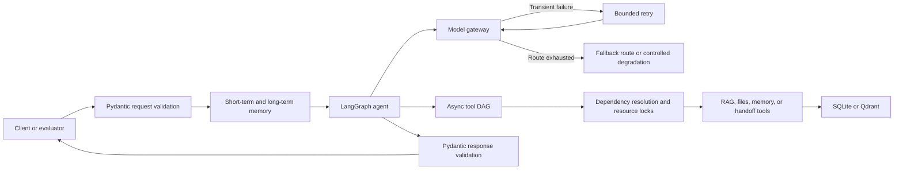

# AgentForge

AgentForge is an evaluation-oriented asynchronous agent service built with **LangGraph, asyncio, FastAPI, Pydantic v2, layered memory, and retrieval-augmented generation (RAG)**.

The project upgrades a single-file demonstration into a modular agent baseline with explicit data contracts, state ownership, failure handling, dependency-aware tool execution, and reproducible acceptance evidence. The existing `POST /chat` response fields remain backward compatible throughout the 0.x line.

> **Evaluation status — August 8, 2026:** Ruff passed, mypy strict passed for 15 source files, and pytest passed all 17 tests. No pressure, throughput, or sustained-load testing was performed, as explicitly excluded from the evaluation scope.

## Reviewer Quick Path

An evaluator can inspect the project in this order:

1. Review the [capability-to-evidence matrix](#capability-to-evidence-matrix).
2. Run the service without a model API key to verify the safe local fallback path.
3. Execute the [quality gates](#quality-gates-and-reproducible-evidence).
4. Inspect `src/agent_service/` for the supported implementation.
5. Consult the detailed [architecture](docs/architecture.md), [dependency review](docs/dependency-review.md), and [acceptance evidence](docs/acceptance-evidence.md).

The repository can be evaluated without external model access. If `AI_AGENT_API_KEY` is empty, AgentForge does not fabricate an online model result; it enters a controlled local fallback mode and reports degradation explicitly.

## Capability-to-Evidence Matrix

| Evaluation area | Implemented design | Primary code or test evidence |
|---|---|---|
| Retry and fallback | Exponential backoff is limited to transient timeout, rate-limit, and server failures. Failed model routes are tried in order; unrecoverable failures can degrade to safe local behavior or human handoff. | `src/agent_service/llm.py`; `test_retry_recovers_from_transient_timeout`; `test_backward_compatible_chat_contract_and_offline_fallback` |
| Fully asynchronous execution | FastAPI, AsyncOpenAI, LangGraph async nodes, aiosqlite, vector adapters, multi-agent workers, and tool orchestration use async APIs. Independent tools are scheduled concurrently behind a semaphore. | `src/agent_service/graph.py`; `src/agent_service/tools/base.py`; `test_independent_tools_run_concurrently_without_load_testing` |
| Function calling | Tool descriptions define selection boundaries, forbidden cases, side effects, argument meaning, and return contracts. Pydantic models generate strict JSON Schema and reject unknown fields. | `src/agent_service/tools/`; `test_tool_descriptions_explain_selection_boundaries`; `test_schema_first_tool_contract_rejects_wrong_types_and_extra_fields` |
| Malformed model output | Structured output is extracted, strictly validated, repaired through a bounded retry, and revalidated. Missing fields and wrong types are rejected before application logic consumes them. | `src/agent_service/llm.py`; `src/agent_service/schemas.py`; `test_structured_output_missing_field_is_repaired_and_revalidated` |
| Parallel tool dependencies | `depends_on` declares a directed acyclic graph. `$ref` resolves upstream results, cycles are rejected, failed dependencies are skipped, and resource locks prevent conflicting mutation. | `src/agent_service/tools/base.py`; dependency, cycle, and shared-resource-lock tests in `tests/test_tools.py` |
| Layered memory | Graph state owns the current turn; SQLite WAL stores session-scoped short-term history; rolling summaries compact context; vectorized long-term memory is isolated by user namespace. | `src/agent_service/memory.py`; `tests/test_memory.py` |
| Multi-agent collaboration | Workers execute concurrently with isolated context and memory namespaces. They return compressed summaries, facts, citations, artifacts, and warnings instead of raw reasoning traces. | `src/agent_service/multi_agent.py`; `test_multi_agent_context_isolated_and_result_compressed` |
| Loop prevention | The graph enforces a maximum step count, repeated tool-call signature limit, tool timeout, and handoff path. | `src/agent_service/graph.py`; `test_langgraph_stops_repeated_tool_loop` |
| RAG | The pipeline performs parsing, semantic-boundary chunking, embedding, retrieval, lightweight lexical/vector fusion, deduplication, and citation aggregation. | `src/agent_service/rag.py`; `src/agent_service/documents.py`; `test_rag_semantic_chunks_and_returns_citations` |
| Scanned documents and tables | TXT, Markdown, CSV, TSV, and text PDFs are supported directly. Table rows are preserved as semantic blocks. Scanned PDFs are detected and request the optional Docling OCR/layout fallback. | `tests/test_rag.py`; optional `documents` dependency group |
| Vector storage | SQLite exact search is the default zero-service backend. Qdrant is available for HNSW and metadata filtering when a service is deployed. | `src/agent_service/vector_store.py`; `test_qdrant_adapter_in_memory_round_trip` |
| Retrieval observability | Retrieval and tool results expose `latency_ms`; citations preserve source, chunk, page or locator, quote, and score where available. | `src/agent_service/schemas.py`; `src/agent_service/rag.py` |
| Type and dependency discipline | Source code is type annotated, checked with mypy strict, linted with Ruff, and locked with `uv.lock`. Optional heavy integrations are isolated in extras. | `pyproject.toml`; `uv.lock`; quality-gate results below |

## Architecture

`main.py` is the only supported backend entry point. The maintained implementation is under `src/agent_service/`.

The top-level `app.py`, `agent_core.py`, `llm_client.py`, and `config.py` files are legacy demo compatibility files. They are retained for a staged deprecation and are not the architectural source of truth.



### Failure decision chain

1. Validate the model plan and tool arguments.
2. Retry only failures classified as transient.
3. Try the next configured model route when the current route is exhausted.
4. Validate tool output before returning it to the graph.
5. Skip calls whose dependencies failed instead of using partial or ambiguous data.
6. Use an alternate safe path when one is explicitly available.
7. Return structured degradation or request human handoff when automated recovery is unsafe.

### Tool schema granularity

Tool contracts are intentionally precise enough to prevent guesswork:

- Every argument has a concrete type, bounds, defaults, and semantic description.
- Unknown arguments are rejected with `extra="forbid"`.
- Descriptions state **when to use**, **when not to use**, side effects, security boundaries, and the shape of a successful result.
- File tools use a workspace root and reject path traversal.
- Tool results use a common envelope with status, data, summary, citations, error details, and latency.

### Memory ownership

| Layer | Owner | Purpose |
|---|---|---|
| Turn state | LangGraph state | Current plan, messages, tool results, counters, and stop conditions |
| Short-term memory | SQLite WAL session store | Recent messages, bounded context, and rolling summary |
| Long-term memory | Namespaced vector memory | Durable semantic facts weighted by importance |
| Knowledge memory | RAG index | Source documents, chunks, metadata, retrieval scores, and citations |

### RAG policy

The default pipeline favors deterministic evaluation and low setup cost:

1. Parse supported files and retain source locators.
2. Split on headings, paragraphs, page boundaries, and table rows before applying character-budget and overlap fallbacks.
3. Use the deterministic hash embedding for offline tests or an OpenAI-compatible embedding route for semantic quality.
4. Use SQLite exact retrieval for small local corpora or Qdrant HNSW for larger filtered collections.
5. Fuse vector and lexical signals, remove duplicate chunks, and return structured citations.

## Repository Layout

```text
.
|-- main.py                         # Supported FastAPI entry point
|-- src/agent_service/
|   |-- app.py                      # API composition and lifecycle
|   |-- graph.py                    # LangGraph control flow and loop limits
|   |-- llm.py                      # Async model gateway, retry, fallback, repair
|   |-- schemas.py                  # Strict Pydantic contracts
|   |-- memory.py                   # Short-term and long-term memory
|   |-- documents.py                # Parsing and semantic chunk preparation
|   |-- rag.py                      # Retrieval, reranking, and citations
|   |-- vector_store.py             # SQLite and Qdrant adapters
|   |-- multi_agent.py              # Isolated parallel worker coordination
|   `-- tools/                      # Tool registry, DAG executor, built-in tools
|-- tests/                          # 17 functional and contract tests
|-- docs/architecture.md            # Design decisions and failure strategies
|-- docs/dependency-review.md       # Maintained-project and dependency review
|-- docs/acceptance-evidence.md     # Detailed acceptance evidence
|-- pyproject.toml                  # Dependencies and tool configuration
`-- uv.lock                         # Reproducible dependency lock
```

## Quick Start

### Prerequisites

- Python 3.12 or later, but earlier than Python 3.15
- Node.js 18 or later for the optional frontend
- `uv` for reproducible Python environment management

### Clone and install

```powershell
git clone https://github.com/chenchufan8-prog/agentforge.git
cd agent
Copy-Item .env.example .env
uv sync --all-groups
```

On Bash, replace `Copy-Item` with:

```bash
cp .env.example .env
```

A model key is optional for local fallback evaluation. To test a real model route, set `AI_AGENT_API_KEY` in `.env`.

### Start the backend

```powershell
uv run uvicorn main:app --reload --host 127.0.0.1 --port 8000
```

Endpoints:

- API root: `http://localhost:8000`
- OpenAPI UI: `http://localhost:8000/docs`
- Health check: `http://localhost:8000/health`

### Start the optional frontend

Open another terminal:

```powershell
npm ci
npm start
```

The frontend is available at `http://localhost:3000`.

### Optional integrations

```powershell
# Qdrant client support; a Qdrant service must be deployed separately.
uv sync --all-groups --extra vector

# Docling OCR, layout analysis, and complex table extraction.
uv sync --all-groups --extra documents
```

## Configuration

Do not commit a real `.env` file or credentials.

| Variable | Default | Purpose |
|---|---:|---|
| `AI_AGENT_API_KEY` | empty | Primary model API key; empty enables controlled local fallback |
| `AI_AGENT_BASE_URL` | OpenAI v1 endpoint | OpenAI-compatible model endpoint |
| `AI_AGENT_MODEL` | `gpt-4o-mini` | Primary model identifier |
| `AI_AGENT_FALLBACK_ROUTES_JSON` | `[]` | Ordered backup model routes |
| `AI_AGENT_WORKSPACE_ROOT` | current directory | Root boundary for file tools |
| `AI_AGENT_STATE_DIR` | `state` | SQLite memory and index directory |
| `AI_AGENT_EMBEDDING_PROVIDER` | `hash` | `hash` or `openai` |
| `AI_AGENT_VECTOR_BACKEND` | `sqlite` | `sqlite` or `qdrant` |
| `AI_AGENT_QDRANT_URL` | `http://localhost:6333` | Qdrant service URL |
| `AI_AGENT_MAX_AGENT_STEPS` | `8` | Maximum graph steps before termination |
| `AI_AGENT_MAX_REPEATED_TOOL_CALLS` | `2` | Maximum repeated tool-call signatures |
| `AI_AGENT_MAX_PARALLEL_TOOLS` | `8` | Tool concurrency limit |

Example fallback route:

```env
AI_AGENT_FALLBACK_ROUTES_JSON=[{"name":"backup","model":"backup-model","base_url":"https://example.com/v1","api_key":"replace-me","timeout_seconds":45,"max_attempts":2}]
```

See [.env.example](.env.example) for the complete configuration surface.

## API Contract

### `POST /chat`

Request:

```json
{
  "message": "Find the retry strategy in the indexed knowledge base.",
  "history": [],
  "session_id": "evaluation-session",
  "user_id": "external-reviewer"
}
```

The response includes:

- `reply`
- structured `tool_calls`
- `citations`
- `session_id`
- `degraded`
- `handoff_required`
- `warnings`

The legacy `tool_calls[].name`, `arguments`, and `result` fields remain available during the 0.x compatibility window. New consumers should use `tool_name`, `status`, `latency_ms`, and `error_code`.

Additional endpoints:

- `GET /health`
- `GET /config`
- `POST /documents/ingest`
- `POST /documents/search`
- `POST /memory`

## Quality Gates and Reproducible Evidence

Run:

```powershell
uv run ruff check src main.py tests
uv run mypy src/agent_service
uv run pytest
node --check public/app.js
node --check server.js
```

Latest verified result on CPython 3.12.13:

```text
Ruff:  all checks passed
mypy:  success, no issues in 15 source files
pytest: 17 passed, 1 warning
Node:  both JavaScript syntax checks passed
PowerShell: run.ps1 parsed successfully
```

The single warning is a Starlette TestClient compatibility deprecation related to the httpx transition; it is not a business-logic test failure.

Representative tests:

- `test_retry_recovers_from_transient_timeout`
- `test_structured_output_missing_field_is_repaired_and_revalidated`
- `test_schema_first_tool_contract_rejects_wrong_types_and_extra_fields`
- `test_independent_tools_run_concurrently_without_load_testing`
- `test_dependencies_resolve_results_and_cycles_are_rejected`
- `test_shared_resource_lock_prevents_conflicting_mutation`
- `test_short_term_memory_is_isolated_and_compacted`
- `test_long_term_memory_uses_semantic_namespace`
- `test_multi_agent_context_isolated_and_result_compressed`
- `test_langgraph_stops_repeated_tool_loop`
- `test_rag_semantic_chunks_and_returns_citations`
- `test_scanned_pdf_is_detected_and_requests_ocr_fallback`
- `test_backward_compatible_chat_contract_and_offline_fallback`
- `test_path_escape_is_rejected`

## Evaluation Scope and Known Limitations

The following boundaries are intentional and should be considered during evaluation:

1. **No pressure testing was performed.** The tests verify concurrency semantics and time overlap only; they do not claim throughput, saturation, p95/p99 latency, or long-duration stability.
2. Real provider-specific function-calling behavior, rate limits, and cross-provider fallback were not exercised because no production API credential was used in the acceptance run.
3. Docling is optional. The default test suite verifies scanned-PDF detection and fallback signaling, not OCR or complex-table extraction quality.
4. The Qdrant adapter is functionally tested in in-memory mode; remote service persistence and production index tuning were not evaluated.
5. The default reranker is a lightweight vector/lexical fusion strategy, not a cross-encoder. A labeled domain dataset is required before claiming Recall@k, MRR, nDCG, or citation-accuracy improvements.
6. Multi-agent coordination is currently a library-level component; it does not yet expose a public orchestration API, authorization model, cost budget, or conflict arbitration policy.
7. Long-term memory still requires production policies for retention, deletion, export, consent, and personally identifiable information.
8. SQLite exact vector search is appropriate for the local evaluation baseline; larger corpora should move to Qdrant or another indexed vector store after workload-specific validation.

## Compatibility and Migration Policy

Public API fields, environment variables, persisted state, and user files are not removed without a staged process:

1. Deprecate and document the replacement.
2. Maintain a migration window with compatibility coverage.
3. Remove only in a later breaking release after migration evidence exists.

For that reason, the Python import package remains `agent_service`, the environment prefix remains `AI_AGENT_`, and legacy chat response fields remain available in the 0.x series even though the project is branded as AgentForge.
