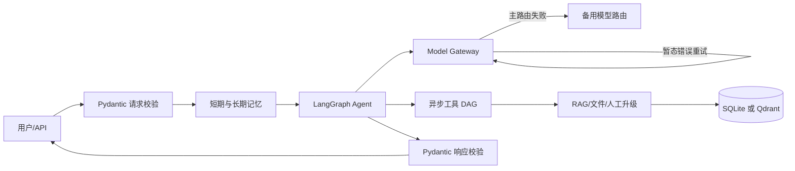

# AgentForge

**AgentForge** 是一个以 **LangGraph + asyncio + Pydantic v2** 为核心的异步 Agent 服务。当前版本从单文件 Demo 升级为有明确数据契约、状态所有权、失败策略和验收证据的模块化实现，同时保留原有 `POST /chat` 的 `reply` 与 `tool_calls[].name/arguments/result` 字段兼容。

## 已实现能力

- **全异步主链路**：FastAPI、AsyncOpenAI、LangGraph async node、aiosqlite、异步工具 DAG；无同步网络调用阻塞事件循环。
- **Retry / Fallback**：仅对超时、限流、5xx 等暂态错误做指数退避；主模型失败后按路由切备用模型；无模型密钥时仍可执行安全的本地工具；不可恢复错误转人工工具。
- **严格 Function Calling**：工具说明包含用途、使用/禁用条件、副作用和返回契约；参数由 Pydantic 生成 JSON Schema，拒绝未知字段，调用前后均校验。
- **并行工具编排**：独立工具并发执行；显式 `depends_on` 形成 DAG；`$ref` 引用上游结果；资源锁避免同一资源的并发冲突；超时、跳过、失败统一返回。
- **分层记忆**：LangGraph 工作状态、SQLite WAL 会话短期记忆、摘要压缩、按用户命名空间隔离的向量化长期记忆。
- **RAG 与引用**：文档解析、语义边界切片、Embedding、SQLite 精确向量检索或 Qdrant HNSW、词法融合重排、去重以及来源引用。
- **文档处理**：内置 TXT/Markdown/CSV/TSV/PDF；扫描件或复杂表格可选 Docling OCR/版面/表格结构解析。
- **多 Agent 协作契约**：并行 worker、独立上下文和记忆命名空间；仅回传摘要、事实、引用、产物与告警，不回传原始推理轨迹。
- **死循环止损**：最大图步数、重复工具签名上限、超时和人工升级。
- **工程质量**：完整类型注解、mypy strict、Ruff、pytest、`uv.lock` 和可选依赖分组。

## 架构

`main.py` 是唯一支持的后端入口；核心实现位于 `src/agent_service/`。

`app.py`、`agent_core.py`、`llm_client.py`、`config.py` 是旧 Demo 兼容文件，本次不删除；其弃用安排见 [架构设计](docs/architecture.md#兼容与迁移)。



详细决策见：

- [架构与失败策略](docs/architecture.md)
- [依赖与高星项目调研](docs/dependency-review.md)
- [验收证据矩阵](docs/acceptance-evidence.md)

## 快速开始（Windows PowerShell）

需要 Python 3.12+、Node.js 18+，推荐安装 [uv](https://docs.astral.sh/uv/)。

```powershell
cd "E:\COMSOL62\Multiphysics\eg\AI agent-1"
Copy-Item .env.example .env
uv sync --all-groups
uv run uvicorn main:app --reload --host 127.0.0.1 --port 8000
```

另开终端启动前端：

```powershell
npm ci
npm start
```

- 前端：`http://localhost:3000`
- 后端：`http://localhost:8000`
- OpenAPI：`http://localhost:8000/docs`

### 可选能力

```powershell
# Qdrant 客户端（Qdrant 服务需另行部署）
uv sync --all-groups --extra vector

# Docling 扫描件、版面和复杂表格解析（依赖较重）
uv sync --all-groups --extra documents
```

## 配置

不要提交真实 `.env` 或密钥。主要变量：

| 变量 | 默认值 | 说明 |
|---|---:|---|
| `AI_AGENT_API_KEY` | 空 | 主模型 API Key；为空时进入本地安全降级 |
| `AI_AGENT_BASE_URL` | OpenAI v1 | OpenAI 兼容地址 |
| `AI_AGENT_MODEL` | `gpt-4o-mini` | 主模型 |
| `AI_AGENT_FALLBACK_ROUTES_JSON` | `[]` | 备用模型路由 JSON 数组 |
| `AI_AGENT_WORKSPACE_ROOT` | 当前目录 | 文件访问沙箱根目录 |
| `AI_AGENT_STATE_DIR` | `state` | SQLite 记忆与索引目录 |
| `AI_AGENT_EMBEDDING_PROVIDER` | `hash` | `hash` 或 `openai` |
| `AI_AGENT_VECTOR_BACKEND` | `sqlite` | `sqlite` 或 `qdrant` |
| `AI_AGENT_QDRANT_URL` | `http://localhost:6333` | Qdrant 地址 |
| `AI_AGENT_MAX_AGENT_STEPS` | `8` | Agent 最大步数 |
| `AI_AGENT_MAX_REPEATED_TOOL_CALLS` | `2` | 相同工具签名最大重复次数 |
| `AI_AGENT_MAX_PARALLEL_TOOLS` | `8` | 工具并发上限 |

备用路由示例：

```env
AI_AGENT_FALLBACK_ROUTES_JSON=[{"name":"backup","model":"backup-model","base_url":"https://example.com/v1","api_key":"secret","timeout_seconds":45,"max_attempts":2}]
```

完整示例见 [.env.example](.env.example)。

## API

### `POST /chat`

```json
{
  "message": "在知识库中查找 Retry 策略",
  "history": [],
  "session_id": "optional-session",
  "user_id": "anonymous"
}
```

响应包含 `reply`、结构化 `tool_calls`、`citations`、`session_id`、`degraded` 和 `handoff_required`。旧前端字段保留在 0.x；新调用方应改用 `tool_name/status/latency_ms/error_code`。

其他接口：

- `GET /health`
- `GET /config`
- `POST /documents/ingest`
- `POST /documents/search`
- `POST /memory`

## 质量检查

```powershell
uv run ruff check src main.py tests
uv run mypy src/agent_service
uv run pytest
```

**按需求，本项目不执行检索或并发压测。** 代码只记录单次检索/工具延迟；压测方法、指标和未验证项写在架构与验收文档中。
