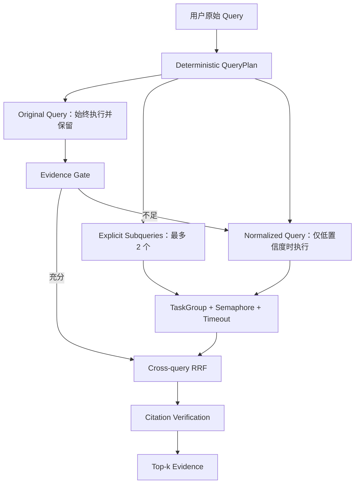

# ADR-009：有界 Query Planning 与跨查询证据融合

- **状态：** Accepted
- **日期：** 2026-08-15
- **范围：** RAG Query Rewrite、任务分解、查询漂移、延迟与成本控制

## 1. 决策背景

旧实现仅把原查询转换为小写、去标点并在结果不足时再次搜索，而且第二轮结果会覆盖第一轮结果。该实现存在四个工程风险：原始意图可能丢失、复合问题没有显式分解、第二轮可能发生 Query Drift、延迟指标按各轮相加而不是端到端 Wall Time。

## 2. 调研结论

本次只借鉴已验证的模式，不复制第三方实现：

| 来源 | 可复用模式 | 本项目决策 |
|---|---|---|
| [LangChain history-aware retriever](https://github.com/langchain-ai/langchain) | 无历史时直接检索；有历史时才进行上下文化 | Agent 已在同一 Function Calling 回合看到会话 Memory，因此不新增独立 LLM Rewrite Call；强化 Tool Schema，要求解析指代且保留约束 |
| [LlamaIndex SubQuestionQueryEngine](https://github.com/run-llama/llama_index/blob/main/llama-index-core/llama_index/core/query_engine/sub_question_query_engine.py) | 将明确的复合问题拆为 Sub-question，并异步执行 | 只拆分用户通过问号、分号或换行显式给出的子问题，最多两个附加 Query；Original 与 Sub-query 同批使用 `asyncio.TaskGroup` 并行 |
| [CRAG](https://arxiv.org/abs/2401.15884) | 先评估检索质量，再决定是否纠错 | 只有原查询证据低于确定性质量门时才执行 Normalized Fallback；检索分支失败不得删除原始证据 |
| [Rewrite-Retrieve-Read](https://arxiv.org/abs/2305.14283) | Rewrite 应面向 Retriever 优化 | V1 只做可解释的 Lexical Normalization，不引入未经 Benchmark 证明的 LLM Rewrite |
| [HyDE](https://arxiv.org/abs/2212.10496) / [Query2doc](https://arxiv.org/abs/2303.07678) | 生成假设文档或伪文档以增强召回 | 暂不进入默认路径；额外生成会增加延迟、Token 成本和事实漂移 |

[NirDiamant/RAG_Techniques](https://github.com/NirDiamant/RAG_Techniques) 只作为概念目录参考。其非商业许可证与本仓库 MIT 目标不兼容，因此禁止复制其代码。

## 3. 最终决策

### 不变量

1. Original Query 永远是第一个 Query，任何 Rewrite 不得替代或删除它。
2. 被引号包围的短语、版本、日期/数值/单位、缩写、连字符标识符和否定词是 Protected Anchors。
3. Deterministic Rewrite 若丢失 Protected Anchor，必须在执行前丢弃。
4. 只对引号外显式分隔的复合问题做分解，不用规则臆测用户隐含任务；引号内的问号和分号不得触发拆分。
5. 最多执行 1 个 Original Query 与 2 个附加 Query；附加 Query 并发数和单分支超时均受配置限制。
6. 查询结果使用 RRF 融合，不能用后一次搜索覆盖前一次搜索。
7. 分支 Timeout/Error 只降级该分支，保留已验证 Original Evidence，并输出结构化 Warning。
8. 明确复合问题的 Original 与 Sub-query 同批并行；普通问题先 Original、证据不足再 Fallback。`latency_ms` 表示端到端 Wall Time，而不是并行分支耗时之和。

## 4. 接口与所有权

- `query_planning.py`：拥有 QueryPlan、Protected Anchor、显式分解和 Lexical Normalization。
- `rag.py`：拥有 Evidence Gate、并发执行、跨查询 RRF、Timeout/Fallback 和 Citation Verification。
- `vector_store.py`：继续拥有单 Query 内的 Vector/Lexical/Metadata 检索与 RRF，不感知会话历史。
- `graph.py` / Tool Schema：拥有会话上下文补全；Tenant/ACL 仍由可信服务端注入，禁止模型生成。

本次不改变持久化格式，也不删除公开字段。新增环境变量均有默认值；旧部署无需迁移即可保持兼容。

## 5. 对抗式审阅

| 攻击/失败方式 | 防线 |
|---|---|
| Rewrite 删除 “not” 或版本号 | Protected Anchor 校验，失败 Variant 不执行 |
| 用户用长句诱导无限拆分 | 只识别引号外强分隔符，Plan 上限 3 个 Query |
| 引号短语中的问号/分号被误拆 | Quote-aware scanner 保留整个短语及其 Protected Anchor |
| 某附加 Query 卡死 | 单分支 `asyncio.timeout` + 有界 Semaphore |
| 第二轮结果覆盖原始证据 | 跨查询 RRF，以 Chunk ID 去重；Original 结果进入同一候选池 |
| 原查询已有好结果仍重复调用 | Evidence Gate 阻止 Normalized Fallback，控制延迟与调用成本 |
| LLM Rewrite 生成虚构实体 | 默认路径不调用 LLM Rewrite；Tool Schema 明确禁止添加事实 |

## 6. 复核触发条件

只有在沿用的 Benchmark 中加入 Multi-turn/Coreference、Semantic Gap 和 Query Drift 标注集，并证明 Recall/MRR 改善足以覆盖延迟与成本后，才评审 LLM Rewrite、HyDE 或 Query2doc Profile。仍不进行压力测试；只记录单请求阶段耗时。
