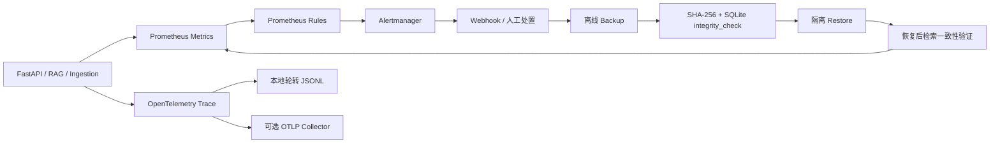

# ADR-010：Metrics、Trace、告警与备份恢复闭环

- 状态：Accepted
- 决策日期：2026-08-15
- 适用版本：AgentForge 0.3.x

## 背景

RAG 的可用性不仅取决于检索质量，还取决于能否发现异常、定位调用链、触发处置，并验证状态可以恢复。仅有日志无法形成稳定机器接口；只复制数据库文件也不能证明备份可用。

## 决策

1. **Metrics**：使用 `prometheus-client` 的独立 `CollectorRegistry`。标签只允许稳定的 route template、status、operation、outcome 和 degraded 状态，禁止 query、source_id、tenant_id、trace_id 等高基数字段。
2. **Trace**：使用 OpenTelemetry SDK；FastAPI 和 RAG 操作生成 Span。默认写入本地 JSONL，单文件 20 MiB、保留 5 个轮转文件；可选通过 OTLP/HTTP 输出。Span attributes 不包含问题、Prompt、文档正文和 Chunk 文本。
3. **告警**：Prometheus 负责规则计算，Alertmanager 负责聚合、重复抑制和路由。规则覆盖 target down、HTTP 5xx、degraded retrieval、ingestion failure/needs_review、backup absent/stale、restore verification failure 和 trace export failure。
4. **Backup**：SQLite 默认部署采用离线备份。服务持有跨进程 state lock；备份必须先停服务，随后通过 `sqlite3.Connection.backup()` 生成一致副本。
5. **验证与 Restore**：manifest 使用 Schema v1、Pydantic `extra=forbid`、文件 SHA-256、字节数和 SQLite `PRAGMA integrity_check`。默认恢复到隔离目录；仅显式 `--replace-existing` 才可替换目标，并保留失败回滚。
6. **Qdrant**：当前 CLI fail-closed，不伪装成完整备份。生产 Qdrant 必须先使用 collection snapshot，并在后续适配器中把 snapshot ID、校验和与 app-state manifest 绑定。
7. **接口兼容性**：`/metrics`、`/ready` 和配置项均为 additive change；没有删除既有公开接口或原地修改既有 SQLite Schema。Backup Manifest v1 是新持久化契约，未来变更必须执行 deprecation、migration window、deletion 三阶段。

## 第一性原理约束

- Metrics 用于聚合与告警，Trace 用于单次因果定位，Log/CLI exit code 用于离线操作审计，三者不互相代替。
- “备份完成”不等于“可恢复”；必须经过校验、隔离恢复和业务读路径验证。
- 告警必须有 owner、处置动作和恢复信号；没有处置路径的指标不进入默认告警集。
- 任何观测数据不得扩大租户数据泄露面。

## 对抗式审阅

| 攻击/故障 | 防护 | 剩余风险 |
|---|---|---|
| 将 query/source_id 放进 label 导致时序爆炸 | 固定低基数标签集 | 自定义后续指标仍需 code review |
| Trace 泄露文档正文 | content-free attributes + 自动检查 | 第三方自动 instrumentation 需单独审计 |
| 运行中复制 WAL 数据库 | state lock 强制离线 + SQLite Backup API | 需要短暂停机窗口 |
| 备份被篡改 | size/hash/integrity 三层校验 | 未签名 manifest 不能抵御同时篡改 manifest 和数据 |
| 恢复覆盖可用状态 | 隔离恢复默认值 + 显式 replace | 操作系统级磁盘故障仍依赖外部副本 |
| Qdrant 未被备份 | fail-closed | Qdrant snapshot 自动编排尚未实现 |
| 告警配置语法正确但行为错误 | `promtool test rules` | 未接真实通知渠道做端到端演练 |

## 依赖依据

- [OpenTelemetry Python exporters](https://opentelemetry.io/docs/languages/python/exporters/)
- [Prometheus alerting rules](https://prometheus.io/docs/prometheus/latest/configuration/alerting_rules/)
- [Prometheus rule unit testing](https://prometheus.io/docs/prometheus/latest/configuration/unit_testing_rules/)
- [Python sqlite3 backup API](https://docs.python.org/3/library/sqlite3.html#sqlite3.Connection.backup)
- [Qdrant snapshots](https://qdrant.tech/documentation/concepts/snapshots/)

## 备选方案

- 自研 Metrics/Trace 协议：拒绝，生态工具和维护成本不合理。
- 仅依赖日志：拒绝，缺少可聚合 SLI 和标准 Trace context。
- 服务运行时在线复制整个 state 目录：拒绝，无法证明 WAL 一致性。
- 默认开启远程 SaaS Observability：拒绝，违反 Local-first 与最小数据暴露。