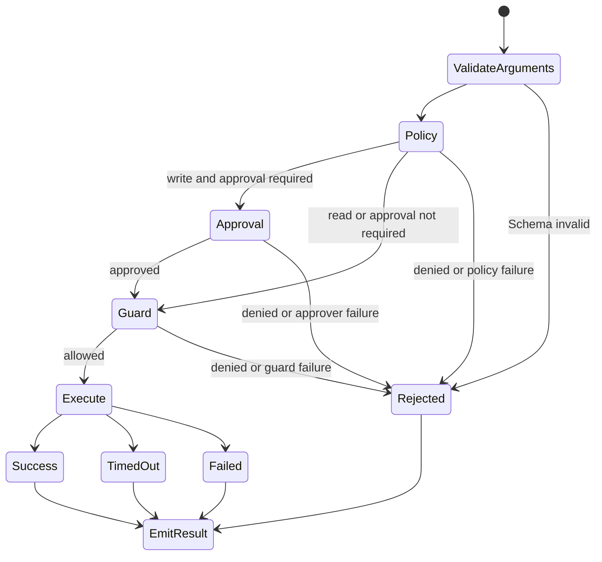

# ADR-011：借鉴 DeepSeek Harness 的运行时 Guardrail

- 状态：Accepted
- 日期：2026-08-16
- 范围：Tool Execution、Context Budget、Tool Result Artifact、Multi-Agent Capability

## 背景

DeepSeek Harness 官方仓库处于 Developer Preview，但其公开架构把 Tool Call 拆为可替换的预执行策略、审批、运行时 Guard、执行和后处理阶段，并把 Subagent 工具能力作为运行时约束而非 Prompt 建议。这些模式与 AgentForge 已有的 Tool Registry、DAG Executor、LangGraph 和 Pydantic 契约兼容，适合以低风险方式吸收。

参考资料：

- https://github.com/deepseek-ai/deepseek-harness
- https://github.com/deepseek-ai/deepseek-harness/blob/main/docs/architecture.md
- https://github.com/deepseek-ai/deepseek-harness/blob/main/docs/tool-execution-pipeline.md
- https://github.com/deepseek-ai/deepseek-harness/blob/main/docs/subsystems/subagent.md
- License：MIT

本项目不把 DeepSeek Harness 作为依赖，不复制其实现，仅采用可验证的架构模式。

## 决策

### 1. Tool Execution Pipeline

- `ToolPolicy`、`ToolApprover`、`ToolGuard` 是内部 Protocol，可替换但不泄漏到公开 API。
- 参数必须先通过严格 Pydantic 校验，之后才允许 Policy 查看标准化参数。
- Policy、Approval 和 Guard 的异常都转换为稳定错误码并 fail-closed。
- 只读分支可以并发；相同 resource key 的写操作继续由现有 Lock 串行化。
- Tool Event 不记录 arguments、正文或用户标识，避免高基数指标和敏感信息泄漏。

### 2. 写工具迁移策略

写工具行为属于用户可见行为，不能直接从允许改为拒绝：

1. **弃用阶段（当前 v0.3.x）**：默认 `allow`，启动时记录迁移告警；生产部署可显式设为 `deny`。
2. **迁移窗口**：审计所有写工具调用方，为需要写权限的入口增加可信 Approval Provider。
3. **删除阶段（后续 Major Version）**：默认改为 `deny`，移除隐式允许；发布日期必须另行记录，不在本 ADR 预设。

### 3. Context Budget 与 Artifact

- 模型上下文按完整 Turn 选择，leading system messages 永远保留。
- 最新完整 Turn 即使超过近似预算也不被截断，而是返回 `CONTEXT_OVER_BUDGET`，避免构造语义不完整历史。
- 大 Tool Result 使用 SHA-256 内容寻址和原子替换写入版本化 JSON Envelope；模型仅获得有界 Preview 和 `artifact://` Reference。
- Graph State 仍保留完整 `ToolResult`，因此本轮只解决模型输入膨胀，不宣称完全限制进程内存。

### 4. Subagent Capability

Child Capability 必须是 Parent Capability 的子集：

- `allowed_tools(child) subset allowed_tools(parent)`；
- Child 不能新增 write、network 或 spawn 权限；
- Child 的最大派生深度不能超过 Parent；
- Coordinator 拒绝超深上下文和 capability escalation。

实际 Worker 调用 Tool Executor 时必须显式传入 `context.tool_scope()`；仅在 Prompt 中描述权限不构成安全边界。

## 对抗式审阅

| 攻击或故障 | 代码层响应 | 剩余风险 |
|---|---|---|
| 模型选择未授权工具 | Capability Policy 在 Handler 前拒绝 | Root Agent 默认 Scope 仍允许注册工具 |
| Policy/Approver/Guard 抛异常 | 稳定错误码，fail-closed | 尚无远程策略服务熔断器 |
| Metrics Sink 故障 | fail-open，不中断 Tool | Sink 故障需由外部告警发现 |
| Tool 返回超大 JSON | 写 Artifact，模型只见 Preview | Graph State 仍持有完整结果 |
| 旧历史被截断后 Tool 链断裂 | 按完整 Turn 裁剪 | 近似 Token 不是模型官方 tokenizer |
| Child 请求更高权限 | Coordinator 拒绝 | Worker 必须正确传 Scope |
| Artifact 半写入 | 临时文件加原子替换 | 当前没有 TTL、Quota 和恢复清单 |
| 最新 Turn 本身超预算 | 保留并发出 Warning | 尚未实现确定性 Compaction/Summarization |

## 未采用方案

- **直接引入 DeepSeek Harness**：Developer Preview 且会与现有 LangGraph Runtime 重叠，收益不足以覆盖迁移成本。
- **复制完整代码**：不需要，现有边界可用少量本地实现承载相同模式。
- **立即默认拒绝所有写工具**：违反公开行为迁移约束。
- **用 Prompt 约束 Subagent 权限**：不能构成可执行安全边界。
- **引入新 tokenizer 包**：当前只需有界保护；增加依赖前应先明确支持的模型族和误差预算。

## 验证要求

- Tool Policy 和 Approval 必须证明在 Handler 前生效。
- Policy 故障必须 fail-closed；Telemetry 故障必须 fail-open。
- Spill Artifact 必须验证 hash、Schema Version 和 Preview 上限。
- Context Trim 必须保留最新完整 Tool Sequence。
- Subagent Capability Escalation 必须被拒绝。
- pytest、Ruff、mypy 和 Markdown Validator 全部通过后才可提交。
