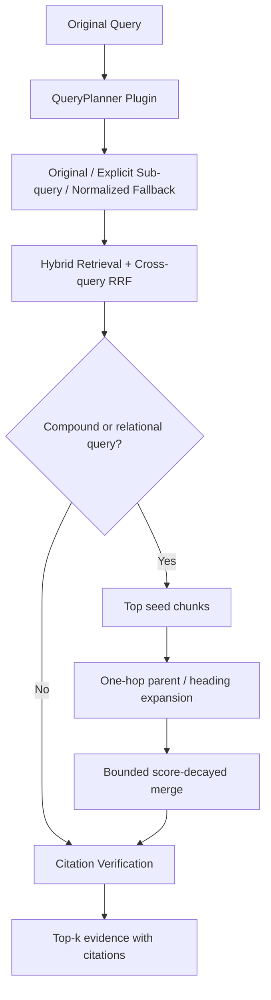

# ADR-014：可插拔 Query Planner 与有界结构图检索

- **状态：** Accepted
- **日期：** 2026-08-18
- **范围：** Query Rewrite、Graph-aware Retrieval、插件边界、延迟与漂移控制

## 1. 背景

项目已经具备 Original Query、显式 Sub-query、低置信度 Normalized Fallback、Hybrid Retrieval、RRF 与 Citation Verification，但 Query Planning 仍由 RAGService 直接调用函数，检索也没有利用 Parent-Child Chunk 已保存的 `parent_id`、`heading_path` 和结构顺序。复杂关系问题只能命中单个 Chunk，无法受控补充同章节的桥接证据。

完整 Microsoft GraphRAG 会增加实体/关系抽取、社区检测、社区报告、Local Search 与 Global Search 等索引和查询阶段。该路线适合跨文档全局主题总结与多跳实体推理，但会引入额外模型调用、图持久化契约、增量更新和重新评测成本，不符合本次“最小修复”边界。

## 2. 调研与取舍

| 来源 | 已验证模式 | 本项目决策 |
|---|---|---|
| [Microsoft GraphRAG](https://microsoft.github.io/graphrag/) | Local Search 将实体、关系、社区报告与原始文本结合；Global Search 面向数据集级问题 | 借鉴“先路由、再扩展关系证据”的模式；暂不复制完整实体抽取、社区检测和图数据库链路 |
| [Microsoft GraphRAG repository](https://github.com/microsoft/graphrag) | 图索引和查询是独立、可配置的工作流 | 保留 `GraphRetriever` 插件协议，使完整 GraphRAG 后端未来可以独立替换 |
| [LangGraph Agentic RAG](https://docs.langchain.com/oss/python/langgraph/agentic-rag) | 检索质量不足时重写问题并重新检索 | 保留现有 Evidence Gate 和最多两次附加 Query，不增加无界反思循环 |
| [Rewrite-Retrieve-Read](https://arxiv.org/abs/2305.14283) | Rewrite 应面向 Retriever 优化 | 默认继续使用确定性 Normalization；通过 `QueryPlanner` 协议允许未来接入经过 Benchmark 的模型 Rewrite |
| 现有 Pydantic / asyncio / SQLite FTS5 | 类型契约、有界超时、已有 Chunk 结构元数据 | 复用现有依赖，不新增 Graph DB、LangChain 或图算法包 |

## 3. 决策

### 3.1 Query Planner 插件边界

新增 `QueryPlanner` Protocol。默认实现 `DeterministicQueryPlanner` 保持现有行为：

1. Original Query 永不被替换；
2. 只拆分用户显式分隔的子问题；
3. 保护版本、数字/单位、引用短语、缩写、标识符和否定约束；
4. 证据不足时才执行 Normalized Fallback；
5. Variant 总数和并发数继续受限。

未来模型型 Planner 必须实现同一 `QueryPlan` 契约，并先通过 Query Drift、延迟和成本 Benchmark；不得直接把自由文本 Rewrite 接入生产路径。

### 3.2 GraphRAG-lite：单跳结构图扩展

新增 `GraphRetriever` Protocol，默认 `StoreBackedStructuralGraphRetriever` 只对显式复合问题或关系型问题触发。SQLite Adapter 将已有 Chunk 元数据解释为结构图：

- Node：Active Version 中的 Child Chunk；
- Strong Edge：相同 `parent_id`；
- Fallback Edge：相同非空 `heading_path`；
- Edge Order：`section:*:chunk:N` 或 Location Reading Order；
- Traversal：最多一跳；
- Seed：默认最多 3 个；
- 每个 Seed 邻居：默认最多 2 个；
- 总邻居：默认最多 6 个；
- Graph Branch Timeout：默认 3 秒。

图邻居分数带衰减且不得超过对应直接命中分数的 95%，避免“结构相邻”取代“语义直接相关”。Tenant、ACL、Source 和 Active Version Filter 在邻居生成前应用；Citation 再经过现有 Active Version 与 Quote Verification。

## 4. 接口与持久化影响

- 新增内部插件协议：`QueryPlanner`、`GraphRetriever`、`StructuralGraphStore`。
- `RAGService` 构造参数均为 additive keyword-only configuration，旧调用方无需迁移。
- 不修改公开 Retrieval Request/Response Schema。
- 不新建图数据库，不修改现有 SQLite 表结构；图关系来自已有 `metadata_json`。
- Qdrant 当前未实现结构邻居能力；关系型 Query 会返回 `graph_expansion:unsupported_backend` Warning，但仍保留直接检索结果。

## 5. 对抗式审阅

| 风险 | 防线 |
|---|---|
| 简单事实查询被无条件增加图延迟 | 确定性 Router 仅匹配显式 Sub-query 或关系词 |
| 图遍历进入死循环 | 当前只允许一跳，无递归队列 |
| 同 Parent 产生大规模 Fan-out | Seed、每 Seed 邻居、总邻居和 Timeout 四重上限 |
| 相邻 Chunk 相关性低却压过直接证据 | Graph Score 衰减并封顶为 Seed Score 的 95% |
| 旧版本或其他租户 Chunk 被扩展 | 邻居查询复用 Tenant、ACL、Source、Active Version Filter |
| Graph Adapter 失败拖垮主检索 | Graph Branch 独立 Timeout/Exception 降级，直接证据不丢失 |
| 模型 Rewrite 删除否定词或数值 | 默认仍为确定性 Planner；未来模型插件必须满足 Protected Anchor Contract |
| 把当前能力包装成完整 GraphRAG | 文档明确命名为 GraphRAG-lite / Structural Graph Retrieval，不宣称实体图、社区检测或 Global Search |

## 6. 未采用项与触发条件

以下能力不在本次最小修复中：

- LLM 实体/关系抽取；
- Community Detection 与 Community Summary；
- Graph Database；
- Self-RAG Critic 循环；
- HyDE / Query2doc；
- 多模态统一 Embedding。

只有当失败 Case 明确显示“跨文档实体关系或全局主题总结”是主要瓶颈，且离线 Benchmark 证明收益覆盖索引成本、延迟和更新复杂度时，才进入完整 GraphRAG PoC。
