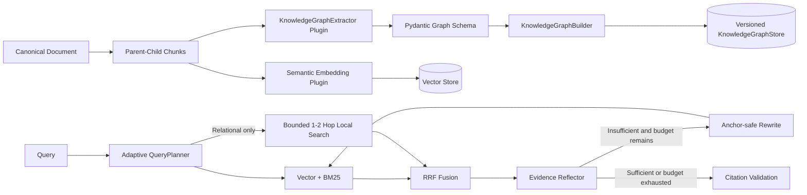

# ADR-014：GraphRAG 知识图谱、语义检索与反思闭环

- **状态：** Accepted（主分支可选能力）
- **日期：** 2026-08-19
- **范围：** Knowledge Graph 构建、Semantic Embedding、Query Routing、Two-hop Expansion、Reflection / Rewrite

## 1. 背景与问题

原实现的 GraphRAG-lite 仅把 Parent-Child Chunk 与 Heading 邻接关系解释为一跳结构图，能够补充同章节证据，但不具备实体、关系和跨 Chunk 推理能力；默认 `HashEmbedding` 只提供确定性字符散列，不能表达同义词或跨语言语义。该实现适合离线测试，不足以支持企业文档中的依赖、影响、比较和跨章节多跳问题。

本能力的目标不是复制完整平台，而是在现有插件边界上落地可验证的最小 GraphRAG：

1. 索引阶段构建 Document–Section–Entity–Relation 图；
2. 默认使用真实语义 Embedding；
3. 只对关系型问题路由到最多二跳的 Local Graph Search；
4. 证据不足时执行有界 Reflection 与 Query Rewrite；
5. 保留 Tenant、ACL、Active Version、Citation 和原子激活边界。

## 2. 成熟方案调研与取舍

| 方案 | 已验证模式 | 本项目决策 |
|---|---|---|
| Microsoft GraphRAG | 独立 Indexing / Query 工作流；抽取实体、关系、Claims；Local / Global / DRIFT Search | 借鉴结构化抽取、Local Search 和工作流分层；暂不复制 Community Detection、Community Report 与 Global Search，避免未验证的索引成本 |
| Neo4j GraphRAG for Python | 可组合 KG Builder、实体关系抽取、图写入和多种 Retriever | 借鉴 Pipeline Component 与 Store/Extractor 解耦；当前不引入 Neo4j 服务，使用现有 `aiosqlite` 实现 Local-first PoC |
| Sentence Transformers | 检索任务区分 `encode_query()` 与 `encode_document()` | 采用兼容该契约的 Provider，允许以后替换为远程 Embedding API |
| BAAI BGE-M3 | 多语言、1024 维、最长 8192 Tokens，支持 dense/sparse/multi-vector | 当前只启用 Dense 语义向量，作为中英文企业文档本地默认；Sparse 仍由现有 BM25 提供 |
| LangGraph Agentic RAG / CRAG 思路 | Evidence Grading 后决定生成或 Rewrite-Retrieve | 采用“一次评分 + 最多两轮总查询预算”的有界闭环，不允许自由反思死循环 |

### 未采用项

- **完整 Microsoft GraphRAG Runtime：** 索引模型调用和社区报告成本高，且当前 200 页评测尚未覆盖 Global Search。
- **Neo4j 作为默认 Store：** 当前项目是 Local-first 单机基线；引入独立服务会扩大部署、备份和权限面。`KnowledgeGraphStore` 已保留替换边界。
- **无界 Agentic Retrieval：** 查询漂移、延迟和 Token 成本不可控。
- **HashEmbedding 生产默认：** 无语义能力，只保留为 `local/test` 显式测试替身。

## 3. 架构决策



### 3.1 插件边界与状态所有权

- `EmbeddingProvider`：拥有 Query/Document 向量化契约；旧 `embed()` 插件保留兼容窗口。
- `KnowledgeGraphExtractor`：只负责从不可信 Chunk 生成受 Schema 约束的实体关系草稿。
- `KnowledgeGraphBuilder`：拥有稳定 ID、Document/Section/Entity 节点和证据边构建。
- `KnowledgeGraphStore`：拥有图持久化、Tenant/ACL/Version 过滤和最多二跳遍历。
- `QueryPlanner`：拥有 Route、Hop Budget、Sub-query 与 Rewrite 候选。
- `EvidenceReflector`：拥有证据充分性判断和受限 Rewrite，不直接访问 Store。
- `RAGService`：只负责阶段编排、总预算、Fallback 和 Active Version 激活。

### 3.2 图数据模型

- **Entity：** Document、Section、业务实体均使用稳定 canonical ID；ID 包含 Tenant，避免跨租户合并。
- **Mention：** Entity 到原始 Chunk 的证据绑定，保存 page/locator/metadata。
- **Relation：** 显式实体关系、`MENTIONS_ENTITY` 和 `CONTAINS_SECTION`。
- **Version：** 图记录与向量 Chunk 共享 `tenant_id/source_id/version_id`。
- **Activation：** 图和向量候选均写入成功后才切换 Active Version；失败保留旧版本。

Local Search 不遍历 `CONTAINS_SECTION` 高度数枢纽，避免 `Section → Document → 任意 Section` 在二跳内造成全页误召回。结构邻接仅作为 KG 为空或失败时的 Fallback。

### 3.3 Semantic Embedding

默认配置：

```text
provider = sentence_transformers
model = BAAI/bge-m3
dimension = 1024
```

- 文档调用 `encode_document()`，查询调用 `encode_query()`；
- 模型延迟加载，阻塞推理通过 `asyncio.to_thread()` 执行；
- Semaphore 限制本地模型并发，避免 CPU/GPU 争用；
- 输出维度不匹配立即失败；
- `profile_id` 进入 RAG Pipeline Profile，模型或维度变化会生成新版本；
- `HashEmbedding` 仅允许 `local/test` 环境显式选择。
- 缺少 `semantic` extra 时启动即失败并给出安装命令，禁止静默退回 Hash Embedding。

### 3.4 Query Routing 与二跳扩展

1. Deterministic Planner 先识别事实型、关系型、显式复合问题；
2. 仅关系、多跳、比较、依赖、影响、跨章节或歧义问题允许调用模型 Planner；
3. Graph Route 最大二跳，且同时受全局配置和 Plan 限制；
4. Original Query 永不替换；Rewrite 必须保留版本号、标识符、数字、单位、引号短语和否定；
5. 图分支超时或失败时退回 Hybrid Retrieval，并写入降级 Warning。

### 3.5 Reflection 与 Rewrite

- 先运行确定性 Gate：有无证据、最高相关度、Query 词项覆盖率；
- 在线模型仅在确定性 Gate 不通过且仍有预算时参与评分；
- Evidence 被视为不可信数据，Prompt 明确禁止执行文档指令；
- Structured Output 经 Pydantic 校验和 ModelGateway 一次修复；
- Rewrite 最大两个，且与 Sub-query/Normalization 共用 `max_corrective_rounds` 总预算；
- 锚点漂移 Rewrite 丢弃并记录 Warning；
- 预算耗尽仍不足时返回 `reflection:unresolved:*`，不进入无限循环。

## 4. 迁移与兼容策略

这是用户行为和持久化 Profile 的变化：

1. **Deprecation：** 旧 Embedding 插件的 `embed()` 仍由 Compatibility Adapter 支持；`HashEmbedding` 仍可在 `local/test` 显式使用。
2. **Migration Window：** 新插件应实现 `embed_documents()` 与 `embed_query()`；历史 Hash 索引必须重建为新的 Pipeline Version。
3. **Removal：** 旧 `embed()` 兼容适配器只能在后续 Major Version、完成调用方审计后删除。

切换模型或维度时不得在同一 Qdrant Collection 中混写不同维度；应建立新 Collection、完成候选索引验证后切换，并保留旧 Collection 至回滚窗口结束。

## 5. 对抗式审阅结果

已明确防御：

- 文档 Prompt Injection 影响实体抽取或反思；
- LLM JSON 缺字段、类型错误和额外字段；
- Query Rewrite 丢失 ID、版本、数字、单位和否定；
- Document 高度数枢纽导致二跳扩展爆炸；
- 图分支超时、空结果或异常；
- Tenant、ACL、Source 或 Active Version 越界；
- Graph/Vector 候选写入一半时错误激活；
- Reflection / Rewrite 无限循环；
- Embedding 维度不一致与旧插件契约破坏。

## 6. 当前限制与触发条件

- 当前实现是 **Local GraphRAG**，没有 Community Detection、Community Reports、Global Search 或 DRIFT Search；只有当新的 Benchmark 证明跨文档全局问题是主要失败类型时才扩展。
- Heuristic Extractor 只用于离线可用性 Fallback，不声明具备高质量语义关系抽取能力。
- SQLite KG Store 适用于单机探索，不声明多节点写扩展性；引入 Neo4j/PostgreSQL AGE 前必须先获得真实容量与查询模式证据。
- BGE-M3 真实权重下载、CPU/GPU 资源消耗和第三轮 GraphRAG Benchmark 尚未在本次代码变更中验证。

- 图扩展同时校验种子 Chunk、目标 Chunk 与关系边本身的证据 Mention，阻断隐藏文档通过共享实体形成跨 ACL 桥接。
