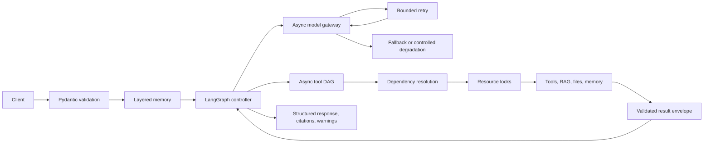
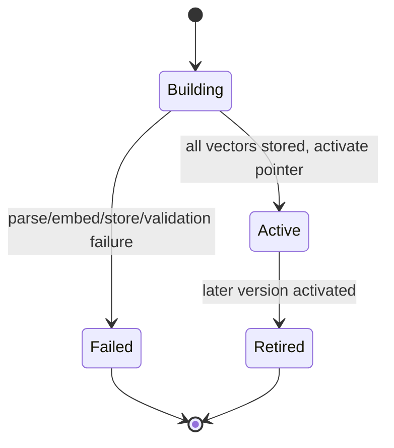
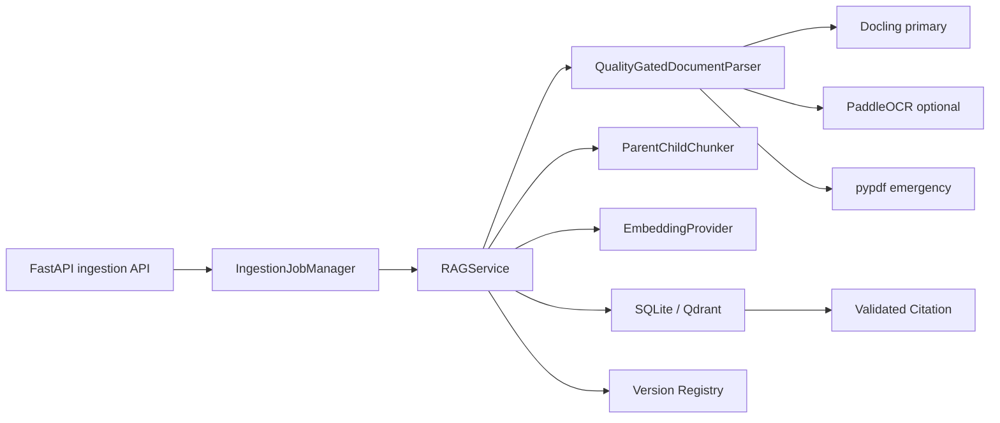
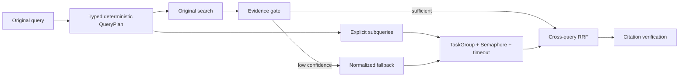
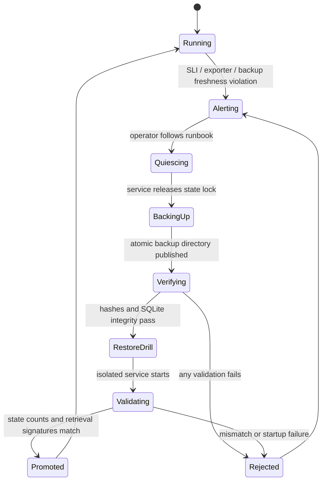
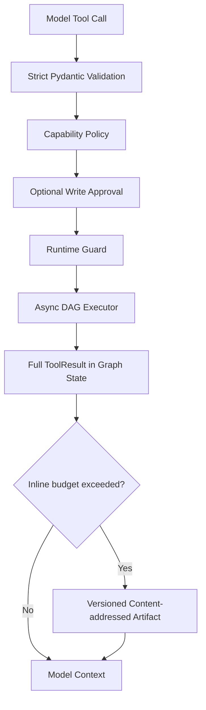

# AgentForge Architecture and Operating Model

## 1. Scope and architectural principles

AgentForge is an asynchronous, schema-first agent service. Its maintained implementation lives under `src/agent_service/`; `main.py` is the supported backend entry point.

The architecture follows these rules:

1. State has one explicit owner.
2. Public contracts are strict, additive during a migration window, and removed only in a breaking release.
3. Failures are classified before retry; permanent errors are not retried blindly.
4. Independent work may run concurrently, but dependency and mutation conflicts are explicit.
5. Model output is untrusted input and must pass Pydantic validation before application logic consumes it.
6. RAG correctness and evidence identity precede ranking sophistication.
7. Heavy integrations stay behind typed adapters and optional dependency groups.

## 2. System boundaries and state ownership

| State | Owner | Persistence | Isolation key |
|---|---|---|---|
| Current turn, plan, tool calls, loop counters | LangGraph state | Request lifetime; no Checkpointer | Request/session |
| Recent conversation and rolling summary | Short-term memory store | SQLite WAL | Session |
| Durable semantic facts | Long-term memory store | Vectorized SQLite baseline | User namespace |
| Document chunks | Vector-store adapter | SQLite or Qdrant | Source and document version |
| Active document version | Version registry | SQLite WAL | Logical `source_id` |
| Tool dependency graph and resource locks | Tool executor | Request lifetime | Tool call/resource key |
| Write-call idempotency reservation and result replay | Tool idempotency store | SQLite in service; process-local only for embedded callers | Tool name/idempotency key |
| Model route attempts | Model gateway | Request lifetime | Request and route |

The graph carries typed IDs and compressed results. It does not duplicate entire documents, raw multi-agent traces, or uncontrolled conversation history. The current graph is compiled without a LangGraph Checkpointer: it is not crash-resumable and SQLite does not persist graph checkpoints. Durable ingestion jobs are owned by `ingestion_jobs.py` as a separate state machine.

## 3. Request flow

## 4. Retry, fallback, and human handoff

The recovery chain is deliberately ordered:

1. Validate request and tool arguments.
2. Execute the selected route or tool once.
3. Retry only transient timeout, rate-limit, or server failures with bounded exponential backoff; write Tools are excluded after dispatch unless the ledger has a completed replayable result.
4. Revalidate every returned structure.
5. Try an explicitly configured compatible fallback route when the current route is exhausted.
6. Skip downstream tool calls whose dependencies failed.
7. Use a safe local fallback only when its semantics are explicit.
8. Return structured degradation or request human handoff when automation cannot remain trustworthy.

Schema errors, permission errors, invalid paths, unsupported operations, and embedding-dimension mismatches are permanent for the current input and are not solved by blind retry.

Write Tools have a stricter boundary: a missing idempotency key is rejected before approval, completed results are replayed from the ledger, and timeout/exception outcomes are marked indeterminate with `retryable=false`. The local ledger prevents duplicate handler dispatch for the same completed key but does not establish cross-system exactly-once semantics.

## 5. Function calling contracts

### 5.1 Tool descriptions

A tool description states:

- what the tool does;
- when the model should use it;
- when it must not use it;
- side effects and security boundaries;
- argument semantics and units;
- successful result shape;
- typed failure behavior.

Selection boundaries are more useful than marketing-style descriptions. For example, a file reader should say that it reads only files under the configured workspace and must not be selected for URLs or mutation.

### 5.2 Schema granularity

Pydantic schemas define concrete field types, bounds, defaults, enums, formats, and descriptions. Unknown fields are rejected with `extra="forbid"`. Nested objects are modeled explicitly rather than accepted as untyped dictionaries when application logic depends on their shape.

The code validates:

- model-produced tool calls;
- tool input arguments;
- repaired structured model output;
- API requests and responses;
- evaluation JSONL records.

A malformed model response is extracted, validated, repaired once within a bounded path, and validated again. If the contract still fails, the application returns a typed error or degradation instead of passing partial data downstream.

## 6. Asynchronous tool orchestration

Tools declare `depends_on` relationships. The executor builds a directed acyclic graph, resolves `$ref` references to upstream results, rejects cycles, and schedules only ready nodes.

Concurrency rules:

- independent read-only tools may overlap;
- a semaphore limits concurrent tool execution;
- failed dependencies cause downstream calls to be skipped;
- resource keys serialize conflicting mutations;
- timeouts and cancellation are bounded;
- tool results return a common status/data/summary/citation/error/latency envelope.

This preserves asynchronous execution without confusing concurrency with correctness.

## 7. Multi-agent collaboration

Workers receive isolated context and memory namespaces. They do not share mutable scratch state or raw chain-of-thought. Each worker returns a compressed typed result containing:

- summary;
- facts;
- citations;
- artifacts;
- warnings;
- status.

The coordinator merges these outputs under a bounded context budget. This reduces context contamination and makes worker results auditable.

## 8. Memory model

| Layer | Purpose | Retention behavior |
|---|---|---|
| Turn state | Current control-flow state and stop conditions | Ends with the request; no durable graph checkpoint |
| Short-term memory | Recent messages plus rolling summary | Bounded by message and character budgets |
| Long-term memory | Durable user-scoped semantic facts | Namespace isolated; validity, supersession, deletion, and embedding-profile aware |
| Knowledge memory | Versioned source documents and citations | Controlled by RAG version lifecycle |

Short-term memory stores a bounded recent window and compacts older context into a rolling summary. Long-term memory is keyed by user namespace and uses schema-v2 validity windows, `memory_key` supersession, namespace-scoped deletion, embedding-profile refresh, and a deterministic semantic/lexical/importance/recency score. Recall abstains below a configured threshold. Production legal hold, export, consent, authentication, and PII policies remain required before handling sensitive data.

## 9. Loop prevention

The graph enforces:

- maximum agent steps;
- maximum repeated tool-call signatures;
- tool timeout;
- dependency cycle rejection;
- explicit degradation or handoff when progress stops.

Loop counters live in graph state, not prompts, so the stop condition cannot be ignored by a model.

## 10. RAG document processing

### 10.1 Parser routing

The built-in parser supports text, Markdown, CSV, TSV, and text-layer PDFs. It preserves headings, paragraphs, pages, locators, and table rows as semantic blocks. A PDF with pages but insufficient extracted text is flagged as a suspected scan and requests the optional Docling OCR/layout path.

Docling remains optional because production OCR and complex-table quality have not yet been verified on a representative corpus.

### 10.2 Chunking

The current chunker splits first on semantic document boundaries and then applies character-budget and overlap fallbacks. It avoids arbitrary fixed windows as the primary strategy, but it is not yet tokenizer-aware and does not preserve full Docling layout objects.

Future chunking profiles must be compared on one versioned labeled corpus. Chunk size is not selected from a universal benchmark claim.

### 10.3 Embeddings

The offline baseline uses deterministic hash embeddings for reproducible tests, not for production semantic-quality claims. The provider-backed path uses an OpenAI-compatible async embedding API.

Each embedding provider exposes an immutable profile containing provider/model and dimension. Returned vector count and dimensions are validated before persistence. A fallback model with different semantics or dimensions may not silently write into the same vector field.

### 10.4 Vector stores

SQLite exact cosine plus FTS5/BM25 is the zero-service Local-first evaluation backend. Qdrant is the optional indexed backend for HNSW and metadata filtering. Both implement the same typed adapter and active-version visibility contract, but the current Qdrant adapter remains dense-first and does not yet provide the SQLite sparse-retrieval behavior.

No remote-Qdrant scale or production index-tuning claim is made.

## 11. RAG version lifecycle

A trustworthy answer must refer to a known immutable evidence version. AgentForge therefore separates chunk storage from visibility state.

A deterministic version ID is derived from:

- logical source ID;
- file SHA-256;
- parser profile and relevant package versions;
- chunker configuration;
- embedding profile and dimension.

The service hashes the file, parses it, and hashes it again. If the source changes during ingestion, the build is rejected before version registration.

Identical content and pipeline profiles return an idempotent success without repeating parsing, embedding, or vector writes. Active-version switching is atomic only inside the registry transaction: candidate vectors are prepared first and one pointer is switched after validation. This is not a distributed transaction across SQLite, Qdrant, or external stores; a crash may leave invisible orphan chunks while the previous active version remains readable.

## 12. Visibility and failure safety

The version registry owns one active pointer per `(tenant_id, source_id)`. Retrieval reads the tenant-scoped active snapshot, removes ACL-ineligible versions, and asks the vector-store adapter to expose only those authorized versions.

This is a read-copy-update pattern:

1. readers continue using the old active version;
2. a candidate is parsed, chunked, embedded, and stored under a new immutable version;
3. activation occurs only after vector persistence succeeds;
4. one SQLite transaction retires the old pointer and activates the new pointer;
5. failed or interrupted candidates remain invisible.

SQLite and Qdrant cannot share a physical transaction with the registry. Logical correctness comes from visibility filtering. A crash after vector upsert and before activation can leave invisible orphan rows, but it cannot erase or replace the active evidence.

## 13. Ingestion concurrency

A process-local `asyncio.Lock` is keyed by `(tenant_id, source_id)`:

- two revisions of one source are serialized;
- unrelated sources may overlap asynchronously;
- retrieval continues against the active version while a candidate builds.

This prevents activation races in one service process. Multi-process or multi-host writers require a single ingestion writer until a distributed lease or durable job queue is implemented.

## 14. Retrieval and citation policy

The current baseline:

1. obtains the tenant-scoped active-version snapshot;
2. removes active versions whose non-empty ACL has no intersection with caller principals;
3. applies tenant, ACL, source, version, and legacy-visibility filters in the storage adapter before candidate scoring;
4. generates vector, FTS5/BM25 lexical, and metadata scores;
5. applies embedding-profile-aware fusion, excluding non-semantic Hash dense ranks;
6. diversifies results across sources/pages before filling duplicate-page chunks;
7. returns structured citations and `index_versions`.

The default reranker is not a learned cross-encoder. The 2026-08-16 200-page OHR-Bench run validates the SQLite FTS5/BM25 profile on the frozen fixture; sparse Qdrant retrieval, LLM-based query rewriting, HyDE, graph retrieval, late interaction, and learned reranking remain optional profiles until a labeled deployment corpus proves a gain.

Generated answers must not cite arbitrary free-form identifiers. Citation integrity requires retrieval-produced source/chunk identities. Claim-level citation verification is a planned hardening phase, not yet complete.

## 15. Evaluation contract

`eval/golden_queries.example.jsonl` demonstrates a strict Pydantic-validated record shape. `scripts/evaluate_rag.py` can validate queries and compute source Recall@k, MRR, nDCG, and empty-result rate from ranked source results.

The example file contains only contract examples. It is not representative enough to set release thresholds or claim quality improvements.

No pressure testing is performed. Ordinary tests may verify asynchronous overlap and report local stage durations, but they do not establish throughput, saturation, percentile latency, or production capacity.

## 16. Security boundaries

Implemented boundaries include strict schemas, workspace-root path validation, namespaced memory, active-version filters, tenant-scoped source identity, and document ACL filtering.

Authorization rules:

- source identity is `(tenant_id, source_id)`, so tenants may safely reuse a logical source ID;
- an empty ACL means tenant-wide visibility;
- a non-empty ACL requires intersection with caller principals;
- unauthorized rows are filtered in SQLite SQL before vector JSON is decoded and in the Qdrant query filter before vector candidates are returned;
- unauthorized active versions are omitted from both hits and `index_versions`;
- legacy rows without tenant metadata are visible only to the `public` tenant during migration.

This is not an authentication implementation. The API's `tenant_id` and `principals` fields represent trusted authorization context that a production gateway or identity middleware must supply. The model-facing knowledge-search tool is intentionally fixed to the public tenant; the model cannot select a tenant or principal set.

Production RAG still requires:

- authentication middleware and trusted identity-to-tenant/principal mapping;
- MIME/content validation and file/page/decompression limits;
- prompt-injection fixtures treating retrieved instructions as untrusted data;
- deletion semantics covering registry, vectors, caches, traces, and artifacts;
- redacted structured logs and secret-safe exceptions.

## 17. Compatibility and migration

Public API changes are additive. Ingestion requests add defaulted `tenant_id` and `acl`; retrieval requests add defaulted `tenant_id` and `principals`. Ingestion responses add `version_id`, `content_sha256`, and `idempotent`; retrieval responses add `index_versions`. Omitted request fields preserve the legacy public-tenant behavior.

The SQLite chunk table receives additive `version_id`, `tenant_id`, and `acl_json` columns. The registry adds composite-key `rag_source_scopes` and `rag_document_versions_v2`; the latter has a composite foreign key to the scope table. Legacy `rag_sources` and `rag_document_versions` remain intact during the 0.x migration window. Initialization copies and reconciles legacy public state into v2, while new public writes are dual-written for rollback compatibility. Existing unversioned chunks remain visible until a source has an active registry version. Recording a `building` candidate does not hide legacy evidence. Successful activation switches visibility to the versioned representation and hides legacy rows for that source without deleting them.

Removal of unversioned compatibility is reserved for a future breaking release after a documented migration window and audit. See `docs/rag-versioning-migration.md`.

## 18. Deferred engineering work

1. Multi-process worker leases and distributed write coordination; v0.3 jobs are durable within the local SQLite/single-service deployment boundary.
2. Orphan/retired-version retention and garbage collection.
3. Authentication middleware and trusted identity propagation into API and graph/tool execution.
4. Representative parser fixtures and production OCR/table verification, including true page-selective OCR replacement.
5. Learned or provider-backed reranking; v0.3 uses deterministic reranking after Vector/Lexical/Metadata RRF.
6. Claim-level evidence sufficiency and natural-language abstention policy; v0.3 validates citation identity and exact quote membership.
7. A versioned representative golden dataset and release thresholds.
8. Remote Qdrant and provider-backed integration verification.

Architectural rationale and rejected alternatives are recorded in `docs/adr-006-rag-correctness-first.md`.

## 19. Quality-gated document RAG implementation (v0.3)

### Canonical ownership

- `document_models.py` owns parser-neutral blocks, assets, attempts, quality reports, locations, and parent-child chunks.
- `document_pipeline.py` owns parser adapters, deterministic quality routing, repeating page-artifact classification, and token-aware chunking.
- `ingestion_jobs.py` owns durable asynchronous job state and restart recovery.
- `query_planning.py` owns deterministic query normalization, explicit decomposition, and protected-anchor drift checks.
- `rag.py` owns content identity, immutable candidate versions, embedding/index stages, active-version validation, evidence gating, bounded query execution, and cross-query RRF.
- `vector_store.py` owns authorization-filtered Vector/FTS5-BM25/Metadata scoring, embedding-profile-aware fusion, source/page diversification, FTS fallback warnings, and code-generated citations.

### Dependency graph

The parser returns exactly one authoritative `ParsedDocument`; downstream modules never merge competing parser bodies. Job state, index state, and active-version state remain separately owned.

### Query planning and retrieval correction

The original query is authoritative and is never replaced. Only explicit `?`, `;`, or newline boundaries outside quoted phrases create subqueries. Versions, numbers/units, quoted phrases, acronyms, identifiers, and negation are protected anchors. Normalized fallback runs only when the original evidence gate is not satisfied. For explicit compound questions, the original query and subqueries run concurrently; ordinary questions run the original first and trigger normalized fallback only when the evidence gate fails. All branches use bounded fan-out and per-branch timeout, and failures retain any verified evidence. End-to-end `latency_ms` is wall-clock latency, not the sum of parallel branch durations.

### Bounded failure policy

| Boundary | Maximum | Terminal behavior |
|---|---:|---|
| Parser attempts | 3/document | `needs_review` |
| OCR route | disabled by default | no silent OCR claim |
| Query plan | 1 original + at most 2 additional queries | preserve original intent and protected anchors |
| Query branch | configured timeout, default 10 s | keep verified branches and mark degraded retrieval |
| Query concurrency | configured, default 2 | bounded `TaskGroup` execution; no unbounded fan-out |
| Structured model repair | 1 repair after initial response | reject invalid output |
| Agent steps | configured, default 8 | handoff/degraded response |
| Repeated tool signature | configured, default 2 | stop loop |

### Verification boundary

The local suite validates routing, attempt bounds, table/header chunking, strict location schemas, asynchronous job completion, deprecation headers, immutable activation, and tenant/ACL filtering. It does not validate Docling/PaddleOCR extraction quality on a representative production corpus and does not perform load testing.

## Operations observability and recovery ownership

State ownership is explicit:

- `Observability` owns the per-process Prometheus registry, TracerProvider and exporters.
- `Services` owns the state-directory lock while the application is live.
- `BackupManager` owns manifest creation, verification and isolated restore; it never activates an index version through the RAG service.
- Deployment owns Prometheus retention, Alertmanager receivers, off-host backup copies, RTO/RPO and promotion of a restored directory.
- Metric labels are bounded operational dimensions; tenant, query, source, user and trace identifiers remain in neither labels nor content-free span attributes.

The default SQLite path has an executable closure. The Qdrant path deliberately fails closed until collection snapshots are bound to the application manifest. See `docs/adr-010-observability-backup-recovery.md` and `docs/operations.md`.

## Runtime guardrails and bounded model context

State ownership is separated:

- `AsyncToolExecutor` owns execution ordering, resource locks, timeout, gate sequencing and normalized `ToolResult`.
- `ToolExecutionScope` owns runtime capabilities for one agent invocation; it is immutable and passed explicitly.
- `ContextBudgetManager` owns model-input selection but never mutates durable conversation memory.
- `ToolResultSpillStore` owns ephemeral content-addressed artifacts under the state directory; it does not own durable backup policy.
- `AgentGraph` owns warnings and the distinction between full internal state and bounded model-visible context.
- `Observability` owns bounded-cardinality counters; telemetry failures cannot change Tool execution outcomes.

The artifact envelope is schema-versioned from its first release. It is deliberately excluded from the current SQLite backup contract because no artifact restore/read API exists yet. If artifacts become user-visible evidence or inputs to later turns, a retention, authorization, backup and migration ADR is required first.
