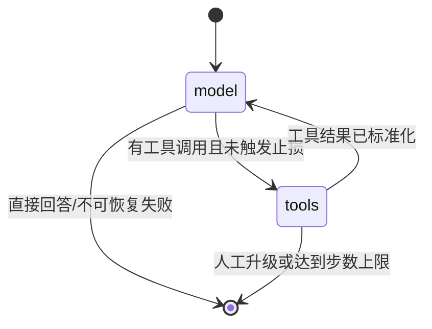
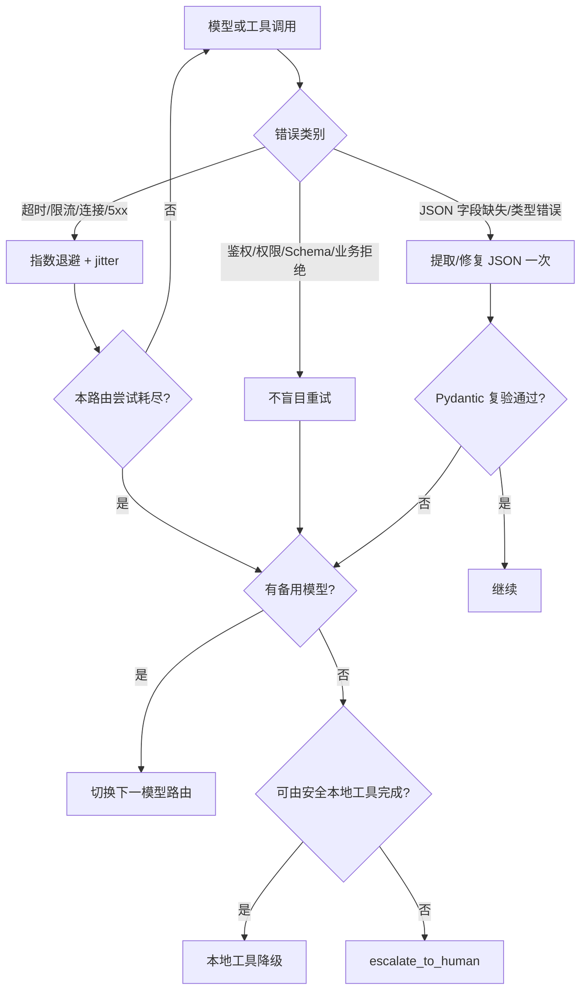

# 架构设计与运行策略

> 决策日期：2026-08-08。目标是把 Demo 升级为可继续演进的异步 Agent 基线，而不是一次性堆叠所有框架。

## 1. 边界、契约与状态所有权

| 模块 | 责任 | 拥有的状态 | 不负责 |
|---|---|---|---|
| `app.py` | HTTP 边界、生命周期、服务装配 | FastAPI app state | 模型/工具业务逻辑 |
| `schemas.py` | 所有跨模块数据契约 | 无 | I/O |
| `llm.py` | 模型路由、重试、Fallback、结构化输出 | 路由配置 | 工具执行 |
| `graph.py` | LangGraph 状态机、步数与循环止损 | 单次运行状态 | 持久化记忆 |
| `tools/` | 工具注册、Schema、DAG、锁、超时 | 单次工具批次 | 会话记忆 |
| `memory.py` | 短期/长期记忆持久化 | SQLite WAL | Agent 决策 |
| `documents.py` | 解析与切片 | 无 | 向量索引 |
| `rag.py` | 文档摄取与检索编排 | 无 | HTTP |
| `vector_store.py` | 向量索引适配器 | SQLite/Qdrant 数据 | 文档解析 |
| `multi_agent.py` | 并发、隔离、压缩回传 | 单次协调状态 | 共享隐式全局上下文 |

所有边界对象使用 Pydantic；模块内部函数使用完整类型注解。模型原始 JSON、工具参数和工具返回不能绕过契约直接进入下一层。

## 2. LangGraph 主流程

图状态只属于一次请求，包含消息、待执行调用、工具结果、调用记录、引用、步数、重复签名计数和人工升级标记。跨请求状态必须进入记忆模块，避免把可变全局状态塞进图节点。

## 3. Retry 与 Fallback 决策树

原则：

1. **重试只处理可能自行恢复的暂态错误。** 鉴权、权限、未知工具、参数越界等确定性错误不重复烧 Token。
2. **每条模型路由独立设置超时和最大尝试次数。** SDK 自带重试关闭，避免“双重重试”放大流量；统一由 Tenacity 控制。
3. **结构化输出先修复一次再切路由。** 修复后必须重新走 Pydantic，不接受“看起来像 JSON”。
4. **工具失败分级。** 参数错误直接返回模型修正；超时可由图重新规划；有副作用或风险的失败转人工，不自动换一个语义不同的工具。
5. **最终兜底是明确降级，而不是伪造成功。** 响应设置 `degraded` / `handoff_required`，工具记录带 `status/error_code`。

## 4. Function Calling：工具描述与参数 Schema

### 工具描述模板

工具说明固定包含：

- `PURPOSE`：一句话说明唯一职责；
- `USE ONLY WHEN`：必要的正向触发条件；
- `DO NOT USE WHEN`：最容易混淆的相邻场景；
- `SIDE EFFECTS`：只读、写入、外部调用等副作用；
- `RETURNS`：返回字段和失败语义；
- “缺少必需参数时不要猜测”。

坏描述：`读取信息`。好描述：`只读取工作区内一个已知相对路径的 UTF-8 文本文件；不要用于知识库语义检索；路径不明确时先询问用户。`

### Schema 粒度

- 对影响路由的值使用 `enum/Literal`，不要留任意字符串。
- 数字给出 `minimum/maximum`；字符串给出长度和必要的 `pattern`。
- 对象默认 `additionalProperties: false`。
- 必需字段全部进入 `required`；确实可选的字段使用显式 `null` 或明确默认值。
- 路径、URL、ID、分页、top-k 等分别建模，不用一个 `options: object` 混装。
- 描述业务语义而不是重复类型，例如说明 `top_k` 是“重排后返回数量”。
- 工具返回统一为 `ToolResult`，大对象只回摘要和 artifact/source 引用。

这既降低模型瞎选，也让代码在执行前第一时间拦住字段缺失、类型错误和未知字段。

## 5. 多工具并行与依赖关系

`AsyncToolExecutor` 把一次模型输出视为 DAG：

1. `depends_on` 声明前置调用；不存在的依赖和环立即拒绝。
2. 同一拓扑层用 `asyncio.gather` 并发，整体受 semaphore 限流。
3. 参数中的 `$ref` 只允许引用已成功的上游结果。
4. 工具可声明资源键；同一资源使用异步锁串行，避免并行读写冲突。
5. 上游失败时下游标记 `skipped`，而不是用残缺参数继续。
6. 每个工具有超时边界；异常统一转为结构化错误，不让一个工具取消所有独立分支。

有写副作用的工具默认不能被模型自由并行；应先通过审批/幂等键/资源锁设计后再注册。

## 6. 多 Agent 协作与上下文隔离

- 每个 worker 得到独立 `AgentContext`：任务、私有上下文、只读共享事实、独立 `memory_namespace`。
- worker 不共享可变消息列表、数据库会话或原始提示词。
- 并发由全局 semaphore 和单 Agent timeout 控制。
- 回传使用 `AgentResult`：最多保留摘要、事实、引用、产物路径和告警；不回传原始 transcript 或 chain-of-thought。
- 父 Agent 合并结果时按来源、置信度和冲突标记处理，不能把多个 Agent 的自由文本直接拼成新事实。

当前实现提供协调器与测试，但没有把多 Agent 自动路由暴露为公开 HTTP API，符合 YAGNI；以后增加时必须先定义任务类型、权限和成本预算。

## 7. 记忆分层

| 层 | 生命周期 | 存储 | 内容 | 策略 |
|---|---|---|---|---|
| 工作记忆 | 单次图运行 | LangGraph state | 当前消息、工具调用、引用、步数 | 请求结束释放 |
| 短期记忆 | 一个 session | SQLite WAL | 最近消息 + 滚动摘要 | 消息数/字符预算触发压缩 |
| 长期记忆 | 用户/Agent 命名空间 | SQLite + embedding | 稳定偏好、事实、任务经验 | 语义召回 + importance |
| 知识记忆 | 文档生命周期 | SQLite/Qdrant | 文档 chunk 与来源元数据 | 混合检索、重排、引用 |

短期记忆不无限追加：超出预算的旧消息先进入确定性摘要，再从活跃上下文移除。长期记忆按命名空间隔离，检索分数由向量相似度和重要度组合。生产环境应增加用户删除、保留期、PII 分类和审计接口。

## 8. 死循环止损

- `max_agent_steps`：模型/工具节点总步数上限。
- `max_repeated_tool_calls`：相同工具名 + 规范化参数哈希的重复次数上限。
- 模型、工具、子 Agent 分别设置 timeout。
- 重复调用或步数耗尽时停止自动执行，响应明确说明并转人工；不通过增加 prompt 文案“希望模型别循环”来替代代码约束。

## 9. RAG 策略

### 文档解析

1. TXT/Markdown：保留标题和段落。
2. CSV/TSV：按表头 + 行切分，避免把列关系打散。
3. 普通 PDF：pypdf 提取文本并保留页码。
4. 扫描 PDF：当多数页面无文本时发出告警；安装 `documents` extra 后交给 Docling OCR。
5. 复杂表格/多栏版面：优先 Docling 的版面和表格结构结果；解析失败时保留告警，不把空内容当成功。

### 切片

默认不是机械固定长度，也不是无限制语义切片，而是“**结构/语义边界优先 + 长度上限兜底 + 小重叠**”：标题、段落、表格行先作为原子单元，累积到预算再切；超长单元才按长度拆。这样既保持语义与表格结构，又控制 Embedding 和上下文成本。

### Embedding 选择

| 场景 | 建议 | 取舍 |
|---|---|---|
| 本地测试、无外网、确定性单测 | `HashEmbedding` | 无语义质量承诺，仅用于离线基线和流程验证 |
| 通用中文/英文知识库 | 托管语义 Embedding（默认配置为 `text-embedding-3-small`） | 质量、成本、延迟较均衡，需真实数据集评估 |
| 高召回或细粒度专业语料 | 更高能力 Embedding + reranker | 成本和向量维度更高 |
| 强隐私/内网 | 经评测的本地多语模型 | 自管推理和版本治理成本更高 |

不同 Embedding 的差距不能用公开榜单替代业务结论。应建立带相关性标注的查询集，比较 Recall@k、MRR/nDCG、端到端答案引用正确率与成本。本次按用户要求不执行压测，也未执行模型质量 benchmark。

### 向量索引

- **SQLite 精确扫描**：默认；适合 Demo、小/中等本地语料和无需外部服务的环境，结果可复现。
- **Qdrant HNSW**：语料增大、需要 payload filter、在线扩展时启用；当前适配器已用内存模式做功能 PoC。
- 索引选择必须结合向量数量、维度、过滤比例、更新率、内存预算和目标 p95；不能只按“高星”决定。

### 检索与重排

1. 向量召回候选；
2. 词法分数补偿专有名词、路径和编号；
3. 线性融合轻量重排；
4. 前缀去重减少高度重复 chunk；
5. 输出 `Citation`：source_id、source_name、chunk/page/locator、短 quote、score。

生产质量更高时，可在候选集上增加 cross-encoder/LLM reranker，但必须单独评测质量增益、延迟和费用。

## 10. 延迟观测与压测方法（未执行）

代码记录每次检索和工具调用的 `latency_ms`，用于线上观测。若未来获准压测，必须区分：

- 冷启动/热缓存；SQLite/Qdrant；不同 corpus 数量、向量维度、top-k、过滤比例；
- 单请求与并发等级；Embedding 是否计入；本地/远程网络；
- p50/p95/p99、吞吐、错误率、超时率、CPU、内存和向量库资源；
- 固定查询集和固定随机种子，先预热，再重复多轮并报告置信区间。

**本次没有运行任何检索、模型或多工具压力测试。** 只有普通单元/集成测试中的单次功能调用。

## 11. 兼容与迁移

公开 `POST /chat` 暂时保留旧字段：`reply` 以及 `tool_calls[].name/arguments/result`。新增字段为 `tool_name/status/latency_ms/error_code/citations/session_id/degraded/handoff_required`。

三阶段计划：

1. **弃用阶段（0.x）**：文档标记旧字段和旧入口；兼容字段继续返回。
2. **迁移窗口（计划 1.x 前）**：前端和所有调用方迁到新字段；记录旧字段使用情况。
3. **删除阶段（未来 major）**：确认无调用方后删除旧字段与根目录旧 Demo 模块，并提供迁移说明。

本次没有删除用户文件、持久化格式或公开字段。SQLite schema 当前仍是 0.x 内部格式；一旦对外承诺稳定，必须引入 schema version 和迁移工具。
