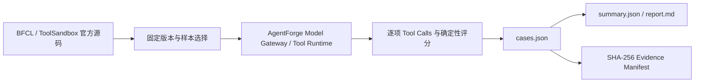

# Tool Benchmark 证据说明

## 证据口径

- BFCL Single/Multiple/Parallel/Irrelevance：使用官方问题、函数定义和 Ground Truth；Harness 将 BFCL 非标准类型映射为 JSON Schema。
- BFCL Multi-turn：使用官方问题、函数文档和 Ground Truth，但未挂载官方可执行状态后端，属于诊断项，不能与排行榜比较。
- ToolSandbox Projection：使用其 Stateful、Canonicalization、Insufficient Information 能力边界设计 15 项轻量测试；不是官方端到端得分。
- AgentForge 对抗集：直接验证当前 Tool Executor 的 DAG、`$ref`、循环/坏依赖、Timeout、Unknown Tool、Schema 和失败终止。

## 必要证据

- `results/cases.json`：逐项预测、评分和单次延迟。
- `results/summary.json`：来源级汇总。
- `manifests/sample_inventory.json`：只含来源、分类、ID 和输入 Hash。
- `evidence_manifest.json`：可交付文件的大小和 SHA-256。

## 不能据此声明

- 不能声明 BFCL 官方排行榜分数。
- 不能声明 ToolSandbox 官方 Milestone/Snapshot 分数。
- 不能声明 P99、QPS、高并发稳定性或生产 SLA。
- AgentForge 15/15 只证明确定性 Runtime Fixture，不证明开放世界 Tool Planning 100% 正确。
