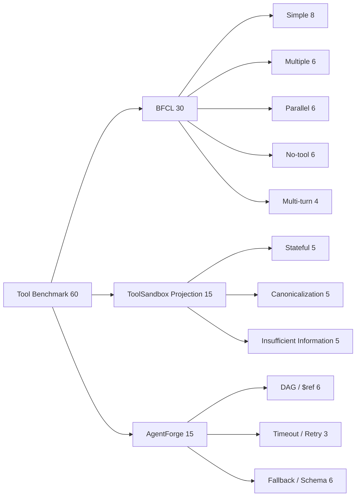

# Tool Orchestration Benchmark 报告

> 日期：2026-08-17  
> 样本：BFCL 30 + ToolSandbox Projection 15 + AgentForge 对抗集 15 = 60  
> 范围：Tool 选择、参数生成、并行调用、多轮调用诊断、No-tool、DAG、`$ref`、锁、Retry、Fallback、幂等与 Schema 拦截  
> 不包含：压力测试、QPS、生产 P99、BFCL 官方排行榜提交、ToolSandbox 官方端到端环境得分

## 1. 结论先行

本轮完成 **60 项顺序功能评估**，总通过率为 **80.00%**。其中 AgentForge 确定性编排对抗集为 **15/15**；BFCL 总体为 **22/30**；ToolSandbox Projection 为 **11/15**。

| 来源 | 样本数 | 通过 | 通过率 |
|---|---:|---:|---:|
| BFCL | 30 | 22 | 73.33% |
| ToolSandbox Projection | 15 | 11 | 73.33% |
| AgentForge 对抗集 | 15 | 15 | 100.00% |
| **合计** | **60** | **48** | **80.00%** |

模型调用中位耗时为 **1026.33 ms**，仅用于单次故障定位，不能解释为服务 P50、P99 或吞吐结论。

## 2. 样本分配

## 3. 分类结果

| 来源 / 分类 | 数量 | 通过 | 通过率 |
|---|---:|---:|---:|
| bad_ref | 3 | 3 | 100.00% |
| canonicalization | 5 | 3 | 60.00% |
| dag_ok | 3 | 3 | 100.00% |
| insufficient | 5 | 3 | 60.00% |
| irrelevance | 6 | 2 | 33.33% |
| multi_turn | 4 | 0 | 0.00% |
| multiple | 6 | 6 | 100.00% |
| parallel | 6 | 6 | 100.00% |
| schema | 3 | 3 | 100.00% |
| simple_python | 8 | 8 | 100.00% |
| stateful | 5 | 5 | 100.00% |
| timeout | 3 | 3 | 100.00% |
| unknown | 3 | 3 | 100.00% |

BFCL 的 **26 个单轮可比样本通过 22 个，通过率 84.62%**。4 个 Multi-turn 样本保留为诊断项，当前 Harness 使用官方问题、函数文档和 Ground Truth，但没有挂载 BFCL 官方可执行状态后端，因此 **0/4 不应解释为官方 BFCL Multi-turn 分数**。

## 4. 暴露问题

1. **No-tool 过调用**：BFCL Irrelevance 仅 2/6，模型在明确不需要工具的请求上仍产生函数调用，说明 Tool 描述与系统策略缺少更强的“不调用”边界。
2. **信息不足时抢跑**：ToolSandbox Projection 的 Insufficient Information 为 3/5；“当前位置”“Call Alex”类请求发生无依据调用，应先澄清或受控拒绝。
3. **参数 Canonicalization 不稳定**：单位枚举大小写、电话号码规范化等严格参数只通过 3/5，需要在 Schema 前置 Enum、Pydantic Normalizer 或 Tool Adapter 层统一处理。
4. **多轮能力尚未形成有效证据**：当前 4 个 BFCL Multi-turn 诊断没有官方状态执行环境，不能用于证明或否定生产级 Stateful Tool 能力。
5. **确定性 Runtime 基线通过**：DAG、坏 `$ref`、Timeout、Unknown Tool 和 Schema 错误均在有限状态内终止，15/15 表明编排器的基础失败边界有效；这不等于真实模型规划也达到 100%。

## 5. 第一性原理判断

Tool Orchestration 的可靠性应拆成三层，不能用一个总分掩盖：

- **模型决策层**：是否选对 Tool、是否选择 No-tool、参数是否规范；本轮仍有明显缺口。
- **契约层**：Schema 是否拦截缺字段、类型和枚举错误；AgentForge 对抗样本已形成确定性证据。
- **执行层**：依赖、并发、锁、Retry/Fallback、幂等与终止；本轮只验证功能正确性，不验证高并发容量。

## 6. 对抗式审阅

- 修复了城市名期望值与输入不一致导致的假阴性。
- BFCL 非标准 `dict`、`float`、`tuple` 类型只在 Harness 边界转换成合法 JSON Schema，不改写官方 Ground Truth。
- 结果文件不保存 BFCL/ToolSandbox 原始 Prompt，只保存 ID、输入 Hash、模型调用和评分字段。
- ToolSandbox 结果明确标记为 **Projection**，不冒充官方 Milestone/Snapshot 端到端得分。
- Multi-turn 明确标记为诊断性结果，不与官方排行榜直接比较。
- 未进行并发、吞吐或持续负载测试。

## 7. 验收结论

| 验收项 | 结果 |
|---|---|
| 总样本数 | 60，Pass |
| BFCL / ToolSandbox / AgentForge 分配 | 30 / 15 / 15，Pass |
| 原始大型数据进入 Git | 否，Pass |
| API Key 写入产物 | 否，Pass |
| Harness 证据可追溯 | Source Commit、样本 ID、Hash、逐项结果均保留 |
| Tool 能力是否已达到企业级 | **否**；No-tool、信息不足处理、参数规范化和官方 Stateful Multi-turn 闭环仍需补强 |
