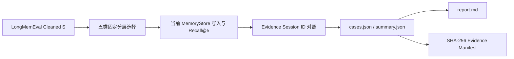

# Memory Benchmark 证据说明

## 指标口径

- Evidence Recall@5：官方 `answer_session_ids` 中有多少出现在当前 MemoryStore 返回的前 5 个 Session ID 中。
- Case Pass：非 Abstention 样本要求全部官方 Evidence Session 被召回；Abstention 要求返回空结果。
- 内部 Fixture Pass：按照隔离、最新偏好、删除能力、摘要保留和外置 Artifact 的确定性断言评分。

**Evidence Recall@5 不等于 LongMemEval 官方 Answer Accuracy。** 本轮未调用答案生成模型，也没有使用官方 LLM Judge。

## 必要证据

- `manifests/sample_inventory.json`：50 个官方 Question ID、分类和问题 Hash。
- `results/cases.json`：逐项 Evidence Session Recall、耗时和内部 Fixture 结果。
- `results/summary.json`：总体与分类汇总。
- `evidence_manifest.json`：交付文件大小与 SHA-256。

## 不能据此声明

- 不能声明 LongMemEval 官方排行榜得分。
- 不能声明语义层面零租户泄露或 Rolling Summary 零信息损失。
- 不能声明 P99、QPS、并发容量或生产 SLA。
