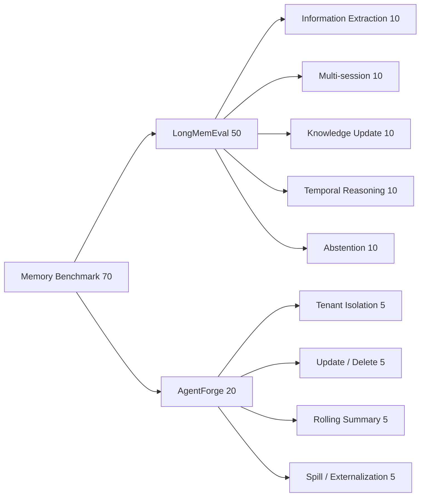

# Memory Benchmark 报告

> 日期：2026-08-17  
> 样本：LongMemEval 分层子集 50 + AgentForge 隔离与压缩集 20 = 70  
> 范围：信息抽取、多 Session 推理、知识更新、时间推理、拒答、多租户隔离、更新删除、Rolling Summary、Tool Result 外置  
> 不包含：压力测试、生产容量、LongMemEval 官方答案级 LLM Judge

## 1. 结论先行

本轮完成 **70 项 Memory 功能评估**，总体通过率为 **37.14%**。LongMemEval 50 项的 Evidence Recall@5 为 **26.33%**；AgentForge 内部 20 项通过 **18/20**。

| 来源 | 样本数 | 核心结果 |
|---|---:|---|
| LongMemEval 分层子集 | 50 | Evidence Recall@5 = 26.33% |
| AgentForge 隔离与压缩集 | 20 | 18/20，通过率 90.00% |
| 合计 | 70 | Case Pass Rate = 37.14% |

LongMemEval 单次检索中位耗时为 **51.07 ms**，只用于串行功能运行的故障定位，不能解释为服务 P50/P99。

## 2. 样本分配

## 3. 分类结果

| 分类 | 数量 | 通过 | 通过率 |
|---|---:|---:|---:|
| abstention | 10 | 0 | 0.00% |
| delete | 2 | 0 | 0.00% |
| information_extraction | 10 | 4 | 40.00% |
| knowledge_update | 10 | 2 | 20.00% |
| multi_session | 10 | 1 | 10.00% |
| rolling_summary | 5 | 5 | 100.00% |
| spill | 5 | 5 | 100.00% |
| temporal_reasoning | 10 | 1 | 10.00% |
| tenant_isolation | 5 | 5 | 100.00% |
| update | 3 | 3 | 100.00% |

## 4. 暴露问题

1. **非语义 HashEmbedding 无法支撑长期事实召回**：LongMemEval Evidence Recall@5 仅 26.33%，说明当前 Local-first 确定性向量适合单元测试，不适合真实长记忆语义检索。
2. **Abstention 缺失**：10/10 拒答样本失败。当前 Recall 在 Namespace 有数据时总会返回 Top-K，没有最小相关性阈值、证据充分性判断和受控拒答。
3. **时间与更新语义薄弱**：Temporal Reasoning 1/10、Knowledge Update 2/10；仅依赖向量相似度与 Importance，不能稳定表达时间顺序、事实替代和冲突消解。
4. **跨 Session 聚合不足**：Multi-session 1/10；Memory 没有 Query 分解、Session-level 聚合或事件图，多个会话中的证据容易被单一近似 Chunk 挤出。
5. **删除闭环缺失**：内部 Delete 0/2，当前公共 Memory API 没有可验证的按 Memory ID/Namespace 删除契约。
6. **隔离与上下文控制基线有效**：Tenant Isolation 5/5、Rolling Summary 5/5、Large Tool Result Spill 5/5；这些是确定性工程 Fixture，不等价于语义泄露审计或摘要保真率测试。

## 5. 第一性原理判断

Memory 不是单一向量库，而应拆成：

- **Working Memory**：Graph State 中当前任务必需字段；有明确所有者和生命周期。
- **Short-term Memory**：最近消息 + Rolling Summary；需要评估关键信息保真，而非只看字符预算。
- **Long-term Episodic/Semantic Memory**：事实、事件、时间和来源；需要语义 Embedding、Metadata Filter、时间/更新策略与 Abstention。
- **Artifact Memory**：大型 Tool 输出按 Content Hash 外置，只在上下文中传递摘要与引用。

本轮证明 AgentForge 已有分层结构和隔离/外置基线，但 **Long-term Memory 检索仍未达到落地级**。

## 6. 对抗式审阅

- 官方 277 MB Cleaned S 数据仅位于 Git Ignore 的 `state/benchmark-sources/longmemeval/data/`，未复制进评测目录。
- 采用流式 JSON Decoder 选择固定样本，避免把整个数据集加载到内存。
- 每类固定选择 10 项并保存 Question ID 与 SHA-256，不保存原始问题、会话或答案。
- 官方指标被命名为 **Evidence Recall@5**，不冒充 LongMemEval 答案级准确率。
- Abstention 的 0/10 和 Delete 的 0/2 被保留，不用宽松评分掩盖缺口。
- 内部隔离测试只验证显式 Namespace 越权，不宣称完成语义隐私审计。
- 未进行并发、吞吐或持续负载测试。

## 7. 验收结论

| 验收项 | 结果 |
|---|---|
| 总样本数 | 70，Pass |
| LongMemEval 五类各 10 | 50，Pass |
| AgentForge 隔离与压缩 | 20，Pass |
| 官方大型数据进入 Git | 否，Pass |
| Evidence Recall 指标可复算 | 是，Pass |
| Memory 能力是否达到企业级 | **否**；语义召回、Abstention、时间/更新、多 Session 和删除闭环需要补强 |
