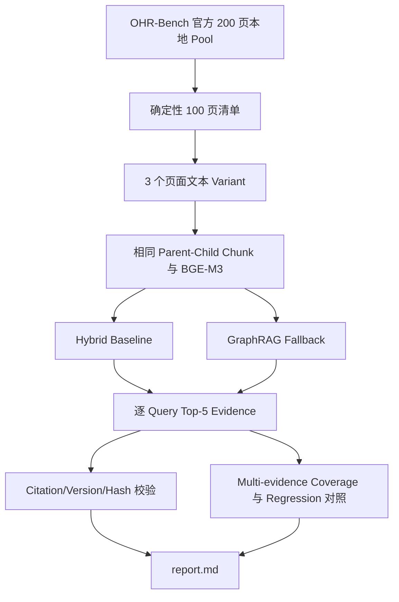

# GraphRAG Benchmark 证据说明

## 证据链

## 保留证据

- `manifests/sample_inventory.json`：100 页身份、领域、选择原因与文本 Hash；不含正文。
- `manifests/query_inventory.json`：Query ID、类型、相关页面和 Query Hash；不含问题正文或答案。
- `results/*_hybrid_baseline.json`：Baseline 逐 Query 排名与诊断。
- `results/*_graphrag_fallback.json`：GraphRAG 逐 Query 排名、路由、Hop 与 Fallback 诊断。
- `results/benchmark_summary.json`：按 Variant、Query Type、Domain 汇总。
- `results/adversarial_gate.json`：完整性门禁、质量门禁和回归比较。
- `evidence_manifest.json`：Git 归档文件的大小和 SHA-256。

## 指标边界

- `Recall@5`：Top-5 至少包含一个 Ground Truth 页面。
- `All-evidence Recall@5`：Multi-evidence Query 的全部相关页面均进入 Top-5。
- `Evidence Coverage@5`：Top-5 命中的相关页面数 / Ground Truth 页面数。
- `Citation Validity`：Source、Active Version、Chunk、Content Hash、Parser 与 Quote 回溯通过代码校验。
- 单请求 Median/P95 只定位阶段耗时，不代表并发容量、SLO 或生产 P95/P99。
- 本轮没有生成最终答案，因此 Citation Validity 不能等价为 Claim-level Entailment 或答案正确率。

## 对抗式检查

1. Baseline 与 GraphRAG 必须共享同一页面、Chunk、Embedding 和 Vector Index，防止不公平对照。
2. Graph Hop 和 Corrective Retrieval 最大值均为 2，任何超限均视为证据完整性失败。
3. GraphRAG 整体 Recall@5 相比 Baseline 不允许下降超过 2 个百分点。
4. Multi-evidence All-evidence Recall@5 不得低于 Baseline。
5. Graph Degraded Rate 必须不高于 1%。
6. Multi-evidence Query 的 Graph Route Rate 必须不低于 80%。
7. Git 目录不得包含正文、答案、PDF、图片、SQLite 或 Embedding Cache，且总大小必须低于 1 GB。

本轮结果：**Integrity Pass，Quality Gate Fail**。失败项为 Graph Degraded Rate（9.64%–14.64%）和 Multi-evidence Graph Route Rate（45.45%）。
