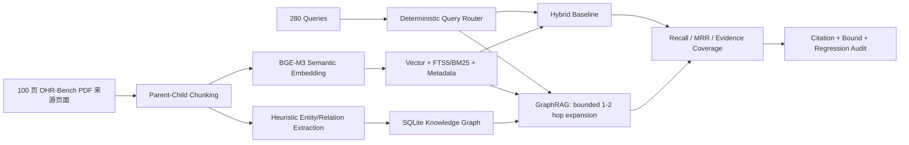

# 基于 OmniDocBench 和 OHR-Bench 的 GraphRAG 基准测试 v1

本目录记录 AgentForge 于 **2026-08-19** 开展的 100 页 PDF 来源 GraphRAG Benchmark。测试目标不是重新评价 Parser，而是在固定页面预算下隔离比较：

- **Hybrid Baseline**：BGE-M3 Dense Retrieval + SQLite FTS5/BM25 + Metadata + RRF；
- **GraphRAG Fallback**：与 Baseline 共用相同文本、Chunk、Embedding、Vector Index 和 Query Planner，仅增加启发式 Knowledge Graph、最多二跳扩展和结构邻接 Fallback。

> 本轮不执行 QPS、P99、吞吐或并发压力测试。记录的 Median/P95 仅为单请求阶段诊断数据，不能作为系统容量结论。

## 评测设计

| 项目 | 分配 |
|---|---:|
| 不重复 PDF 来源页面 | 100 |
| OHR-Bench 完整 Ground Truth Query | 280 / Arm / Variant |
| 其中 Multi-evidence Query | 22 |
| 文本 Variant | 3 |
| 对照 Arm | 2 |
| 总检索调用 | 1,680 |

页面覆盖 7 个领域：Academic 15、Administration 14、Finance 15、Law 14、Manual 14、News 14、Textbook 14。选择顺序优先覆盖全部 Multi-evidence 页面和第三轮 Benchmark 的 Semantic/OCR Failure 页面，再按固定规则补齐领域配额。

## 核心结果

| Variant | Baseline Recall@5 | GraphRAG Recall@5 | Multi-evidence 变化 | Graph Degraded Rate |
|---|---:|---:|---:|---:|
| Ground Truth | 95.71% | 95.71% | 86.36% → 90.91% | 12.14% |
| Formatting Noise | 95.71% | 95.71% | 86.36% → 86.36% | 14.64% |
| Semantic/OCR Noise | 85.36% | 85.36% | 77.27% → 77.27% | 9.64% |

**审阅结论：** 证据完整性通过，GraphRAG 质量门失败。GraphRAG 在标准文本中为 1 条 Multi-evidence Query 补回第二证据页，但没有提高整体 Recall@5；多证据路由覆盖率仅 45.45%，且 Graph 超时/降级率为 9.64%–14.64%，不能表述为生产可用或整体优于 Hybrid Baseline。

## 运行边界

- 使用真实语义 Embedding：`BAAI/bge-m3`，1024 维、CPU、本地离线缓存；
- 使用 OHR-Bench 官方页面级文本 Variant，避免把 Parser 变化混入 GraphRAG 对照；
- 当前在线 Model Gateway 预检返回 HTTP 404，因此本轮只验证可生产降级链路：Heuristic KG Extraction + Deterministic Query Planning + Deterministic Reflection；
- 原始正文、Query、Answer、Embedding Cache 和 SQLite Index 均保存在 Git Ignore 的 `state/benchmark-graphrag-100p/`；
- Git 仅保留脱敏清单、逐查询排名、汇总指标、失败样本标识和 SHA-256 证据。

## 流程



## 复现命令

```powershell
.\.venv\Scripts\python.exe "eval\基于OmniDocBench和OHR-Bench的GraphRAG基准测试v1\scripts\run_benchmark.py" --batch-size 8
.\.venv\Scripts\python.exe "eval\基于OmniDocBench和OHR-Bench的GraphRAG基准测试v1\scripts\adversarial_audit.py"
.\.venv\Scripts\python.exe "eval\基于OmniDocBench和OHR-Bench的GraphRAG基准测试v1\scripts\generate_evidence_manifest.py"
```

详细设计、失败分析和改进计划见 [report.md](report.md)。
