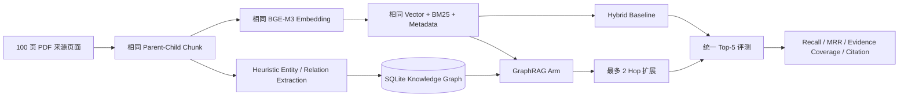
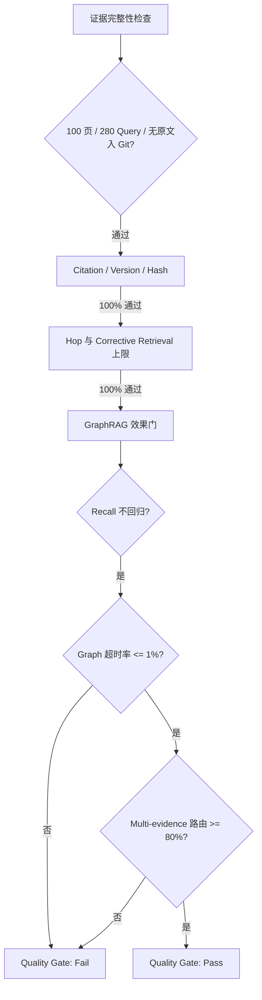

# 基于 OmniDocBench 和 OHR-Bench 的 GraphRAG 基准测试报告（100 页）

> 运行日期：2026-08-19
> 结论等级：**证据完整性通过，GraphRAG 质量门未通过**
> 测试边界：功能与检索质量回归；不包含负载、并发、QPS、生产 P95/P99 或成本测试

## 1. 执行摘要

本轮在 **100 个不重复 PDF 来源页面**上，对 AgentForge 的 Hybrid Retrieval 与最小 GraphRAG 路径进行受控对照。每个 Arm 使用相同页面、Parent-Child Chunk、`BAAI/bge-m3` Embedding、SQLite Vector/FTS5 Index、Query Planner 与 Evidence Contract，只允许 GraphRAG Arm 增加 Knowledge Graph 和最多二跳扩展。

核心结论如下：

1. **基础检索保持稳定**：标准文本和格式干扰场景的 Recall@5 均为 **95.71%**，Semantic/OCR Noise 场景为 **85.36%**。
2. **GraphRAG 未提高整体 Recall@5**：三个 Variant 的净变化均为 **0.00 个百分点**。
3. **多证据场景出现一个有效增益**：标准文本的 Multi-evidence All-evidence Recall@5 从 **86.36%** 提升至 **90.91%**，对应 22 条 Multi-evidence Query 中 1 条由“缺一页”变为“全部证据命中”。
4. **收益不足以抵消工程风险**：Graph 扩展在三个 Variant 中分别出现 **12.14% / 14.64% / 9.64%** 的降级率，诊断 P95 从 Baseline 的 **330.8–451.7 ms** 上升至 **3.29–3.40 s**。
5. **路由仍不成熟**：22 条 Multi-evidence Query 中仅 **10 条（45.45%）**进入 Graph Route，同时 258 条 Single-evidence Query 中有 **39 条（15.12%）**被路由到 Graph。
6. **对抗式结论**：样本、Schema、Citation、Hop 上限和产物大小均通过完整性检查；由于 Graph 超时率高于 1% 且 Multi-evidence 路由覆盖率低于 80%，质量门判定为 **Fail**。

因此，本轮证明了 AgentForge 已具备可运行、可降级、可审计的 GraphRAG 插件链路，并验证了 Knowledge Graph 对个别多证据查询的潜在价值；但**尚不能证明该 GraphRAG 实现达到生产可用或普遍优于 Hybrid Retrieval**。

## 2. 测试问题与第一性原理

GraphRAG 的价值不应通过“是否建了图”判断，而应回答三个可验证问题：

- 图扩展是否找到 Baseline 未找到的相关证据？
- 图扩展是否破坏原有 Recall、Citation 和租户/版本边界？
- 额外收益是否足以覆盖路由错误、超时和系统复杂度？

本轮采用控制变量设计：



这种设计避免把 Parser、Chunk、Embedding 或 Query 数据差异误认为 GraphRAG 收益。

## 3. 数据与样本分配

### 3.1 页面预算

| 领域 | 页面数 |
|---|---:|
| Academic | 15 |
| Administration | 14 |
| Finance | 15 |
| Law | 14 |
| Manual | 14 |
| News | 14 |
| Textbook | 14 |
| **合计** | **100** |

100 页来自既有 OHR-Bench 本地忽略数据池，包含 65 页 Longitudinal 样本与 35 页 Holdout 样本。选择优先级为：

1. 覆盖全部 22 条可完整评测的 Multi-evidence Query；
2. 覆盖第三轮 200 页 Benchmark 中 Semantic/OCR Recall@5 失败页；
3. 按领域配额、QA 密度和稳定排序补齐页面。

OmniDocBench 继续作为复杂 PDF Parser 的长期回归来源；由于本轮没有修改 Parser，为避免将解析变量混入 GraphRAG 对照，本轮没有重复运行 OmniDocBench Parser Case。

### 3.2 Query 与调用量

| 项目 | 数量 |
|---|---:|
| 每个 Arm / Variant 的 Query | 280 |
| Single-evidence Query | 258 |
| Multi-evidence Query | 22 |
| 文本 Variant | 3 |
| 对照 Arm | 2 |
| **总检索调用** | **1,680** |

三个文本 Variant 分别为：

- `gt_text`：官方 Ground Truth 文本；
- `formatting_noise_moderate`：中等格式噪声；
- `semantic_noise_MinerU_moderate`：中等 Semantic/OCR 噪声。

### 3.3 运行环境

- Python 3.12.13，Windows，CPU 推理；
- Semantic Embedding：`BAAI/bge-m3`，1024 维；
- Chunking：Token-aware Parent-Child，配置为 500 / 650 Tokens、60 Tokens Overlap；
- KG：SQLite，标准文本包含 1,253 Entities、2,002 Mentions、3,696 Relations；
- Graph 上限：最多 2 Hop，单次 Graph 扩展 Deadline 为 3 秒；
- 在线 Model Gateway 预检返回 HTTP 404，因此本轮实际运行 `HeuristicKnowledgeGraphExtractor`、`DeterministicQueryPlanner` 和 `DeterministicEvidenceReflector` 的受控 Fallback。

## 4. 结果

### 4.1 整体检索质量

| Variant | Arm | Recall@1 | Recall@5 | MRR@5 | Citation Validity |
|---|---|---:|---:|---:|---:|
| Ground Truth | Hybrid Baseline | 86.07% | 95.71% | 89.79% | 100% |
| Ground Truth | GraphRAG Fallback | 86.07% | 95.71% | 89.79% | 100% |
| Formatting Noise | Hybrid Baseline | 85.36% | 95.71% | 89.29% | 100% |
| Formatting Noise | GraphRAG Fallback | 85.36% | 95.71% | 89.29% | 100% |
| Semantic/OCR Noise | Hybrid Baseline | 68.93% | 85.36% | 75.51% | 100% |
| Semantic/OCR Noise | GraphRAG Fallback | 68.93% | 85.36% | 75.51% | 100% |

`Citation Validity` 仅表示 Source、Version、Chunk、Content Hash、Parser 和 Quote 满足代码层回溯契约。由于本轮未生成最终答案，它**不等价于 Claim-level Entailment 或答案正确率**。

### 4.2 Multi-evidence 效果

| Variant | Baseline All-evidence Recall@5 | GraphRAG All-evidence Recall@5 | 变化 |
|---|---:|---:|---:|
| Ground Truth | 86.36% | 90.91% | **+4.55 pp** |
| Formatting Noise | 86.36% | 86.36% | 0.00 pp |
| Semantic/OCR Noise | 77.27% | 77.27% | 0.00 pp |

唯一增益样例为 Law 领域 Query `b75db71e-a453-4fe9-b48f-653e7b1bcb6b`：

- Ground Truth 页面：`ohr-holdout-026`、`ohr-holdout-029`；
- Baseline Top-5 仅命中 `ohr-holdout-029`；
- GraphRAG 经 1 Hop 扩展后同时命中 `ohr-holdout-026` 与 `ohr-holdout-029`；
- 该样例未触发 Graph Timeout，Citation Contract 通过。

这说明结构扩展具有实际潜力，但当前证据仅为 **1/22** 个 Multi-evidence Case，不能外推为稳定收益。

### 4.3 路由、扩展与诊断延迟

| Variant | Graph Route | Graph Expansion | Graph Degraded/Timeout | Baseline Median | Graph Median | Baseline 诊断 P95 | Graph 诊断 P95 |
|---|---:|---:|---:|---:|---:|---:|---:|
| Ground Truth | 17.50% | 5.36% | **12.14%** | 333.0 ms | 333.7 ms | 401.8 ms | **3,323.5 ms** |
| Formatting Noise | 17.50% | 2.86% | **14.64%** | 378.1 ms | 389.4 ms | 451.7 ms | **3,400.8 ms** |
| Semantic/OCR Noise | 17.50% | 7.86% | **9.64%** | 294.1 ms | 294.0 ms | 330.8 ms | **3,285.3 ms** |

所有超时均被有界 Deadline 拦截，并降级到剩余 Hybrid Evidence，因此没有造成 Recall@5 回归；但该结果也说明当前 Graph Store 查询路径尚不适合作为默认在线路径。

> 表中的 P95 是单机、串行 Benchmark 的单请求诊断分位数，不是并发 SLO，也不能表述为生产 P95。

## 5. 失败类型与根因分析

### 5.1 Query Routing 覆盖不足

- Multi-evidence Graph Route：10/22，覆盖率 **45.45%**；
- Single-evidence Graph Route：39/258，误入比例 **15.12%**。

当前确定性 Planner 对显式比较、关联或多步词形有响应，但对隐式多证据意图识别不足；与此同时，一部分单证据问题被关键词规则误判为 Graph Query。结果是“真正需要图的没有全部进入，不需要图的承担了额外开销”。

### 5.2 Graph Expansion 超时

三个 Variant 分别有 34、41、27 条请求在 3 秒 Deadline 内未完成 Graph 扩展。代码审阅显示，当前 SQLite Traversal 会：

1. 从多个 Seed Chunk 展开实体 Frontier；
2. 对 Frontier 执行双向 Relation Join；
3. 将候选实体关联回全部 Mentions；
4. 对每条候选调用 `_entity_names` 恢复路径。

最后一步可能形成按候选逐次查询的 N+1 访问；同时，双向 `OR ... IN (...)` Join 与不断扩大的 Frontier 会增加 SQLite 查询成本。该判断是基于代码路径和诊断现象的工程推断，仍需独立 Query Plan 与 Span 证据确认。

### 5.3 Graph 收益稀疏

- Overall Recall@5：三个 Variant 均 **0.00 pp** 增益；
- Ground Truth：新增 1 个相关页面，无相关页面丢失；
- 两个噪声 Variant：新增 0、丢失 0。

当前图谱由启发式实体共现生成，边主要表达“同块共现”，尚未稳定编码业务语义关系、时间关系、因果关系或表格字段关系。因此，它更像受限的结构邻接索引，而不是成熟的 Enterprise Knowledge Graph。

### 5.4 Semantic/OCR Noise 仍是主要短板

Semantic/OCR Noise 的 Recall@5 从标准文本的 95.71% 降至 85.36%，下降 **10.35 pp**。失败共 41 条，其中 Finance 27 条，占 **65.85%**；其余为 Law 4、Academic 4、Textbook 4、Manual 1、Administration 1。

GraphRAG 没有修复这类缺陷，原因是图谱本身也从受噪文本抽取：当 Entity Mention 在源文本中被 OCR 损坏或丢失时，Graph Construction 与 Dense/BM25 Retrieval 同时失去可靠输入。该问题需要 Parser/OCR 归一化、表格结构恢复和 Entity Linking 联合修复，而不能只增加 Graph Traversal。

## 6. 对抗式审阅



| 门禁 | 结果 | 证据 |
|---|---|---|
| 100 个唯一页面 | Pass | `sample_inventory.json` |
| 280 个完整 Query，含 22 个 Multi-evidence | Pass | `query_inventory.json` |
| 不提交正文、答案、PDF、图片、SQLite、Embedding | Pass | Manifest + 文件扫描 |
| Citation Contract | Pass | 1,680/1,680 调用中的最终 Hit 均通过 |
| Graph Hop ≤ 2 | Pass | 100% |
| Corrective Retrieval ≤ 2 | Pass | 100% |
| Overall Recall@5 回归 ≤ 2 pp | Pass | 三个 Variant 均无回归 |
| Graph Degraded Rate ≤ 1% | **Fail** | 9.64%–14.64% |
| Multi-evidence Graph Route ≥ 80% | **Fail** | 45.45% |
| **综合完整性** | **Pass** | `adversarial_gate.json` |
| **综合质量门** | **Fail** | `adversarial_gate.json` |

## 7. 改进计划

### P0：先消除 Graph 在线路径的不确定性

1. 为 KG Expand 增加阶段 Span：Seed Lookup、Relation Traversal、Mention Fetch、Path Restore；
2. 将逐 Evidence `_entity_names` 查询改为一次批量读取，消除 N+1；
3. 使用 `EXPLAIN QUERY PLAN` 检查 Relation 双向查询，必要时拆成 `UNION ALL` 以利用 Source/Target Index；
4. 限制 Frontier、Expanded Entity 和 Mention 数，并记录截断原因；
5. 验收：Graph Degraded Rate ≤ 1%，且无 Recall/Citation 回归。

### P1：提高路由和图谱语义质量

1. 修复 Model Gateway 404，恢复可插拔 Structured Query Planner 与 KG Extractor；
2. 在不依赖在线 LLM 的 Fallback 中增加 Query Decomposition、实体消歧和时间/比较意图特征；
3. 将图关系从“共现”扩展到类型化关系，并保留 Relation Evidence Provenance；
4. 验收：Multi-evidence Graph Route Recall ≥ 80%，同时控制 Single-evidence Graph Route ≤ 10%。

### P2：建立 GraphRAG 专项证据

1. 增加需要实体链、时间链和跨页表格关系的 Hard Case；
2. 评测 Path Precision、Graph Evidence Precision、All-evidence Recall 与 Claim-level Citation Entailment；
3. 建立 Baseline / GraphRAG A/B 配置，不将 Graph 默认开启，只有在专项门禁通过后逐步放量。

## 8. 本轮能证明与不能证明的内容

**能证明：**

- 100 页、1,680 次受控检索可稳定复现；
- BGE-M3 Hybrid Baseline 在标准与格式干扰场景达到 95.71% Recall@5；
- GraphRAG 有界路由、二跳限制、Citation 校验和超时降级均实际运行；
- Knowledge Graph 对至少一个 Multi-evidence Case 提供了 Baseline 没有的第二证据页；
- 失败被完整记录，未通过的质量门没有被包装成“已达生产级”。

**不能证明：**

- 在线 LLM Planner、LLM KG Extraction 或 LLM Reflection 的效果；
- GraphRAG 在整体检索上优于 Hybrid Baseline；
- Claim-level 答案正确率；
- Docling/PaddleOCR 在本轮 100 页上的解析质量；
- Qdrant/PostgreSQL 等生产存储下的延迟、吞吐、并发和成本；
- 当前 GraphRAG 已达到企业级默认上线标准。

## 9. 复现与证据路径

```powershell
.\.venv\Scripts\python.exe "eval\基于OmniDocBench和OHR-Bench的GraphRAG基准测试v1\scripts\run_benchmark.py" --batch-size 8
.\.venv\Scripts\python.exe "eval\基于OmniDocBench和OHR-Bench的GraphRAG基准测试v1\scripts\adversarial_audit.py"
.\.venv\Scripts\python.exe "eval\基于OmniDocBench和OHR-Bench的GraphRAG基准测试v1\scripts\generate_evidence_manifest.py"
```

主要产物：

- `manifests/sample_inventory.json`：页面身份、选择原因和文本 Hash；
- `manifests/query_inventory.json`：Query ID、类型、相关页面和 Query Hash；
- `results/benchmark_summary.json`：分 Variant、Query Type、Domain 聚合；
- `results/*_hybrid_baseline.json`：逐 Query Baseline 结果；
- `results/*_graphrag_fallback.json`：逐 Query Graph Route、Hop、Timeout 与排名；
- `results/adversarial_gate.json`：完整性和质量门禁；
- `evidence_manifest.json`：归档文件大小与 SHA-256。
