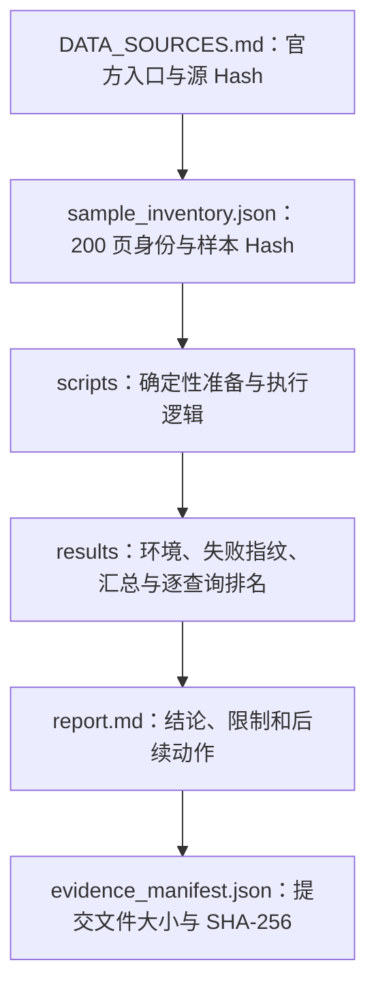

# Benchmark 证据说明与对抗式审阅

## 1. 证据目标

本目录的目标不是保存官方数据集镜像，而是让外部评估者可以回答四个问题：

1. 测试是否确实覆盖 200 个不重复页面；
2. 输入版本是否可识别，抽样是否可重复；
3. 报告中的解析失败和检索指标是否有机器可读依据；
4. 提交内容是否避免大型数据、原文、隐私路径和不可重建二进制产物。

## 2. 保留与排除矩阵

| 内容 | Git 中保留 | 理由 |
|---|---:|---|
| 正式报告与运行说明 | 是 | 解释方法、结论和边界 |
| 官方 URL 与源文件 SHA-256 | 是 | 锁定来源版本 |
| 200 页去文本化样本清单 | 是 | 验证页面数量、分层和身份 |
| 环境版本 | 是 | 解释兼容性和结果差异 |
| Parser 汇总与脱敏失败指纹 | 是 | 证明 0/50 的故障类别，不泄露本机路径 |
| Retrieval 汇总和逐查询排名 | 是 | 允许重新计算 Recall/MRR/Citation 合法率 |
| 官方 JSON、图片、PDF、页面正文 | 否 | 体积、版权和重复分发风险 |
| 问题、答案与噪声全文 | 否 | 非指标复核所必需，避免复制数据集内容 |
| SQLite 索引、模型权重、缓存 | 否 | 可重建且可能快速膨胀 |
| 绝对用户目录、凭据、Token | 否 | 隐私和安全风险 |

## 3. 证据链

逐查询 Retrieval 文件不含 Query、Answer 或正文，只保留：

- `qa_id`；
- 领域和证据类型；
- 相关 Source ID；
- Top-K 命中 Source ID；
- 首个相关结果排名；
- 单请求阶段耗时；
- Citation 数据契约校验布尔值。

这些字段足以复核 Recall@K、MRR@5 和检索 Hit 层 Citation Validity，同时显著降低数据复制量。

## 4. 对抗式审阅

提交前按“若结论错误，最可能是哪里出错”进行审阅：

| 攻击/错误假设 | 检查方法 | 处置 |
|---|---|---|
| 200 页中存在重复页面 | 检查样本 ID、源页定位和 Hash 唯一性 | 重复则拒绝提交 |
| 汇总指标无法从明细复核 | 用逐查询首个相关排名重新计算指标 | 不一致则以明细重算并修正文档 |
| Parser 错误泄露用户名或缓存路径 | 扫描绝对路径、用户名和原始异常字符串 | 仅保留错误类型和稳定 Failure Fingerprint |
| 提交误含官方正文或 QA 内容 | 扫描 JSON 键与大文本字段，检查文件类型 | 删除原文，仅保留去文本化元数据 |
| 候选提交超过 1 GiB | 统计 staged/untracked 候选总大小和最大文件 | 超限则停止提交并进一步裁剪 |
| SQLite、图片、PDF 或模型缓存被误提交 | 按扩展名和目录扫描 | 保持在已忽略的 `state/` |
| 把单次耗时误写成性能结论 | 检查报告措辞 | 只作为故障定位，不报告吞吐/SLA |
| Citation 100% 被误解为答案完全可信 | 核对指标定义 | 明确其仅为检索 Hit 层 Schema/Provenance 合法性 |
| 上游数据更新导致不可比 | 校验源文件 SHA-256 | Hash 变化时必须重跑 |

## 5. 不能由本证据推出的结论

以下说法均不成立，报告不得暗示：

- “系统已通过 OmniDocBench 官方排行榜评测”；
- “复杂 PDF Parser 已可用于生产”；
- “Citation Precision 为 100%”；
- “系统达到生产级检索质量或性能 SLA”；
- “三种 OHR 文本条件合计测试了 450 个独立页面”；
- “本目录可脱离上游许可无限制再分发数据”。

## 6. 完整性核验

`evidence_manifest.json` 记录除其自身外的提交内证据文件：

- 相对路径；
- 字节数；
- SHA-256；
- 文件角色。

修改任何证据或文档后都应重新生成该 Manifest。Manifest 不能证明执行过程没有被篡改，但可以证明评估者收到的文件集合与提交时登记的内容一致。
