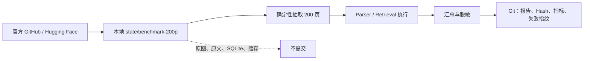

# 基于 OmniDocBench 和 OHR-Bench 的 RAG 基准测试

本目录归档 AgentForge 于 **2026-08-15** 完成的 200 页复杂文档 RAG 工程基准测试。目录只保留可审阅、可校验、可复现所必需的轻量证据；官方大型数据集、页面图片、临时 PDF、SQLite 索引和含原文的完整 Manifest 均不进入 Git。

## 快速结论

| 项目 | 结果 |
|---|---:|
| 不重复页面 | 200 |
| OmniDocBench | 50 页 |
| OHR-Bench | 150 页、427 条 QA |
| Ground Truth Recall@5 | 73.30% |
| Formatting Noise Recall@5 | 70.26% |
| Semantic/OCR Noise Recall@5 | 57.38% |
| Citation Validity | 100% |
| 压力测试 | 未执行 |

> Citation Validity 是检索 Hit 层的数据契约验证，不等同于答案 Claim-level Citation Precision。完整结论、失败证据和边界见 [report.md](report.md)。

## 目录结构

```text
基于OmniDocBench和OHR-Bench的RAG基准测试/
├── .gitignore
├── README.md
├── DATA_SOURCES.md
├── EVIDENCE.md
├── evidence_manifest.json
├── report.md
├── manifests/
│   └── sample_inventory.json
├── results/
│   ├── environment.json
│   ├── sample_summary.json
│   ├── omni_parser_summary.json
│   ├── omni_parser_failures_sanitized.json
│   ├── omni_unavailable.json
│   ├── ohr_retrieval_summary.json
│   └── ohr_retrieval_*.json
└── scripts/
    ├── prepare_samples.py
    └── run_benchmark.py
```

## 文件职责

- [report.md](report.md)：面向外部评估的正式报告，是本轮结论的主要事实来源。
- [DATA_SOURCES.md](DATA_SOURCES.md)：官方数据来源、下载接口、源文件 Hash 与许可边界。
- [EVIDENCE.md](EVIDENCE.md)：证据保留策略、对抗式审阅结果和不可据此推导的结论。
- `evidence_manifest.json`：提交内证据文件的路径、大小和 SHA-256，可用于完整性核验。
- `manifests/sample_inventory.json`：200 页固定样本的去文本化清单；保留样本身份、分层、定位和 Hash，不保留官方正文。
- `results/`：环境、汇总指标、脱敏失败分类及逐查询排名证据；逐查询文件不包含问题、答案或页面正文。
- `scripts/`：本次 Benchmark 驱动脚本；默认把下载数据和运行产物写入项目根目录下已忽略的 `state/benchmark-200p/`。

## 数据最小化与上传边界



约束如下：

1. Git 中不保留 OmniDocBench 或 OHR-Bench 的完整官方数据集副本。
2. 不提交页面图片、临时 PDF、模型缓存、SQLite 索引或含大段官方正文的 Manifest。
3. 通过官方 URL、源文件 SHA-256、确定性抽样规则、样本级 Hash 和逐查询排名结果提供复现与审阅证据。
4. 提交前检查候选文件总体积与单文件体积；本目录设计目标远低于 1 GiB 上限。
5. 上游数据的下载和使用仍受各官方仓库/数据集页面所列许可证、条款与内容权利约束。

## 复现方式

在项目根目录执行：

```powershell
uv sync --extra documents --extra vector

uv run python "eval\基于OmniDocBench和OHR-Bench的RAG基准测试\scripts\prepare_samples.py"
uv run python "eval\基于OmniDocBench和OHR-Bench的RAG基准测试\scripts\run_benchmark.py" environment
uv run python "eval\基于OmniDocBench和OHR-Bench的RAG基准测试\scripts\run_benchmark.py" parser
uv run python "eval\基于OmniDocBench和OHR-Bench的RAG基准测试\scripts\run_benchmark.py" retrieval
```

脚本将本地数据写入 `state/benchmark-200p/`。该目录被项目 `.gitignore` 忽略；复现者应先阅读 [DATA_SOURCES.md](DATA_SOURCES.md)，确认数据许可和下载范围。`parser` 与 `retrieval` 会执行实际工作，不属于压力测试。

## 当前状态

- 复杂 PDF Parser：目标环境中的 Docling 模型加载被兼容性问题阻断，0/50 页成功。
- 检索：链路可运行，但 Ground Truth Recall@5 未达到 0.85 目标。
- Citation：检索 Hit 层结构验证为 100%。
- 工程回归：本轮记录为 56 项 Pytest 通过，Ruff 和 Mypy 通过。
- 压力测试：按需求未执行。

## 官方入口

- [OmniDocBench 官方仓库](https://github.com/opendatalab/OmniDocBench)
- [OHR-Bench 官方仓库](https://github.com/opendatalab/OHR-Bench)

更完整的数据地址和 Hash 见 [DATA_SOURCES.md](DATA_SOURCES.md)。
