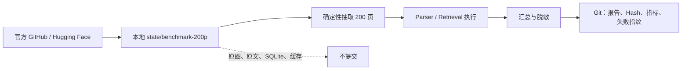

# 基于 OmniDocBench 和 OHR-Bench 的 RAG 基准测试

本目录归档 AgentForge 于 **2026-08-15** 完成的 200 页复杂文档 RAG 工程基准测试。目录只保留可审阅、可校验、可复现所必需的轻量证据；官方大型数据集、页面图片、临时 PDF、SQLite 索引和含原文的完整 Manifest 均不进入 Git。

## 快速结论

| 项目 | 结果 |
|---|---:|
| 不重复页面 | 200 |
| OmniDocBench | 50 页 |
| OHR-Bench | 150 页、427 条 QA |
| Ground Truth Recall@5 | 73.30% |
| Formatting Noise Recall@5 | 70.26% |
| Semantic/OCR Noise Recall@5 | 57.38% |
| Citation Validity | 100% |
| 压力测试 | 未执行 |

> Citation Validity 是检索 Hit 层的数据契约验证，不等同于答案 Claim-level Citation Precision。完整结论、失败证据和边界见 [report.md](report.md)。

## 目录结构

```text
基于OmniDocBench和OHR-Bench的RAG基准测试/
├── .gitignore
├── README.md
├── DATA_SOURCES.md
├── EVIDENCE.md
├── evidence_manifest.json
├── report.md
├── manifests/
│   └── sample_inventory.json
├── results/
│   ├── environment.json
│   ├── sample_summary.json
│   ├── omni_parser_summary.json
│   ├── omni_parser_failures_sanitized.json
│   ├── omni_unavailable.json
│   ├── ohr_retrieval_summary.json
│   └── ohr_retrieval_*.json
└── scripts/
    ├── adversarial_audit.py
    ├── generate_evidence_manifest.py
    ├── prepare_samples.py
    └── run_benchmark.py
```

## 文件职责

- [report.md](report.md)：面向外部评估的正式报告，是本轮结论的主要事实来源。
- [DATA_SOURCES.md](DATA_SOURCES.md)：官方数据来源、下载接口、源文件 Hash 与许可边界。
- [EVIDENCE.md](EVIDENCE.md)：证据保留策略、对抗式审阅结果和不可据此推导的结论。
- `evidence_manifest.json`：提交内证据文件的路径、大小和 SHA-256，可用于完整性核验。
- `manifests/sample_inventory.json`：200 页固定样本的去文本化清单；保留样本身份、分层、定位和 Hash，不保留官方正文。
- `results/`：环境、汇总指标、脱敏失败分类及逐查询排名证据；逐查询文件不包含问题、答案或页面正文。
- `scripts/`：固定抽样、Benchmark 执行、证据 Hash 生成和对抗式审阅脚本；运行数据写入项目根目录下已忽略的 `state/benchmark-200p/`。

## 数据最小化与上传边界



约束如下：

1. Git 中不保留 OmniDocBench 或 OHR-Bench 的完整官方数据集副本。
2. 不提交页面图片、临时 PDF、模型缓存、SQLite 索引或含大段官方正文的 Manifest。
3. 通过官方 URL、源文件 SHA-256、确定性抽样规则、样本级 Hash 和逐查询排名结果提供复现与审阅证据。
4. 提交前检查候选文件总体积与单文件体积；本目录设计目标远低于 1 GiB 上限。
5. 上游数据的下载和使用仍受各官方仓库/数据集页面所列许可证、条款与内容权利约束。

## 复现方式

在项目根目录执行：

```powershell
uv sync --extra documents --extra vector

uv run python "eval\基于OmniDocBench和OHR-Bench的RAG基准测试\scripts\prepare_samples.py"
uv run python "eval\基于OmniDocBench和OHR-Bench的RAG基准测试\scripts\run_benchmark.py" environment
uv run python "eval\基于OmniDocBench和OHR-Bench的RAG基准测试\scripts\run_benchmark.py" parser
uv run python "eval\基于OmniDocBench和OHR-Bench的RAG基准测试\scripts\run_benchmark.py" retrieval

# 刷新证据 Hash 并执行对抗式审阅
uv run python "eval\基于OmniDocBench和OHR-Bench的RAG基准测试\scripts\generate_evidence_manifest.py"
uv run python "eval\基于OmniDocBench和OHR-Bench的RAG基准测试\scripts\adversarial_audit.py"
```

脚本将本地数据写入 `state/benchmark-200p/`。该目录被项目 `.gitignore` 忽略；复现者应先阅读 [DATA_SOURCES.md](DATA_SOURCES.md)，确认数据许可和下载范围。`parser` 与 `retrieval` 会执行实际工作，不属于压力测试。

## 当前状态

- 复杂 PDF Parser：历史 200 页基线中的 OmniDocBench Parser 阶段为 0/50；修复运行时前置条件后，10 页失败样本同集复测为 10/10 解析成功。最小内容完整性门控接受 6/10，并将 4 页路由到 OCR/人工复核。
- 检索：链路可运行，但 Ground Truth Recall@5 未达到 0.85 目标。
- Citation：检索 Hit 层结构验证为 100%。
- 工程回归：本轮记录为 65 项 Pytest 通过，Ruff 全仓检查和 Mypy（20 个 Python 文件）通过。
- 压力测试：按需求未执行。

## 官方入口

- [OmniDocBench 官方仓库](https://github.com/opendatalab/OmniDocBench)
- [OHR-Bench 官方仓库](https://github.com/opendatalab/OHR-Bench)

更完整的数据地址和 Hash 见 [DATA_SOURCES.md](DATA_SOURCES.md)。

## 下一轮执行契约修复（2026-08-15）

现有 `results/` 和 `report.md` 保持为历史证据，不回写旧结果。下一次复用同一批 Benchmark 时：

- Parser Backend 复用已初始化的 Docling/PaddleOCR 实例，不再按文档重复构造模型管线；
- 三次 Parser Attempt 的最后一个位置会保留给显式启用的 Cloud Fallback，避免配置存在但路由不可达；
- SQLite Hybrid Retrieval 只让有效的 Lexical/Metadata Top-N 候选参与 RRF，零分结果不再获得排名分；
- Citation 验证使用统一的 `content_sha256`，并与完整来源页文本 Hash 对照。

这些变更修复的是执行与评估契约，不代表 Recall 或复杂 PDF 解析质量已经提升；新的质量结论必须来自重新执行后的独立结果目录。

## 10 页失败 PDF 回归测试

2026-08-15 从上一轮失败的 OmniDocBench 页面中按 10 个 Stratum 各选择 1 页进行复测。Windows CPU 环境需显式启用 UTF-8，并关闭 Docling 的 `torch.compile`：

```powershell
$env:DOCLING_INFERENCE_COMPILE_TORCH_MODELS = "false"
uv run python -X utf8 "eval\基于OmniDocBench和OHR-Bench的RAG基准测试\scripts\run_failed_pdf_smoke.py"
```

默认结果写入 Git Ignore 的 `state/benchmark-200p/omni_failed_10_smoke_latest.json`。本轮冻结证据位于 [`results/omni_failed_10_smoke_2026-08-15.json`](results/omni_failed_10_smoke_2026-08-15.json)。

复测结果为 10/10 完成解析，但平均字符 Trigram F1 仅为 0.4812，因此**不能把 Parser 成功率或当前结构质量分数直接解释为内容忠实度**。详细对抗性结论见 [`report.md`](report.md#15-失败-pdf-的-10-页小型复测2026-08-15)。

## 最小修复后的同集复测

在同一批 10 页、同一模型缓存和单 Backend 串行条件下加入内容完整性门控后：

- Parser 仍为 **10/10 完成解析**，说明运行可用性没有回退。
- 质量门控接受从 10 页调整为 **6 页**。
- `omni-031`、`omni-016`、`omni-021`、`omni-036` 共 4 页被确定性拒绝并标记 `OCR_REQUIRED`。
- 被拒绝页面均包含视觉/表格信号且文本覆盖严重不足，其中 `omni-021` 与 `omni-036` 的字符 Trigram F1 分别为 0.021 和 0。
- 门控不读取 Ground Truth；Ground Truth 只用于本次离线证明拒绝方向正确。

这次修复的目标是降低 False Acceptance，而不是提高 Parser 内容 F1。因此 `quality_acceptance_rate=0.6` 是安全门控收紧的预期结果，不是解析成功率下降；`parse_success_rate` 仍为 1.0。修复后证据位于 [`results/omni_failed_10_smoke_minimal_fix_2026-08-15.json`](results/omni_failed_10_smoke_minimal_fix_2026-08-15.json)，详细对抗性分析见 [`report.md`](report.md#16-最小内容完整性门控修复后的同集复测2026-08-15)。
