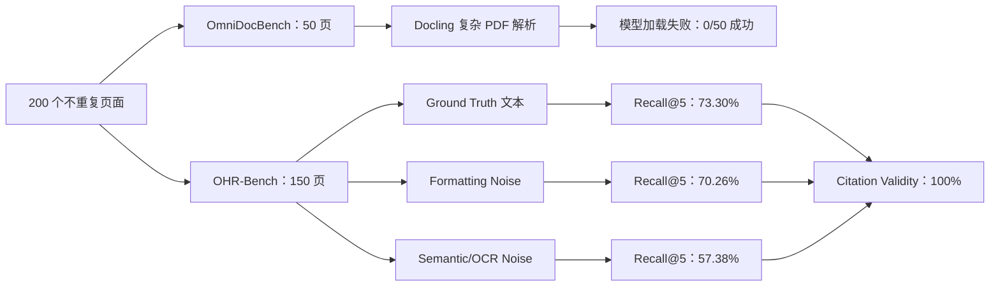
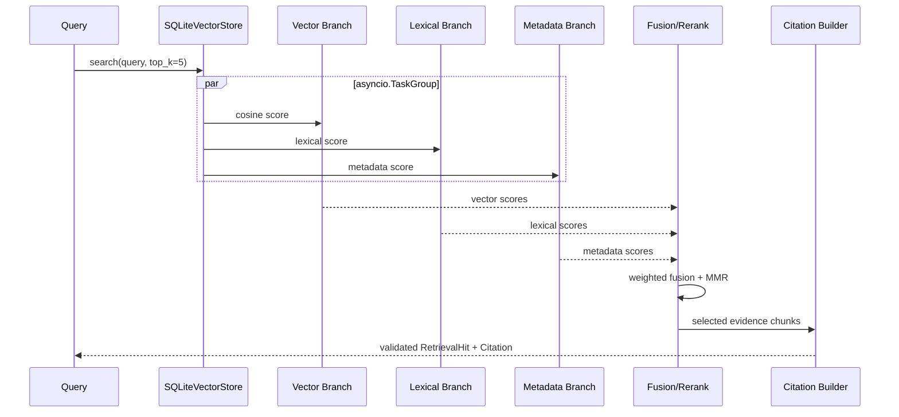
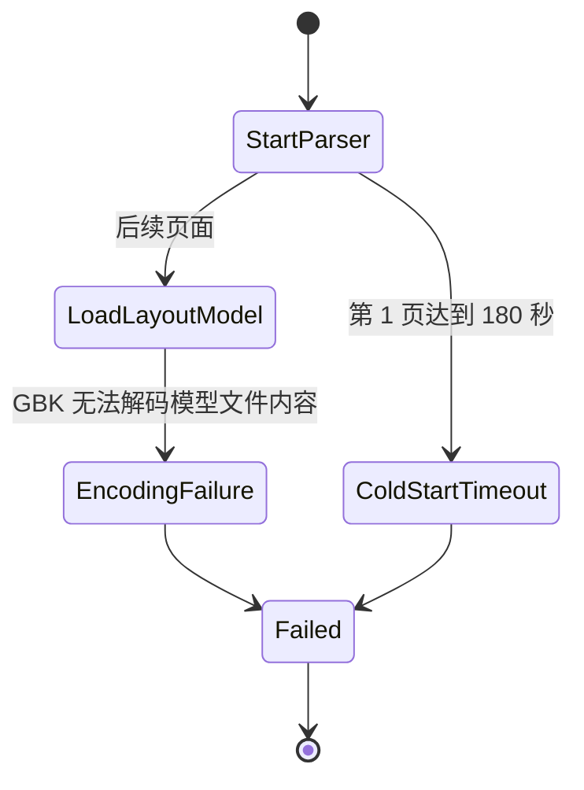
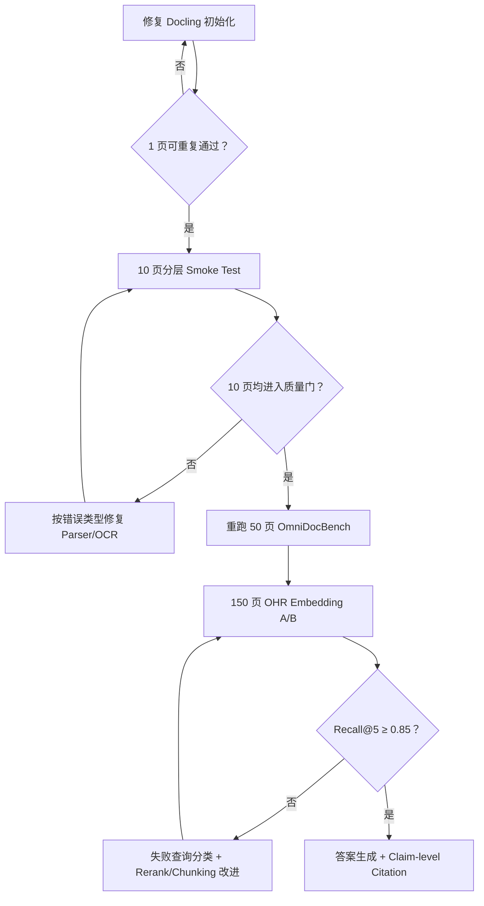

# 200 页 Word/PDF RAG 工程能力测试报告

> **项目**：Agentic RAG Service
> **测试日期**：2026-08-15
> **测试规模**：200 个不重复文档页
> **测试类型**：功能与质量回归；不包含负载、吞吐或并发压力测试
> **结论等级**：**未达到端到端发布门槛**

## 1. 执行摘要

本轮测试按照“控制总工作量、优先暴露工程风险”的原则，从两个公开 Benchmark 中确定性抽取了 **200 个不重复页面**：

- **OmniDocBench：50 页**，覆盖双栏、三栏、复杂报纸版面、中英文表格、公式、彩色背景、笔记和考试材料，用于验证真实复杂页面的 PDF 解析入口。
- **OHR-Bench：150 页**，覆盖 academic、administration、finance、law、manual、news、textbook 七个领域，用于验证 Chunking、混合检索、噪声鲁棒性和 Citation 数据契约。

结论可以概括为三点：

1. **复杂 PDF 解析链路被环境兼容性问题阻断。** 50 页中 0 页成功进入结构解析；49 页在加载 Docling layout model 时因 Windows GBK 解码错误失败，另 1 页在冷启动阶段达到 180 秒超时。因此，本轮不能对阅读顺序、表格恢复、公式识别或 OCR 准确率作正面结论。
2. **下游检索链路能够运行，但召回未达到项目预设门槛。** 使用 OHR-Bench 官方 Ground Truth 文本时，Recall@5 为 **73.30%**，低于设计目标 85%；格式噪声下降至 **70.26%**，语义/OCR 噪声下降至 **57.38%**。
3. **Citation 结构一致性表现稳定。** 三种文本条件下 Citation Validity 均为 **100%**。但该指标只证明“返回引用可回溯到检索 Chunk 和对应来源页”，不等价于“最终答案的事实全部有正确引用”。



**评估判断**：当前项目已经具备清晰的数据契约、Parent-Child Chunking、异步混合检索和可验证 Citation 的工程骨架；但复杂 PDF 主解析器在目标 Windows 环境中尚不能可靠启动，离线 Embedding 与当前 Rerank 策略的召回能力也不足以支撑 0.85 的验收目标。

## 2. 测试目标与边界

### 2.1 本轮要回答的问题

本轮不是追求 Benchmark 榜单分数，而是进行一次受控的工程验收，重点回答：

- 当前复杂 PDF 主解析路径能否在本机稳定启动？
- 当前结构化 Chunking 和本地混合检索是否能够找回官方标注的证据页？
- 面对格式噪声和语义/OCR 噪声时，召回能力下降多少？
- Citation 是否满足 Pydantic 数据契约，且引用文本能够回溯到实际 Chunk？
- 失败是否能够被明确记录，而不是静默生成低质量索引？

### 2.2 明确不在本轮范围内的内容

- 不进行并发、吞吐、长时间稳定性或资源饱和压力测试。
- 不调用付费 LLM 或云端 Embedding API。
- 不评价最终生成答案的 Correctness、Faithfulness、拒答率或 Prompt Injection 防护效果。
- 不测试 Word/DOCX、Cloud Parser、PaddleOCR、Qdrant 或 GPU Parser。
- 不将本轮子集结果解释为 OmniDocBench 或 OHR-Bench 官方排行榜成绩。

### 2.3 指标定义

| 指标 | 本报告中的含义 | 不能代表什么 |
|---|---|---|
| Parse Success | Parser 返回满足项目 `ParsedDocument` 契约的结果 | 不代表解析内容准确 |
| Quality Acceptance | 项目确定性 `ParseQualityEvaluator` 接受该页 | 不代表人工审阅完全正确 |
| Recall@1 | 第 1 个检索结果属于官方证据页 | 不代表答案正确 |
| Recall@5 | 前 5 个结果中至少一个属于官方证据页 | 不代表所有必要证据均被召回 |
| MRR@5 | 首个正确证据页在前 5 位中的平均倒数排名 | 不衡量答案生成质量 |
| Citation Validity | 每个返回 Hit 的 quote 属于该 Hit 文本，Hit 文本属于对应来源页 | 不等价于 Citation Precision 或 Answer Faithfulness |
| 阶段耗时 | 单次、单进程、当前子集的阶段时间 | 不可外推为生产吞吐或并发容量 |

## 3. 200 页分配方案

### 3.1 分配原则

解析测试单页成本高，需要覆盖尽可能多的复杂版面；检索评估单页可产生多个 QA，适合用更大比例获得较稳定的召回统计。因此采用 **25% 复杂解析 + 75% 检索鲁棒性**：

| Benchmark | 页面数 | 占比 | 核心用途 |
|---|---:|---:|---|
| OmniDocBench | 50 | 25% | PDF 解析、复杂版面、表格、公式、OCR 入口 |
| OHR-Bench | 150 | 75% | Chunking、检索、噪声鲁棒性、Citation Contract |
| **合计** | **200** | **100%** | — |

OHR-Bench 的同一组 150 页分别测试 Ground Truth、Formatting Noise、Semantic Noise 三种文本版本。这是对同一批页面的三种输入条件复测，**不重复计入页面总数**。

### 3.2 OmniDocBench 分层

每个分层固定选择 5 页，共 50 页：

| 分层 | 页数 |
|---|---:|
| English academic double-column | 5 |
| Chinese newspaper complex layout | 5 |
| English newspaper three-column | 5 |
| Chinese hard table | 5 |
| English hard table | 5 |
| English academic equation-heavy | 5 |
| Chinese PPT with color background | 5 |
| Mixed-language notes | 5 |
| English exam multi-column | 5 |
| English book equation-heavy | 5 |

样本按固定规则排序后选择，不使用随机种子。一个候选图片链接返回 404，采样器在同一分层中顺延选择下一页，并将不可用样本记录在 `state/benchmark-200p/omni_unavailable.json`。

### 3.3 OHR-Bench 领域分配

| 领域 | 页数 | QA 数 |
|---|---:|---:|
| Academic | 22 | 83 |
| Administration | 22 | 34 |
| Finance | 22 | 131 |
| Law | 21 | 39 |
| Manual | 21 | 46 |
| News | 21 | 52 |
| Textbook | 21 | 42 |
| **合计** | **150** | **427** |

150 页中有 144 页带官方 QA 标注；其余 6 页作为真实的无标签干扰页保留在索引中。检索指标基于与样本证据页有交集的 **427 条官方 QA** 计算。

## 4. 被测工程链路

本轮直接复用项目已有实现，而不是另写一个脱离生产代码的检索器：

- `DoclingParserBackend`：复杂 PDF 主解析入口。
- `ParseQualityEvaluator`：确定性质量门控。
- `ParentChildChunker`：目标 500 Tokens、最大 650 Tokens、连续正文 Overlap 60 Tokens。
- `HashEmbedding(384)`：可复现、无外部服务依赖的离线基线。
- `SQLiteVectorStore`：本地索引与检索。
- Vector、Lexical、Metadata 三个评分分支通过 `asyncio.TaskGroup` 并行执行。
- 检索分支完成后进行融合评分、排序和 MMR 去重。
- Citation 由代码层从实际 Evidence 构造，并通过严格 Pydantic Location Schema 校验。



### 4.1 可复现环境

| 项目 | 值 |
|---|---|
| OS | Windows 10.0.19045 |
| Python | 3.12.13 |
| CPU logical cores | 16 |
| Memory | 15.36 GiB |
| Docling | 2.118.1 |
| Torch | 2.13.0+cpu |
| CUDA | false |
| Embedding profile | `hash-blake2b-v1:384` |

源数据校验值：

| 文件 | SHA-256 |
|---|---|
| `OmniDocBench.json` | `a45cd84b04ad8b793e775089640e6b681209abea33ead54c1828ddca35fae496` |
| `ohr_qas_v2.json` | `2446db28741fa9f392067ee7aae7f3b05e0d85c584069a50ddd5b1b5bc783f58` |

## 5. OmniDocBench：复杂 PDF 解析结果

### 5.1 总体结果

| 指标 | 结果 | 判断 |
|---|---:|---|
| 测试页数 | 50 | 完成 |
| Parse Success | 0/50 | **失败** |
| Quality Acceptance | 0/50 | **失败** |
| 可计算文本相似度的页面 | 0/50 | 无法评价 |
| 常规失败中位耗时 | 3.55 s | 仅用于故障定位 |
| 常规失败 P95 耗时 | 4.98 s | 仅用于故障定位 |
| 单页超时上限 | 180 s | 已触发 1 次 |

十个分层均为 0/5 成功。由于失败发生在 layout model 加载阶段，而不是内容解析阶段，本轮**不能据此判断 Docling 对双栏、表格或公式的算法精度**；能够确认的是，当前项目在该 Windows 用户环境中无法可靠初始化主 Parser。

### 5.2 失败证据

失败分布：

- **49 页**：`RuntimeError`，Docling layout model 从 Hugging Face cache 加载时触发：`'gbk' codec can't decode byte 0x94 ...`。
- **1 页**：冷启动/模型获取阶段达到 180 秒超时。

缓存路径位于包含中文用户名的 Windows 用户目录。当前证据显示这是模型加载或其依赖链的编码兼容问题，而非某一类 PDF 内容特有的问题。



### 5.3 对抗性审阅

该结果暴露的核心工程问题不是“某页没解析好”，而是**基础设施级故障被逐页重复执行**：

- Parser 初始化没有独立 Preflight，批任务在同一个确定性错误上重复失败 49 次。
- 缺少针对“模型加载失败”的 Circuit Breaker；这类错误与页面内容无关，不应继续消耗每页 3–5 秒。
- 当前 180 秒单页超时能够止损，但不能区分首次模型下载、模型初始化和真实解析超时。
- 复杂页不应静默切换到 `pypdf` 并进入正式索引，否则会得到看似成功、实际丢失版面结构的结果。

### 5.4 修复优先级

| 优先级 | 建议 | 验证标准 |
|---|---|---|
| P0 | 在启动或 Ingestion Job 开始前执行 Docling model preflight | 模型只初始化一次；失败时整批快速进入 `needs_review` |
| P0 | 在 ASCII-only cache 路径和 UTF-8 进程环境下复现/排除编码问题 | 选定 1 页能完成端到端解析，且重启后可重复 |
| P0 | 对相同 model-load fingerprint 增加 Circuit Breaker | 同类错误达到阈值后不再逐页调用 Parser |
| P1 | 区分 download、initialization、parse 三类 timeout | 状态与日志能定位具体阶段 |
| P1 | Parser 修复后重跑本报告的 50 页固定清单 | 先获得 Parse Success，再评价文本、版面、表格和公式质量 |
| P2 | 仅对质量门识别出的扫描页启用页级 OCR Fallback | Fallback 不改变数字 PDF 的可信结构，且有最大尝试次数 |

## 6. OHR-Bench：检索与引用结果

### 6.1 总体指标

| 输入条件 | Chunks | Queries | Recall@1 | Recall@5 | MRR@5 | Citation Validity | Median | P95 |
|---|---:|---:|---:|---:|---:|---:|---:|---:|
| Ground Truth | 241 | 427 | 47.31% | **73.30%** | 57.28% | **100%** | 235.70 ms | 273.94 ms |
| Formatting Noise, moderate | 276 | 427 | 41.92% | **70.26%** | 52.41% | **100%** | 277.69 ms | 338.47 ms |
| Semantic Noise, MinerU moderate | 214 | 427 | 31.85% | **57.38%** | 41.54% | **100%** | 219.98 ms | 272.53 ms |

相对 Ground Truth：

- Formatting Noise 的 Recall@5 下降 **3.04 个百分点**。
- Semantic Noise 的 Recall@5 下降 **15.93 个百分点**。
- 语义/OCR 错误造成的损失约为格式噪声损失的 5.2 倍，是当前更重要的检索风险。

### 6.2 分领域 Recall@5

| 领域 | Ground Truth | Formatting Noise | Semantic Noise |
|---|---:|---:|---:|
| Academic | 77.11% | 73.49% | 63.86% |
| Administration | 70.59% | 73.53% | 64.71% |
| Finance | 67.18% | 64.12% | 44.27% |
| Law | 84.62% | 84.62% | 66.67% |
| Manual | 50.00% | 43.48% | 39.13% |
| News | 90.38% | 84.62% | 71.15% |
| Textbook | 80.95% | 78.57% | 73.81% |

观察：

- News 在 Ground Truth 条件下超过 0.85 目标，Law 接近目标。
- Manual 在三种条件下都是最弱领域，Ground Truth Recall@5 仅 50.00%。
- Finance 的 Semantic Noise Recall@5 从 67.18% 降至 44.27%，对语义抽取错误尤其敏感。
- Administration 的 Formatting Noise 分数略高于 Ground Truth，可能来自噪声文本改变 Chunk 边界或词项分布；该小幅上升不应直接解释为格式噪声有益，需要更大样本或逐查询误差分析。

### 6.3 为什么未达到 0.85

本轮使用的是项目明确标注为“deterministic offline baseline”的 `HashEmbedding(384)`。它通过 Token Hash 构造稀疏式固定向量，适合单元测试、离线回归和小型词法型语料，但不具备成熟语义 Embedding 的同义表达能力。因此，73.30% 应被视为**当前离线基线**，不是采用生产级 Embedding 和 Cross-Encoder Reranker 后的能力上限。

从实现与结果联合看，优先验证以下假设：

1. **Embedding 上限**：用同一 150 页、同一 Chunk、同一 QA，仅替换为成熟的 multilingual embedding，做严格 A/B。
2. **Rerank 不足**：当前为固定权重融合，不是学习型 Cross-Encoder；对 Finance、Manual 的长文本和相似页面区分可能不足。
3. **词法归一化不足**：Lexical branch 基于简单空白分词；OCR 粘连、断词、连字符、全半角和 CJK 文本会降低词项重合。
4. **Chunk 边界敏感**：三种文本分别产生 241、276、214 个 Chunks，说明格式和语义噪声会改变 Chunking 结果，进而改变召回空间。
5. **Page-level 相关性较粗**：本轮命中标准是证据页，不是证据 Block。后续应保留 page-level 指标，同时增加 block-level evidence span 指标。

### 6.4 Citation 结果如何解释

三种输入条件下 Citation Validity 均为 100%，说明当前代码层满足：

- `citation.source_id` 指向被索引的来源页；
- `citation.quote` 是实际返回 Chunk 的子串；
- 返回 Chunk 是对应来源页文本的子串；
- PDF Location 能通过严格 Pydantic Schema 验证；
- `source_id`、`chunk_id`、`content_hash` 和 parser metadata 能被一并保留。

该结果支持“引用应由代码从证据构造，而不是让 LLM 自由生成”的架构方向。但本轮没有运行答案生成和逐 Claim 引用对齐，所以不能宣称最终 Citation Precision 已达到 0.95。

## 7. 与项目验收目标对照

| 验收项 | 目标 | 本轮结果 | 状态 |
|---|---:|---:|---|
| 复杂 PDF Parser 可运行 | 应成功进入质量门 | 0/50 | **Fail** |
| Recall@5 | ≥ 0.85 | 0.7330（Ground Truth） | **Fail** |
| Citation Schema 合法率 | 100% | 100% | **Pass** |
| 不存在来源的伪引用 | 0 | 0（检索 Hit 层） | **Pass，范围有限** |
| Retry/Fallback/Loop 有界 | 可证明最大次数 | 本轮脚本单页 180 秒超时；未覆盖完整 Job Fallback | **Partially Verified** |
| 单文档失败不破坏 Active Index | 应保持旧版本 | 未执行故障注入 | **Not Verified** |
| 证据不足拒答率 | ≥ 0.90 | 未运行生成链路 | **Not Verified** |
| 多租户越权召回 | 0 | 未运行多租户集成测试 | **Not Verified** |
| 不进行压力测试 | 是 | 未进行 | **Pass** |

## 8. 风险排序与下一轮最小工作集

### 8.1 风险排序

| 风险 | 严重度 | 证据 | 影响 |
|---|---|---|---|
| Parser model 初始化失败 | Blocker | 50/50 未解析 | 原始 PDF 无法进入 RAG |
| Ground Truth Recall@5 不达标 | High | 73.30% < 85% | 即使文本正确也可能漏证据 |
| Semantic Noise 鲁棒性弱 | High | Recall@5 下降 15.93 pp | OCR/解析误差会被下游放大 |
| Manual/Finance 领域弱 | Medium-High | 最低 39.13%–50.00% | 工程手册和财务材料召回不稳定 |
| Citation 仅验证 Hit 级 | Medium | 未运行 Claim-level 验证 | 不能证明答案级引用正确 |
| 阶段耗时不可外推 | Low | 单机小样本、无压测 | 不应作容量承诺 |

### 8.2 建议的下一轮最小闭环

为继续控制工作量，不建议立即扩大到更多页面。下一轮仍复用当前固定 200 页，按以下顺序推进：

1. **先修 Parser 启动问题，只重跑 1 页**，确认模型预加载与编码路径稳定。
2. 通过后重跑 OmniDocBench 的 **10 页 smoke set**，每个分层 1 页。
3. 10 页均能进入质量门后，再恢复全部 50 页解析回归。
4. 在 OHR-Bench 150 页上做 Embedding A/B，不改变样本、Chunking 或 Top-K。
5. 对 Ground Truth 中失败的 114 条查询进行 error taxonomy：无语义匹配、Chunk 错位、同文档页面混淆、Rerank 排名错误。
6. 只有 Recall@5 达到目标后，才加入 answer generation、Claim-level Citation 和拒答率评测。



## 9. 复现命令

以下命令均在项目根目录执行：

```powershell
cd "<repository-root>"

# 安装项目已有 documents extra；未新增依赖声明
uv sync --extra documents

# 记录环境
uv run python "eval\基于OmniDocBench和OHR-Bench的RAG基准测试\scripts\run_benchmark.py" environment

# 复杂 PDF 解析测试：50 页
uv run python "eval\基于OmniDocBench和OHR-Bench的RAG基准测试\scripts\run_benchmark.py" parser

# 检索与 Citation 测试：150 页、3 种文本条件、427 条 QA
uv run python "eval\基于OmniDocBench和OHR-Bench的RAG基准测试\scripts\run_benchmark.py" retrieval
```

说明：脚本将官方数据、完整含文本 Manifest、页面图片、临时 PDF、SQLite 索引和可重建中间产物写入 `state/benchmark-200p/`。该目录已被项目 `.gitignore` 忽略。Git 只保留去文本化样本清单、汇总指标、脱敏失败指纹和不含问题/答案/正文的逐查询排名证据。官方入口、源文件 Hash 与许可边界见 [DATA_SOURCES.md](DATA_SOURCES.md)。

## 10. 证据与产物

| 产物 | 路径 | 说明 |
|---|---|---|
| 本报告 | `report.md` | 面向外部评估的结论、方法和限制 |
| 数据来源 | `DATA_SOURCES.md` | 官方 URL、源文件 SHA-256、抽样和许可边界 |
| 证据说明 | `EVIDENCE.md` | 保留/排除矩阵与对抗式审阅 |
| 完整性清单 | `evidence_manifest.json` | 提交文件大小、SHA-256 和角色 |
| 200 页样本清单 | `manifests/sample_inventory.json` | 去文本化样本身份、分层、定位和样本 Hash |
| 样本摘要 | `results/sample_summary.json` | 200 页分配、来源 Hash |
| 环境记录 | `results/environment.json` | Python、Docling、Torch 和硬件信息 |
| Omni 脱敏失败明细 | `results/omni_parser_failures_sanitized.json` | 50 页状态、耗时、错误类型和稳定失败指纹 |
| Omni 汇总 | `results/omni_parser_summary.json` | 总体与分层结果 |
| OHR 汇总 | `results/ohr_retrieval_summary.json` | 三种条件总体与领域指标 |
| OHR 逐查询证据 | `results/ohr_retrieval_*.json` | 427 条 QA 的 ID、命中、排名、耗时和引用验证；不含问题、答案或正文 |
| Benchmark 驱动 | `scripts/prepare_samples.py`、`scripts/run_benchmark.py` | 固定抽样与本地执行入口 |

原始 Benchmark 数据与完整中间产物不作为 Git 证据提交；它们可由上述来源和脚本在获准环境中重新生成。

## 11. 已知限制

- OmniDocBench 样本由官方页面图片转换为单页 PDF，适合测试视觉页面解析，但不保留原始多页 PDF 内部对象、书签和跨页关系。
- Parser 在模型加载阶段失败，因此没有产生 OCR、阅读顺序、表格、公式和 Chunk 质量指标。
- OHR-Bench 检索直接使用官方 Ground Truth 或噪声文本，绕过了本项目 Parser；该结果是下游组件测试，不是端到端 RAG 测试。
- HashEmbedding 是离线基线，不能代表生产级语义 Embedding。
- Citation Validity 是检索 Hit 级结构验证，不是答案 Claim 级 Citation Precision。
- 单次阶段耗时只用于定位故障；本轮没有压力测试，不提供吞吐、并发或 SLA 结论。
- 未覆盖 DOCX、扫描件页级 OCR Fallback、Cloud Fallback、Qdrant、多租户隔离、索引原子切换和人工复核流程。

## 12. 工程回归与静态检查

Benchmark 完成后，对当前仓库执行了完整工程校验：

| 检查项 | 命令 | 结果 |
|---|---|---|
| Unit/Integration Tests | `uv run pytest -p no:cacheprovider` | **56 passed，1 warning，23.30 s** |
| Ruff | `uv run ruff check src main.py tests scripts eval/<benchmark>/scripts` | **All checks passed** |
| Mypy | `uv run mypy --no-incremental src scripts` | **20 source files，0 issues** |
| Benchmark 对抗式审阅 | uv run python state/benchmark-200p/adversarial_audit.py | **通过：200 页唯一性、3 × 427 查询指标重算、50 条失败证据、隐私和体积检查** |
| Markdown 验证 | alidate_typora_md.py <file.md> | **6 个 Markdown 文件全部 PASS** |

第一次执行 Pytest 时，系统临时目录 `C:\Users\<user>\AppData\Local\Temp` 返回 Windows `PermissionError`，同时当前虚拟环境只同步了 `documents` extra，缺少 `qdrant-client`。随后采用以下受控修正：

- 同步项目已声明的 `documents` 与 `vector` extras；
- 将 `TEMP` 和 `TMP` 指向仓库内已忽略的 `state/pytest-tmp`；
- 不修改生产代码、测试代码或依赖声明。

修正运行环境后，完整测试套件通过。唯一 warning 来自 Starlette `TestClient` 对 `httpx` 兼容层的弃用提示，不影响本轮测试结论。
## 13. 最终结论

当前项目的工程架构方向是合理的：解析与质量门解耦、Chunk 与 Citation 有清晰的数据契约、检索分支通过 `asyncio.TaskGroup` 并行、Pydantic 在代码层阻止无效引用进入响应。然而，本轮 200 页证据显示，系统尚不能被描述为“复杂文档 RAG 已完成”：

- 原始复杂 PDF 入口在目标环境中 **完全不可用**；
- 正确文本条件下 Recall@5 仍比 0.85 目标低 **11.70 个百分点**；
- 语义/OCR 噪声会进一步造成 **15.93 个百分点**的召回损失；
- Citation Contract 已具备可用的工程基础，但答案级可信度仍需后续验证。

因此，下一步不应扩大 Benchmark 页数，也不应先增加更多 Agent 功能。应先完成 **Parser Preflight/Circuit Breaker → 50 页解析回归 → Embedding/Rerank A/B → Claim-level Citation** 这一最小闭环，再决定是否扩展数据规模。

## 14. 参考资料

1. [OmniDocBench — Official GitHub Repository](https://github.com/opendatalab/OmniDocBench)
2. [OmniDocBench — Hugging Face Dataset](https://huggingface.co/datasets/opendatalab/OmniDocBench)
3. [OHR-Bench — Official GitHub Repository](https://github.com/opendatalab/OHR-Bench)
4. [OHR-Bench — Hugging Face Dataset](https://huggingface.co/datasets/opendatalab/OHR-Bench)
5. [OHR-Bench Paper — arXiv:2412.02592](https://arxiv.org/abs/2412.02592)
6. [Docling — Official GitHub Repository](https://github.com/docling-project/docling)
