# 基于 OmniDocBench 和 OHR-Bench 的 RAG 基准测试 v2

本目录复用既有固定 **200 页 PDF** 样本身份，不新增页面预算：OmniDocBench 50 页、OHR-Bench 150 页。

本轮只验证工程闭环：Metrics、Trace、告警规则、离线 Backup、完整性校验、隔离 Restore，以及恢复前后检索签名一致性。**不执行负载、吞吐、并发或压力测试**。

原始官方数据和运行态继续保存在 Git ignored 的 `state/`，本目录只保留小型、可审阅证据。

## 数据来源

- 样本来源、许可证和下载方式沿用 `../基于OmniDocBench和OHR-Bench的RAG基准测试/DATA_SOURCES.md`。
- 固定样本清单沿用 `../基于OmniDocBench和OHR-Bench的RAG基准测试/manifests/sample_inventory.json`。
- 本轮不会重新计算 PDF Parser 质量；输入层使用这 200 页对应的 canonical ground-truth text，专门隔离验证可观测性和灾备正确性。

## 流程

```mermaid
flowchart LR
    A["固定 200 页样本身份"] --> B["Canonical Text 派生文件"]
    B --> C["顺序 Ingestion 与 Retrieval"]
    C --> D["Metrics 与 Trace 证据"]
    D --> E["服务停止并获取状态锁"]
    E --> F["SQLite Online Backup API"]
    F --> G["SHA-256 与 integrity_check"]
    G --> H["隔离目录 Restore"]
    H --> I["恢复后 200 次顺序 Retrieval"]
    I --> J["状态计数与检索签名逐项对比"]
```



## 运行

```powershell
$env:PYTHONPATH = "src"
.\.venv\Scripts\python.exe ".\eval\基于OmniDocBench和OHR-Bench的RAG基准测试v2\scripts\run_operational_benchmark.py"
```

告警规则验证需要官方 `promtool` 和 `amtool`，二进制保存在 Git ignored 的 `state/tools/`：

```powershell
.\.venv\Scripts\python.exe ".\eval\基于OmniDocBench和OHR-Bench的RAG基准测试v2\scripts\validate_alerts.py" `
  --promtool ".\state\tools\prometheus-3.13.1.windows-amd64\promtool.exe" `
  --amtool ".\state\tools\alertmanager-0.32.1.windows-amd64\amtool.exe"
```

## 灾备 CLI 演练

服务停止后，可使用统一 CLI 创建、校验并恢复到隔离目录：

```powershell
$env:PYTHONPATH = "src"
.\.venv\Scripts\python.exe -m agent_service.operations backup --state-dir <state-dir> --output-dir <backup-root>
.\.venv\Scripts\python.exe -m agent_service.operations verify --backup-dir <backup-dir>
.\.venv\Scripts\python.exe -m agent_service.operations restore --backup-dir <backup-dir> --target-state-dir <isolated-state-dir>
```

## 证据产物

- `report.md`：人工可读结论、边界和对抗式审阅。
- `results/operational_benchmark.json`：固定 200 页、11 项机器验收结果。
- `results/metrics_snapshot.prom` 与 `results/trace_summary.json`：Metrics/Trace 轻量证据。
- `results/alert_validation.json`：promtool/amtool 验证结果。
- `results/cli_recovery_validation.json`：脱敏 CLI Backup/Verify/Restore 演练结果。
- `evidence_manifest.json`：证据文件与 gitignored 源 manifest 的 SHA-256。
