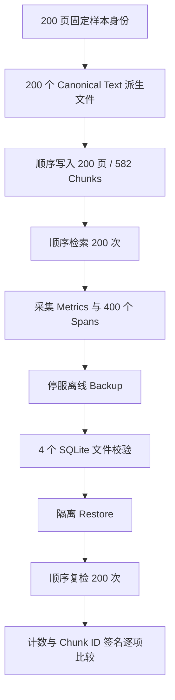

# 基于 OmniDocBench 和 OHR-Bench 的 RAG 基准测试 v2：可观测性与灾备报告

> 测试日期：2026-08-15
> 结论边界：顺序功能、可观测性和恢复正确性测试；**未执行负载、吞吐、并发或压力测试**。

## 1. 目标与预算

本轮沿用此前固定的 200 个 PDF 页面身份，不扩大数据预算：OmniDocBench 50 页、OHR-Bench 150 页。为隔离验证 Metrics、Trace、告警和灾备链路，输入使用这 200 页对应的 canonical ground-truth text；本轮不重复评价 PDF Parser 质量，也不覆盖此前 Parser benchmark 的结论。

方案允许增加测试机，但本次闭环不依赖横向扩容，因此实际只使用 1 台测试机。页面总量仍严格保持 200 页。

## 2. 测试环境

| 项目 | 值 |
|---|---|
| Test node | `local-node-1` |
| 物理测试机 | 1 台；方案允许增加测试机，但本轮无需使用 |
| OS | Windows 10 10.0.19045 |
| Python | 3.12.13 |
| Embedding | Deterministic HashEmbedding |
| Vector backend | SQLite |
| Prometheus 工具 | promtool 3.13.1 |
| Alertmanager 工具 | amtool 0.32.1 |
| 执行方式 | 全程顺序执行，无并发压测 |

## 3. 结果摘要

| 验收项 | 结果 | 证据 |
|---|---:|---|
| PDF 页面预算 | 200/200 | OmniDocBench 50 + OHR-Bench 150 |
| Ingestion | 200/200 | 582 Chunks，200 Active Versions |
| 恢复前可检索 | 200/200 | 所有页面至少 1 个命中 |
| 恢复后可检索 | 200/200 | 所有页面至少 1 个命中 |
| 状态计数一致 | 通过 | 582 Chunks、200 Active Versions 完全一致 |
| 检索签名一致 | 通过 | 200 个样本 Chunk ID 列表 mismatch=0 |
| Metrics family | 6/6 | RAG、ingestion、backup、restore、trace export 均存在 |
| Backup/Restore 状态指标 | 通过 | backup success 时间戳和 restore success counter 均从持久化状态加载 |
| Trace 内容安全 | 通过 | 400 Spans，正文/查询内容属性出现 0 次 |
| Backup 校验 | 通过 | 4/4 SQLite 文件 size/hash/integrity 通过 |
| Prometheus/Alertmanager 配置 | 通过 | 4/4 官方工具检查通过，8 条规则 |
| CLI 灾备演练 | 通过 | backup、verify、隔离 restore 三个命令均成功 |

全部 **11 项**机器可判定 benchmark acceptance 均为 `true`。

## 4. 单请求阶段耗时（仅诊断，不是性能结论）

| 阶段 | 结果 |
|---|---:|
| 200 页顺序 Ingestion | 21.729 s |
| 恢复前 200 次顺序 Retrieval | 8.836 s |
| 恢复前单请求 mean/min/max | 41.09 / 33.57 / 127.32 ms |
| Backup | 0.318 s |
| Backup verify | 0.111 s |
| Restore | 0.230 s |
| 恢复后 200 次顺序 Retrieval | 8.937 s |
| 恢复后单请求 mean/min/max | 41.56 / 33.62 / 137.43 ms |

这些数字只用于定位阶段异常。由于未控制硬件、缓存、后台负载和统计置信区间，不得据此作容量、SLA、吞吐或并发结论。

## 5. Metrics 与 Trace 验证

- Metrics 快照包含 6 个必需 family。
- 备份成功时间戳大于 0，证明离线备份状态可被新进程重新加载。
- 恢复成功 counter 为 1，证明隔离恢复验证结果可被新服务实例重新加载。
- 采集 200 个 `rag.ingest` 和 200 个 `rag.retrieve` Span，共 400 个 Span、400 个 Trace ID。
- Trace 属性未记录问题正文、Chunk 正文或原始查询内容；禁止内容字段出现次数为 0。
- 证据仅提交 Metrics 快照、Trace 摘要与 SHA-256，不提交完整本地 Trace JSONL。

## 6. 告警验证

官方 `promtool`/`amtool` 验证结果：

- Prometheus config：通过；加载 1 个 rule file。
- Alert rules：通过；识别 8 条规则。
- Rule unit tests：通过；覆盖 degraded retrieval firing/resolved 与 ingestion failure。
- Alertmanager config：通过；示例 receiver 和 route 可解析。

本轮未连接真实企业通知渠道，因此“规则计算与路由配置”已验证，“Webhook/IM/On-call 实际送达”未验证。

## 7. 备份与恢复闭环

闭环采用停服离线备份：服务持有状态目录锁时，Backup 必须失败；服务关闭后，SQLite 使用一致性备份接口生成 4 个文件，并逐文件校验 size、SHA-256 和 `PRAGMA integrity_check`。Restore 默认写入新的隔离目录，验证通过后再由运维决定是否切换。

除 benchmark 内部调用外，本轮额外执行 CLI 演练：

1. `backup` 创建 `afb_20260815T183754Z_e3b765a3`，4/4 文件验证通过；
2. `verify` 再次验证相同备份，结果有效；
3. `restore` 恢复到新的隔离状态目录，结果 `verified=true`。

命令输出已脱敏整理到 `results/cli_recovery_validation.json`，未提交实际数据库备份。

## 8. 对抗式审阅

| 质疑 | 客观回答 |
|---|---|
| 是否偷换成 200 个新页面？ | 否。复用已有 50+150 固定页面身份，没有扩大页面预算。 |
| 是否证明复杂 PDF Parser 已解决？ | 否。本轮输入是 canonical text，专测运维闭环；Parser 能力仍以前序 OmniDocBench/OHR-Bench 报告为准。 |
| 恢复后“能查到”是否过于宽松？ | 除 200/200 命中外，还逐样本比较 Chunk ID 签名，mismatch=0，并比较数据库计数。 |
| Metrics family 存在是否等于状态有效？ | 否，因此额外断言 backup 时间戳大于 0、restore success counter 等于 1。 |
| 是否证明生产性能？ | 否。明确未压测，耗时只能作为单机顺序诊断数据。 |
| 是否证明告警真实送达？ | 否。只验证语法、规则行为和 Alertmanager 配置，真实通知渠道需在部署环境验收。 |
| 是否覆盖 Qdrant 灾备？ | 否。当前 Qdrant 路径 fail-closed，待 collection snapshot 单独验收。 |
| 是否可抵御攻击者同时改 manifest 和数据？ | 不能。当前 SHA-256 提供损坏检测，但无签名或不可变存储证明。 |
| 是否已经形成异地灾备？ | 否。本轮只证明本机隔离恢复；未验证 off-host/immutable copy。 |

## 9. 结论

本轮证明了 **SQLite/Local-first 部署下的最小工程闭环可工作**：指标可抓取，持久化 Backup/Restore 状态可被重新加载；Trace 可关联且不携带正文；规则可被官方工具验证；运行中备份被锁阻止；离线备份可校验；恢复可在隔离目录完成；固定 200 页的检索状态在恢复前后完全一致。

这不等于“企业完整灾备认证”。进入生产前仍需完成真实通知渠道、跨主机/离线副本、备份保留策略、manifest 签名或不可变存储、Qdrant snapshot 集成，以及依据业务 RTO/RPO 制定调度频率。

## 10. 证据索引

- `results/operational_benchmark.json`
- `results/metrics_snapshot.prom`
- `results/trace_summary.json`
- `results/backup_manifest_sanitized.json`
- `results/alert_validation.json`
- `results/cli_recovery_validation.json`
- `evidence_manifest.json`
- `EVIDENCE.md`
- `DATA_SOURCES.md`
