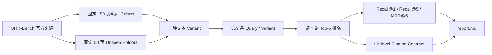

# Benchmark 证据说明

## 证据链

## 保留的必要证据

- `manifests/sample_inventory.json`：200 个不重复页面的身份、Cohort、领域、页号、QA 数量与三种文本 Hash；不含正文。
- `results/ohr_retrieval_*.json`：每条 Query 的相关 Source ID、Top-5 Source ID、首个相关排名、单请求阶段耗时与 Citation 校验布尔值。
- `results/ohr_retrieval_summary.json`：200 页综合指标。
- `results/cohort_summary.json`：150 页纵向、50 页 Holdout 及首轮 Baseline。
- `results/adversarial_gate.json`：Benchmark 启动前的代码与安全门禁。
- `evidence_manifest.json`：上述文件的字节数和 SHA-256。

## 指标口径

- Recall@1/5：至少一个 Ground Truth Source 在前 1/5 个 Hit 中。
- MRR@5：首个 Ground Truth Source 在前 5 个 Hit 中的倒数排名，未命中记 0。
- Citation Validity：Hit 的 Citation 字段、Source/Chunk/版本关系和 Quote 可回溯性通过代码校验。

**Citation Validity 100% 不等于答案级 Citation Precision 100%。** 本轮未让 LLM 生成答案，也没有做人类 Claim-level Entailment 标注，因此不能声称所有引用都在语义上完整支撑最终答案。

## 对抗式审阅结果

通过项：

1. 构造误导性 HashEmbedding 排名，确认非语义 Dense Rank 不再压过 BM25。
2. 验证旧 SQLite 数据库 FTS Backfill、Chunk 更新和 Source 删除保持一致。
3. 验证 Top-K 优先覆盖不同页面，再填充同页 Chunk。
4. 全量回归覆盖 Tenant/ACL Pre-filter、Retrieval 分支降级、Citation Contract 和版本一致性。
5. 200 页清单不重复，150 页与 50 页 Row Index 不相交；每个 Variant 均为 559 条记录。
6. 目录不含官方正文、问题、答案、图片、PDF、SQLite 数据库或超过 1 GB 的内容。

保留风险：

- Semantic/OCR Noise 仍弱于 Clean/Formatting，尤其 Finance 领域仍是主要 Hard Case。
- Qdrant Adapter 仍是 Dense-first；本次最小修复只闭合 SQLite Local-first 路径。
- SQLite `unicode61` 不是完整中文分词器；中文专业语料需要单独 Fixture 决定是否引入专用 Analyzer。
- 单次查询耗时随索引规模变化，只用于故障定位，不能解释为 P95 服务容量。

## 未计入结果

在确定本轮 Scope 时曾启动 OmniDocBench Parser 探索运行，处理 4 页后取消。原因是本次代码未修改 Parser，继续占用 200 页预算无法验证 Retrieval 修复。该未完成运行不进入 V3 指标、样本清单或结论。
