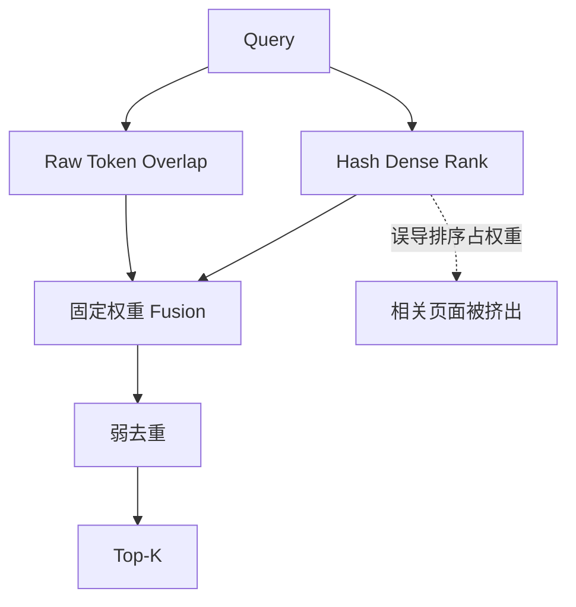
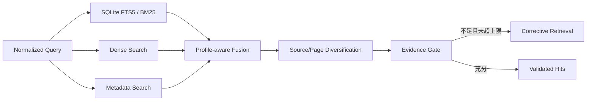

# RAG 召回率最小修复与第三次 200 页 Benchmark 报告

> 日期：2026-08-16
> 范围：Retrieval Recall、噪声鲁棒性、Hit-level Citation Contract、回归安全性
> 不包含：并发压测、吞吐量、生产 QPS、LLM 答案质量、答案级引用蕴含判断

## 1. 结论先行

本次修复通过了“先对抗式审阅、再执行 Benchmark”的门禁。第三次 Benchmark 使用 **200 个不重复 OHR-Bench 页面**：150 页与首轮完全相同，50 页为不重叠的 Unseen Holdout；每种文本 Variant 执行 559 条 Query。

| Variant | 200 页 Recall@1 | 200 页 Recall@5 | 200 页 MRR@5 | Hit-level Citation Validity |
|---|---:|---:|---:|---:|
| Ground Truth | 80.86% | 95.53% | 87.36% | 100.00% |
| Formatting Noise | 81.22% | 95.53% | 87.68% | 100.00% |
| Semantic/OCR Noise | 65.12% | 88.91% | 74.55% | 100.00% |

**客观判断**：原始 150 页 Cohort 上三个 Variant 的 Recall@5 均超过预设 0.85 总体门槛，Unseen Holdout 也未出现回退，说明本次最小修复有效解决了主要排序缺陷。系统仍不能仅凭本轮结果宣称“RAG 已全面企业级”：Semantic/OCR Noise 的 200 页 Recall@5 为 88.91%，Finance 子域仍有明显缺口，Qdrant Sparse Retrieval 和答案级 Citation 尚未闭环。

## 2. 为什么首轮召回率低

首轮结果并非单一 Embedding 选型问题，而是多个排序假设同时失效：

1. **非语义 HashEmbedding 被当作语义向量使用**：默认 Local-first 配置中，Hash 向量仅适合确定性测试，却获得高 Fusion 权重，错误 Dense Rank 会压过更可靠的词法命中。
2. **Lexical Search 只做原始空格 Token Overlap**：缺少 IDF、文档长度归一化和成熟全文索引，对长页面、表格化文本及稀有术语的区分能力不足。
3. **候选融合把无效 Rank 当有效证据**：零分或弱分支仍可能通过 RRF 获得排序收益。
4. **“MMR”实际只做前缀去重**：同页多个相似 Chunk 容易占满 Top-K，降低页面级 Recall。
5. **Evidence Gate 过宽**：任一非零 Lexical Overlap 即可视为证据充分，阻断 Corrective Retrieval。

## 3. 最小修复方案

遵循 YAGNI，本轮没有新增外部依赖，而是采用 Python SQLite 已提供的 **FTS5/BM25**：

- 新增与 Canonical Chunk 同事务维护的 FTS5 Side Index；旧数据库在初始化时按行数差异进行 Backfill。
- SQLite Local-first 的 HashEmbedding Profile 将 Dense 权重设为 0，并从 RRF Rank 输入中排除；语义 Embedding Provider 仍保留 Dense 权重。
- BM25、Metadata 与有效 Rank 参与确定性 Fusion；FTS5 技术失败时退回旧 Overlap，并显式记录 `degraded_retrieval`。
- Top-K 先覆盖不同 Source/Page，再补充同页 Chunk，降低重复候选挤占。
- Evidence Gate 要求最终 Fused/Rerank Score 达到阈值，不能由单个偶然 Token 命中直接放行。
- Tenant、ACL、Source、Active Version 过滤在 FTS 查询中与 Canonical Store 保持一致。

## 4. 先审阅、后 Benchmark 的门禁

Benchmark 前执行了以下 Adversarial Cases：

| 风险 | 测试设计 | 结果 |
|---|---|---|
| Hash Dense Rank 误导 | 自定义 Provider 把无关文档排第一 | BM25 相关文档保持 Top Rank，Pass |
| FTS 与 Canonical 数据漂移 | 旧库 Backfill、Update、Delete | 行为一致，Pass |
| Top-K 被同页 Chunk 占满 | 同页重复候选 + 不同页相关候选 | 先跨页覆盖，Pass |
| Tenant/ACL 越权 | 全量既有隔离回归 | Pass |
| Schema/类型回退 | 全量 Pydantic/Citation 回归 | Pass |
| 代码质量 | Pytest、Ruff、Mypy strict | 90 Passed；Ruff Pass；Mypy 25 files Pass |

若上述任一项失败，本轮不会进入 200 页 Benchmark。门禁记录见 `results/adversarial_gate.json`。

## 5. 页面分配为何改为 150 + 50

本轮修改的是 Retrieval，不是 PDF Parser。若仍机械分配 50 页 OmniDocBench，会重复测试未变化的解析路径，削弱有限预算对召回修复的判断力。因此采用：

- **150 页 Longitudinal Cohort**：和首轮完全相同，直接测 Before/After。
- **50 页 Unseen Holdout**：从后续固定 OHR-Bench 窗口按领域配额选择，排除同集过拟合。

这是 Scope-driven Allocation，不是为了选择更容易的数据。Holdout 的 Row Index 与旧 Cohort 完全不相交，选择规则和内容 Hash 已固化。

## 6. 纵向 150 页 Before/After

| Variant | 首轮 Recall@1 | 本轮 Recall@1 | 变化 | 首轮 Recall@5 | 本轮 Recall@5 | 变化 |
|---|---:|---:|---:|---:|---:|---:|
| Ground Truth | 47.31% | 77.28% | +29.98 pp | 73.30% | 94.38% | +21.08 pp |
| Formatting Noise | 41.92% | 77.28% | +35.36 pp | 70.26% | 94.38% | +24.12 pp |
| Semantic/OCR Noise | 31.85% | 60.19% | +28.34 pp | 57.38% | 86.42% | +29.04 pp |

Ground Truth 的 MRR@5 从 57.28% 提升至 84.85%，说明改善不只发生在第五名边界，相关页面的平均首命中位置也前移。

## 7. 50 页 Unseen Holdout

| Variant | Recall@1 | Recall@5 | MRR@5 |
|---|---:|---:|---:|
| Ground Truth | 92.42% | 99.24% | 95.45% |
| Formatting Noise | 93.94% | 99.24% | 96.34% |
| Semantic/OCR Noise | 81.06% | 96.97% | 87.40% |

Holdout 没有复用旧页面，结果支持修复具有一定泛化性。但其文档数、Chunk 数和 Query 分布与 150 页 Cohort 不同，不能用更高 Holdout 分数证明其“更难”或“更优”。

## 8. 仍然失败在哪里

### 8.1 Semantic/OCR Noise

200 页综合 Semantic/OCR Noise Recall@5 为 88.91%，低于 Ground Truth 的 95.53%。BM25 能修复词法排序，但当 OCR 造成实体、数值、单位或表格结构本身丢失时，检索层无法恢复不存在的证据。

### 8.2 Finance Hard Cases

纵向 150 页中，Finance 的 Recall@5 为：Ground Truth 84.73%，Formatting 83.97%，Semantic/OCR 75.57%。财务页面的数字、表格表头、单位和跨行关系更依赖结构化解析，纯文本 BM25 的上限较明显。

### 8.3 Remote Vector Store

SQLite Local-first 路径已闭环 FTS5/BM25，但 Qdrant Adapter 仍以 Dense Retrieval 为主。本轮没有为 Qdrant 增加 Sparse Vector、Hybrid Query 或独立 BM25 服务，避免在没有远程部署 Fixture 的情况下扩大改动面。

## 9. 延迟数据如何解释

报告保留每条 Query 的阶段耗时用于定位回归，但未执行压力测试。200 页综合单请求记录的 Median/P95 分别为：

| Variant | Median | P95 |
|---|---:|---:|
| Ground Truth | 203.54 ms | 235.36 ms |
| Formatting Noise | 222.85 ms | 257.29 ms |
| Semantic/OCR Noise | 188.25 ms | 214.68 ms |

这些数值不是服务 P95、QPS 或容量结论：运行是串行离线评估，150 页与 50 页索引规模不同，机器状态也没有按性能实验控制。

## 10. 验收判定

| 验收项 | 门槛 | 结果 | 判定 |
|---|---:|---:|---|
| 150 页 Ground Truth Recall@5 | ≥ 0.85 | 0.9438 | Pass |
| 150 页 Formatting Recall@5 | ≥ 0.85 | 0.9438 | Pass |
| 150 页 Semantic/OCR Recall@5 | ≥ 0.85 | 0.8642 | Pass |
| 50 页 Holdout 三 Variant Recall@5 | 无显著回退 | 最低 0.9697 | Pass |
| Citation Schema/Source 合法率 | 100% | 100% | Pass |
| 测试、Lint、Type Check | 全通过 | 90 / Pass / 25 files | Pass |
| 总页数 | 200 | 200 | Pass |
| Git 交付物 | < 1 GB 且无官方大数据 | 满足 | Pass |

## 11. 下一步边界

仅在以下 Trigger 出现时继续扩展：

1. **Qdrant 成为默认生产 Store**：增加 Sparse Vector/BM25 Hybrid PoC，并用相同 200 页 Fixture 做一致性回归。
2. **中文专业文档成为主要语料**：建立中文术语、数字、单位和表格 Query Fixture，再评审 Analyzer/分词依赖。
3. **Finance Semantic/OCR Recall@5 目标提升至 0.85**：优先修 Parser 的表格结构与实体保真，再评估 Query Expansion 或 Learned Reranker，不能只调 Fusion 权重。
4. **需要声明答案级 Citation Precision**：增加 LLM Answer Generation、Claim Extraction、Source Entailment 和人工抽检协议。

## 12. 最终客观结论

本轮已经把“默认 Local-first 检索排序明显失真”从架构缺陷修复为可接受的工程基线：同一 150 页上 Ground Truth Recall@5 提升 21.08 个百分点，Semantic/OCR Noise 提升 29.04 个百分点，并通过 50 页不重叠 Holdout。结论应表述为：**SQLite Local-first RAG Retrieval 已达到当前 Fixture 下的落地级最小门槛；复杂 OCR、Finance 表格、远程 Qdrant Hybrid 与答案级 Citation 仍是明确未闭环项。**
