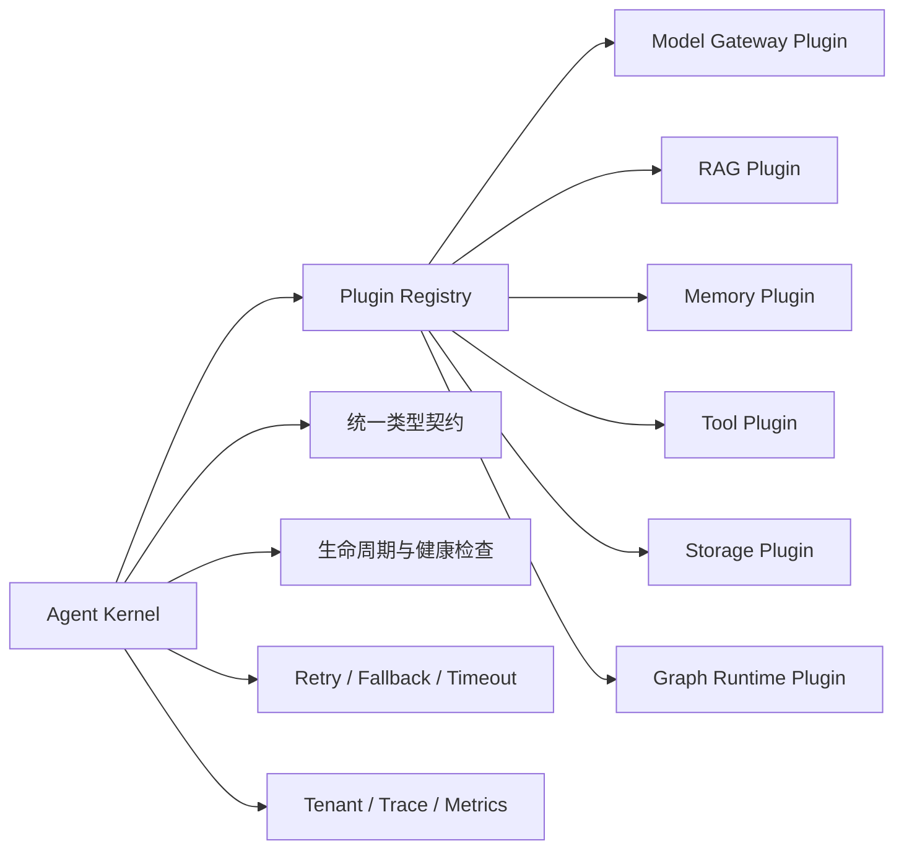
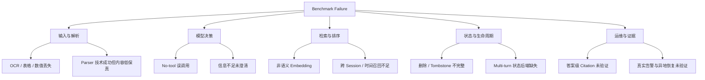

# AgentForge 综合评测报告

> 报告日期：2026-08-18
> 覆盖范围：RAG、Tool Orchestration、Memory、可观测性与备份恢复
> 评测原则：固定样本、保留失败、证据可复算、结论不越过测试边界
> 性能边界：既有评测均为顺序功能或质量测试，**未执行 QPS、并发、吞吐或压力测试**

## 1. 执行摘要

AgentForge 已完成三轮 RAG 主评测、一次复杂 PDF 失败页 Smoke Test、一次 Tool Orchestration Benchmark 和一次 Memory Benchmark。当前结果表明：

- **RAG 检索链路已形成 Local-first 落地基线。** 在第三轮 200 页、每种文本条件 559 条 Query 的测试中，Ground Truth、Formatting Noise、Semantic/OCR Noise 的 Recall@5 分别达到 **95.53%、95.53%、88.91%**；相比首轮相同 150 页 Cohort，分别提升 **21.08、24.12、29.04 个百分点**。
- **RAG 工程恢复闭环已通过固定样本验证。** 同一批 200 页在备份恢复前后均可检索，582 个 Chunk、200 个 Active Version 计数一致，200 个样本的 Chunk ID 签名差异为 **0**；400 个 Trace Span 中未记录正文或查询内容属性。
- **Tool Runtime 的确定性失败边界较完整，但模型决策仍需补强。** 60 项评测总体通过率 **80.00%**；DAG、`$ref`、Schema、Timeout、Unknown Tool 等 15 项内部对抗用例全部通过，但 No-tool、信息不足澄清、参数规范化和真实 Stateful Multi-turn 仍存在缺口。
- **Memory 的隔离与上下文控制有效，但长期语义记忆尚未落地。** 内部隔离与压缩集通过 **18/20**，Tenant Isolation、Rolling Summary、Tool Result Spill 均为 **5/5**；LongMemEval Evidence Recall@5 仅 **26.33%**，Abstention、时间推理、跨 Session 聚合和删除闭环是主要短板。

因此，当前项目应客观定位为：**RAG 的 SQLite Local-first 检索与工程恢复达到当前 Fixture 下的最小落地门槛；Tool Runtime 具备可靠性骨架；Memory Long-term Retrieval 尚未达到企业级。整个 Agent 系统仍不能仅凭现有 Benchmark 宣称全面企业级。**

## 2. 插件化如何实现（简述）

插件化不是把文件放进 `plugins/` 目录，而是让业务内核只依赖稳定契约，不直接依赖某个模型、向量库、工具框架或 Memory 实现。

实现时只需要抓住四点：

1. **定义协议**：每类插件实现统一的异步接口，例如 `embed()`、`retrieve()`、`recall()`、`execute()` 和 `healthcheck()`。
2. **声明能力**：插件通过 Manifest 声明版本、输入输出 Schema、是否支持 Streaming、Batch、OCR、Sparse Retrieval、持久化状态和副作用。
3. **注册与选择**：Registry 根据配置和 Capability 选择实现；Kernel 只拿到接口，不直接实例化 Qdrant、OpenAI、Docling 或 LangGraph。
4. **隔离状态和失败**：插件拥有自己的连接、缓存和持久化状态；Kernel 统一控制超时、重试、降级、指标和 Trace。更换 Embedding、Chunker 或 Vector Store 时必须创建新版本并迁移，不能把不兼容的向量空间直接混用。

简单理解：**Kernel 类似插座标准，Model、RAG、Memory、Tools 是可替换电器；能否替换取决于接口、电压和状态格式是否一致，而不是类名是否相同。**

## 3. Benchmark 总览

| 模块 / 轮次 | 日期 | 规模 | 核心结论 | 当前判定 |
|---|---|---:|---|---|
| RAG v1：解析与检索基线 | 2026-08-15 | 200 页；OHR 每 Variant 427 Query | PDF Parser 0/50；Recall@5 为 73.30% / 70.26% / 57.38% | 未达标 |
| PDF 失败页 Smoke Test | 2026-08-15 | 10 页 | 10/10 可解析；修复质量门后仅 6/10 接受，4 页因内容保真不足被拒绝 | 门控修复有效 |
| RAG v2：可观测性与灾备 | 2026-08-15 | 沿用 200 页 | 恢复前后 582 Chunks、200 Versions、200 个检索签名一致 | 最小闭环通过 |
| RAG v3：召回率修复 | 2026-08-16 | 200 页；每 Variant 559 Query | Recall@5 为 95.53% / 95.53% / 88.91% | 当前 Fixture 达标 |
| Tool Orchestration v1 | 2026-08-17 | 60 Case | 48/60，80.00%；内部对抗集 15/15 | Runtime 基线有效，决策层不足 |
| Memory v1 | 2026-08-17 | 70 Case | LongMemEval Recall@5 26.33%；内部集 18/20 | 长期语义记忆未达标 |

> 注：不同轮次复用了部分页面和样本，表中规模不能简单相加为“独立样本总数”。报告中的耗时仅用于单次故障定位，不能解释为生产 P95、P99、QPS 或容量数据。

## 4. RAG Benchmark 复盘

### 4.1 第一轮：复杂文档解析与检索基线

第一轮采用 **OmniDocBench 50 页 + OHR-Bench 150 页**：前者验证双栏、表格、公式、扫描件等复杂 PDF 入口，后者验证 Chunking、Retrieval 和 Hit-level Citation Contract。

| 测试项 | 结果 |
|---|---:|
| OmniDocBench Parser Success | 0/50 |
| Ground Truth Recall@1 / Recall@5 / MRR@5 | 47.31% / 73.30% / 57.28% |
| Formatting Noise Recall@1 / Recall@5 / MRR@5 | 41.92% / 70.26% / 52.41% |
| Semantic/OCR Noise Recall@1 / Recall@5 / MRR@5 | 31.85% / 57.38% / 41.54% |
| Hit-level Citation Validity | 三种条件均为 100% |

主要失败原因：

- Docling Layout Model 在目标 Windows 环境中触发 GBK 解码错误，49 页失败；另 1 页冷启动达到 180 秒超时。
- 非语义 HashEmbedding 被赋予较高 Dense Fusion 权重，错误向量排名会压过词法证据。
- 原始 Token Overlap 缺少 IDF、文档长度归一化和成熟全文索引。
- 弱分支仍能通过 RRF 获得收益；同页重复 Chunk 容易占满 Top-K。
- Evidence Gate 过宽，偶然 Token 命中可能阻断 Corrective Retrieval。

### 4.2 10 页失败样本 Smoke Test：修复“能解析但内容失真”

修复运行环境后，从十个复杂版式分层各选择一个此前失败页面：

| 阶段 | Parse Success | Quality Accepted | 平均字符 Trigram F1 | 说明 |
|---|---:|---:|---:|---|
| 环境修复后、内容门控修复前 | 10/10 | 10/10 | 48.12% | Parser 能运行，但质量门存在假阳性 |
| 最小内容门控修复后 | 10/10 | 6/10 | 48.12% | 4 个低保真页面被明确拒绝 |

这不是质量回退，而是把“技术调用成功”与“内容可用于索引”分开：4 页虽然 Parser 返回了结构，但正文覆盖率或字符保真不足，不再静默进入索引。

### 4.3 第二轮：Metrics、Trace、告警、备份恢复

第二轮沿用固定的 200 页身份，以 Canonical Text 隔离验证运维闭环，不重复评价 PDF Parser。

| 验收项 | 结果 |
|---|---:|
| Ingestion | 200/200；582 Chunks；200 Active Versions |
| 恢复前 / 恢复后可检索 | 200/200 / 200/200 |
| 恢复前后 Chunk / Version 计数 | 完全一致 |
| 200 个样本 Chunk ID 签名 | mismatch = 0 |
| Metrics Family | 6/6 |
| Trace | 400 Spans；正文/查询内容属性 0 次 |
| SQLite 备份校验 | 4/4 文件 size/hash/integrity 通过 |
| Prometheus / Alertmanager | 4/4 官方工具检查通过；8 条规则 |
| CLI 灾备演练 | backup、verify、隔离 restore 均成功 |

边界：尚未验证真实告警送达、异地或不可变备份、Manifest 签名、Qdrant Snapshot 和依据业务 RTO/RPO 的调度策略。

### 4.4 第三轮：检索最小修复

第三轮使用 150 页原 Cohort 加 50 页不重叠 Holdout，共 200 页；每种文本 Variant 执行 559 条 Query。修复包括 SQLite FTS5/BM25、Embedding Profile-aware Fusion、无效 Rank 排除、跨 Source/Page 多样化和更严格的 Evidence Gate。

| Variant | Recall@1 | Recall@5 | MRR@5 | Hit-level Citation Validity |
|---|---:|---:|---:|---:|
| Ground Truth | 80.86% | 95.53% | 87.36% | 100.00% |
| Formatting Noise | 81.22% | 95.53% | 87.68% | 100.00% |
| Semantic/OCR Noise | 65.12% | 88.91% | 74.55% | 100.00% |

相同 150 页 Cohort 的纵向变化：

| Variant | 首轮 Recall@5 | 修复后 Recall@5 | 提升 |
|---|---:|---:|---:|
| Ground Truth | 73.30% | 94.38% | +21.08 pp |
| Formatting Noise | 70.26% | 94.38% | +24.12 pp |
| Semantic/OCR Noise | 57.38% | 86.42% | +29.04 pp |

仍然存在的失败类型：

- Semantic/OCR Noise 仍比 Ground Truth 低 **6.62 个百分点**；实体、数值、单位或表格结构已经在解析阶段丢失时，BM25 无法恢复不存在的证据。
- 150 页 Finance 子域 Recall@5 为 Ground Truth **84.73%**、Formatting **83.97%**、Semantic/OCR **75.57%**，反映跨行表头、数值与单位关系的结构化保真不足。
- Qdrant Adapter 仍以 Dense Retrieval 为主，尚未完成 Sparse/Hybrid Retrieval 的等价闭环。
- Citation Validity 只验证 Hit、Schema、Chunk 和 Source 一致，不等于答案 Claim 被来源语义支持。

## 5. Tool Orchestration Benchmark

测试集由 BFCL 30 项、ToolSandbox Projection 15 项和 AgentForge 对抗集 15 项组成。

| 来源 | 样本数 | 通过 | 通过率 |
|---|---:|---:|---:|
| BFCL | 30 | 22 | 73.33% |
| ToolSandbox Projection | 15 | 11 | 73.33% |
| AgentForge 对抗集 | 15 | 15 | 100.00% |
| **合计** | **60** | **48** | **80.00%** |

分类结果中的强项：

- Multiple 6/6、Parallel 6/6、Stateful Projection 5/5。
- DAG 3/3、Bad `$ref` 3/3、Schema 3/3、Timeout 3/3、Unknown Tool 3/3。
- 所有内部异常均在有限状态内终止，证明循环、错误引用、超时和非法参数具备确定性失败边界。

主要失败类型：

1. **No-tool 过调用**：Irrelevance 仅 2/6，模型对无需工具的请求仍倾向调用函数。
2. **信息不足时抢跑**：Insufficient Information 3/5，应澄清的请求出现无依据调用。
3. **参数规范化不稳定**：Canonicalization 3/5，单位枚举、大小写和电话号码格式需要代码层归一化。
4. **Multi-turn 证据不足**：4 个 BFCL Multi-turn 为 0/4，但未挂载 BFCL 官方可执行状态后端，因此只能作为 Harness 缺口，不能冒充官方得分。

## 6. Memory Benchmark

测试集由 LongMemEval 五类各 10 项和 AgentForge 隔离与压缩集 20 项组成。

| 来源 | 样本数 | 核心结果 |
|---|---:|---|
| LongMemEval | 50 | Evidence Recall@5 = 26.33% |
| AgentForge 内部集 | 20 | 18/20，通过率 90.00% |
| 合计 | 70 | Case Pass Rate = 37.14% |

| 分类 | 通过率 | 判断 |
|---|---:|---|
| Tenant Isolation | 5/5 | 显式 Namespace 隔离有效 |
| Rolling Summary | 5/5 | 字符预算控制基线有效 |
| Tool Result Spill | 5/5 | 大型结果外置有效 |
| Update | 3/3 | 基础更新 Fixture 通过 |
| Information Extraction | 4/10 | 语义召回不足 |
| Knowledge Update | 2/10 | 新旧事实冲突处理不足 |
| Multi-session | 1/10 | 跨会话证据聚合不足 |
| Temporal Reasoning | 1/10 | 时间锚点与事件顺序不足 |
| Abstention | 0/10 | 缺少证据阈值与受控拒答 |
| Delete | 0/2 | 公共删除契约与 Tombstone 闭环缺失 |

当前 HashEmbedding 适合确定性单元测试，不适合真实语义 Memory。内部 18/20 只能证明隔离、压缩和外置机制的功能正确性，不能证明语义隐私审计、摘要保真率或长期事实召回已经达标。

## 7. 跨模块失败分类

| 失败类别 | 已有防线 | 剩余缺口 |
|---|---|---|
| Parser 技术失败 | 有限重试、质量报告、Fallback 状态 | OCR Backend 和复杂版式全量回归不足 |
| Parser 内容失真 | 内容覆盖门控、低质量拒绝 | 表格、公式、图像和阅读顺序的专项指标不足 |
| Retrieval 排序错误 | FTS5/BM25、Profile-aware Fusion、Page Diversification | 语义 Embedding、Qdrant Hybrid、Learned Reranker 未闭环 |
| Tool 误选 | Tool Schema、Registry、执行前校验 | No-tool Policy、澄清状态、Tool 描述 A/B 不足 |
| 参数错误 | Pydantic Schema、错误终止 | Canonicalizer、领域格式和跨字段约束不足 |
| Memory 遗忘/冲突 | Namespace、Rolling Summary、Vector Recall | 时间模型、事实版本、冲突消解和多 Session 聚合不足 |
| 状态损坏 | 原子 Active Version、SQLite Backup/Restore | Qdrant Snapshot、异地副本、签名 Manifest 未验证 |
| 伪引用 | Hit-level Citation Validator | Claim-level Entailment 和人工抽检协议未实现 |

## 8. 改进计划

### P0：移除生产 HashEmbedding，建立语义 Embedding 插件

- 默认 Local-first 候选采用 `Qwen/Qwen3-Embedding-0.6B`，通过独立 TEI Sidecar 提供服务；OpenAI Embedding 保留为显式 Cloud Plugin，不做静默 Fallback。
- HashEmbedding 仅保留为测试替身；生产缺少语义模型时直接 Fail Closed，不得自动退回无语义向量。
- Embedding Profile 固化 Model Revision、Dimension、Distance、Normalization、Query Instruction、Tokenizer 和 Plugin Version。
- 新旧向量空间通过新索引版本重建、验证、快照和原子激活迁移，禁止在同一索引中混用。
- 在原有 200 页、三种 Variant 上执行 A/B；重点验证 Semantic/OCR Recall@5、MRR@5、数字/标识符召回和 Memory LongMemEval Evidence Recall@5。

### P0：补全 Memory 正确性闭环

- 增加 `minimum_relevance + evidence_sufficiency`，无足够证据时返回 Abstain，不强制输出 Top-K。
- 为长期事实增加 `event_time`、`valid_from`、`valid_to`、`supersedes`、`source` 和 `confidence`，将时间与更新从纯向量相似度中拆出。
- 增加按 Memory ID、User、Tenant、Namespace 的 Delete/Tombstone 契约，并验证向量索引、Metadata 和缓存同步删除。
- 跨 Session 查询使用 Query Decomposition、Session-level Candidate Fusion 和时间过滤，避免单一近似 Chunk 挤出多段证据。

### P1：提高 Tool 决策可靠性

- 在模型调用前增加确定性 Tool Eligibility Policy，显式区分 `call_tool`、`no_tool`、`clarify` 和 `human_handoff`。
- Tool 描述采用“用途 + 禁止使用条件 + 必需信息 + 副作用 + 返回契约”，减少只有正向能力描述导致的误选。
- 在 Pydantic 校验前增加 Canonicalizer，统一枚举大小写、电话、日期、单位和标识符；跨字段约束在代码层验证。
- 接入 BFCL 官方 Stateful Multi-turn 执行环境或等价可执行 Fixture，区分模型规划错误与 Harness 后端缺失。

### P1：补齐 RAG 剩余难点

- 对 Finance、表格、数值、单位和 OCR 实体建立固定 Hard Case 集，先修解析保真，再调检索权重。
- Qdrant 成为默认 Store 前，完成 Dense + Sparse/BM25 Hybrid PoC，并用相同 Fixture 验证 SQLite/Qdrant 行为一致性。
- 仅当候选召回已稳定后评估 Cross-Encoder Reranker，避免用重排器掩盖 Parser 或 Candidate Generation 缺陷。
- 需要声明答案级引用时，再增加 Claim Extraction、Source Entailment、拒答和人工抽检；当前不得将 100% Hit-level Validity 表述为 Citation Precision 100%。

### P2：运维与反馈闭环

- 在 Trace 中记录失败归因、Plugin ID、Model Profile、重试次数、降级路径和 Token/调用成本，但不记录原始敏感正文。
- 建立失败样本回流：RAG False Negative、Tool Mis-selection、Memory Conflict 分别进入固定回归集，禁止只调 Prompt 后删除 Bad Case。
- 补充真实告警渠道、离线或异地主副本、Manifest 签名或不可变存储、Qdrant Snapshot 演练。
- 性能容量评测仍不属于当前 Benchmark 结论；只有用户明确扩大范围后，才单独设计并发、P99、QPS 和资源占用实验。

## 9. 下一轮验收建议

| 模块 | 下一轮最小目标 | 推荐固定样本 |
|---|---|---|
| RAG Embedding A/B | Semantic/OCR Recall@5 相比 88.91% 提升至少 2 pp；MRR@5 不回退 | 沿用 v3 的 200 页、每 Variant 559 Query |
| Memory | LongMemEval Evidence Recall@5 显著高于 26.33%；Abstention ≥ 8/10；Delete = 2/2 | 沿用 70 项，不扩大样本 |
| Tools | Irrelevance ≥ 5/6；Insufficient ≥ 4/5；Canonicalization = 5/5 | 沿用 60 项，并补齐 Stateful Backend |
| PDF Quality Gate | 10 页 Smoke 中低保真样本不得被静默接受 | 沿用原 10 页失败样本 |
| Recovery | 新 Embedding Profile 切换失败时旧索引仍 Active | 沿用 200 页恢复 Fixture |

## 10. 证据索引

- [RAG v1：200 页解析与检索报告](eval/基于OmniDocBench和OHR-Bench的RAG基准测试/report.md)
- [RAG v1：数据来源](eval/基于OmniDocBench和OHR-Bench的RAG基准测试/DATA_SOURCES.md)
- [RAG v1：10 页原始 Smoke 结果](eval/基于OmniDocBench和OHR-Bench的RAG基准测试/results/omni_failed_10_smoke_2026-08-15.json)
- [RAG v1：10 页门控修复结果](eval/基于OmniDocBench和OHR-Bench的RAG基准测试/results/omni_failed_10_smoke_minimal_fix_2026-08-15.json)
- [RAG v2：可观测性与灾备报告](eval/基于OmniDocBench和OHR-Bench的RAG基准测试v2/report.md)
- [RAG v3：召回率修复报告](eval/基于OmniDocBench和OHR-Bench的RAG基准测试v3/report.md)
- [RAG v3：对抗门禁](eval/基于OmniDocBench和OHR-Bench的RAG基准测试v3/results/adversarial_gate.json)
- [Tool Orchestration Benchmark](eval/基于BFCL和ToolSandbox的Tool基准测试v1/report.md)
- [Memory Benchmark](eval/基于LongMemEval的Memory基准测试v1/report.md)
- [架构设计](docs/architecture.md)
- [RAG 实现证据](docs/rag-implementation-evidence.md)

## 11. 最终判断

现有评测最有价值的部分，不是某个单一高分，而是形成了“**基线失败 → 最小修复 → 对抗门禁 → 固定样本复测 → 保留剩余缺口**”的闭环。RAG v3 已证明检索排序修复有效，RAG v2 已证明 Local-first 状态恢复的一致性，Tool Benchmark 已验证确定性 Runtime 的失败边界，Memory Benchmark 则明确暴露了语义召回和时间状态模型的不足。

下一阶段不应继续堆叠框架，而应围绕插件契约完成两项高收益工作：**用真实语义 Embedding 替换生产 HashEmbedding，以及补齐 Memory 的 Abstention、时间版本和删除闭环**。所有新实现继续沿用当前固定 Benchmark，只有在现有失败项被量化关闭后再扩大样本或系统复杂度。
